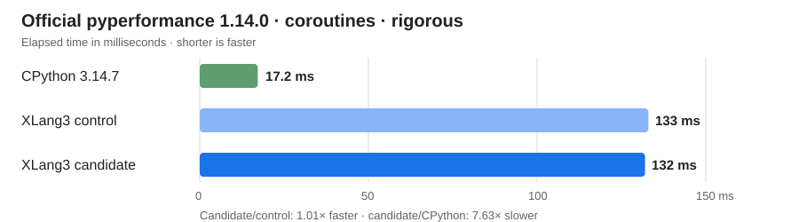

# Inline coroutine await ownership transfer

The inline coroutine path now transfers the temporary child `Value` into the
parent generator's `awaiting` slot. The temporary already owns the child
reference, so copying it into the slot needlessly increments and then
decrements the generator reference count on each inline await. The source
register stays unchanged because exception-unwind and liveness paths may still
read the await operand.

The comment beside `value_move_assign_fast` records both parts of this design
invariant. This is a targeted improvement: the official `coroutines` benchmark
shows about a one percent gain, while XLang3 remains far behind CPython on this
workload.

| Runtime | Mean | Relative result |
| --- | ---: | ---: |
| CPython 3.14.7 | 17.2 ms ± 0.3 ms | 1.00× |
| XLang3 fixed control | 133 ms ± 1 ms | 7.75× slower than CPython |
| XLang3 candidate | 132 ms ± 1 ms | 1.01× faster than XLang3 control; 7.63× slower than CPython |

The paired candidate/control comparison used official pyperformance 1.14.0 in
rigorous mode. `pyperf compare_to` reports the candidate as 1.01× faster.
CPython 3.14.7 was run with the same official benchmark and version. The XLang3
benchmark runner exposed the existing CPython 3.14.7 dependency site-packages
and compatibility hooks to both XLang3 samples.

The diagnostic coroutine body showed the intended reduction while preserving
generator allocations and final releases:

| Generator counters | Control | Candidate | Change |
| --- | ---: | ---: | ---: |
| Allocations | 242,786 | 242,786 | unchanged |
| Final releases | 242,786 | 242,786 | unchanged |
| Increments | 485,573 | 242,789 | −242,784 |
| Decrements | 728,359 | 485,575 | −242,784 |

These counters are diagnostic evidence, not benchmark timings. They support the
mechanism: ownership moves from the already-owning local temporary instead of
retaining a second reference in the parent slot and releasing the temporary.
Moving directly from the operand register was unsafe; the
`async_generator_await_exception_unwind` fixture exercises the case where that
register must remain available. The complete fixture runner passes with the
safe local-temporary transfer.

The candidate passed all 11 cases in the fixed Release gate, with 21
order-balanced paired samples, five warmups, and a 10% per-case slowdown limit.
The largest candidate/control ratio was `function_calls` at 1.038×. CTest passed
54 of 55 tests; the remaining pre-existing
`xlang3_cli_visual_studio_debugpy_launch` check fails because the checked-in
Visual Studio profile does not point directly to `xlang3.exe`.

The Release candidate runtime DLL SHA-256 is
`4a5c42f8611415db0314de9fdaa06ff58fa0cecfcfc60b9da27fa463132343fe`; the
executable SHA-256 is
`0e9468638afd21f9f40d68a27b4bac30f4f8bd96c3534eabfc01a136b5b65179`.
The fixed control runtime DLL SHA-256 is
`27e2892713e8f473613f73b9e658b4c353366197068059afe2f9b0e36c4a1f94`; its
executable SHA-256 is
`091105b9328cc1d1531e2e70fb86b9fdc23a8608e3be8ddcbad90bdb532a8b3f`.

The raw rigorous samples are available for [XLang3 control](data/await-child-ownership-control-xlang3-rigorous-20261006.json), [XLang3 candidate](data/await-child-ownership-candidate-xlang3-rigorous-20261006.json), and [CPython 3.14.7](data/await-child-ownership-cpython314-rigorous-20261006.json). The [complete fixed Release gate](data/await-child-ownership-fixed-release-gate-20261006.json), [control counters](data/await-child-ownership-control-counters-20261006.txt), and [candidate counters](data/await-child-ownership-candidate-counters-20261006.txt) preserve the validation and mechanism evidence. Runner logs sit beside the corresponding XLang3 samples.

This change does not close the overall performance goal; the coroutine path
is still more than seven times slower than CPython and needs deeper profiling.
