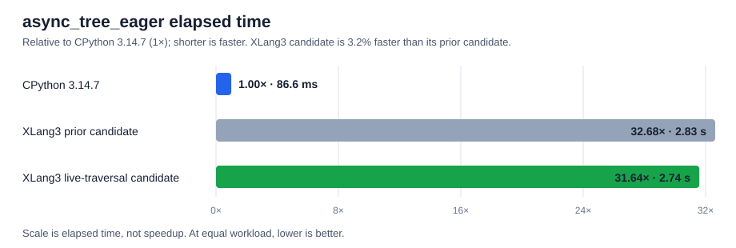

# Async Task/Future live GC traversal trial

The native asyncio `Future`/`Task` edge-publication optimization reduced the official `async_tree_eager` time by about **3%** in a matched XLang3 pyperformance run. It passed all 11 fixed Release regression cases and the complete fixture suite. This is a small targeted improvement, not a major step toward beating CPython overall.

## Measurement

| Runtime | `async_tree_eager` mean | Std. dev. | Relative elapsed time |
|---|---:|---:|---:|
| CPython 3.14.7, full reference run | 86.6 ms | 1.7 ms | 1.00× |
| XLang3 prior candidate | 2.83 s | 0.03 s | 32.68× CPython time |
| XLang3 live-traversal candidate | 2.74 s | 0.02 s | 31.64× CPython time |

The candidate used **3.2% less time** than the prior XLang3 binary (`2.83 / 2.74 = 1.033×` speedup). It remains about **31.6× slower** than CPython on this case (`2.74 s / 86.6 ms`). These are `pyperformance 1.14.0 --fast` measurements. XLang3 control and candidate each had 10 measured runs, two values per run, one warmup, and one loop per value. The CPython figure is from the recorded full-suite run; its samples used two loops per value. Means are per-loop values. The old and new XLang3 runs were executed sequentially on the same machine with the same Python 3.14 dependency site and compatibility shim.

The focused diagnostic `--debug-single-value` took 2.71 seconds, but the matched fast run above is the comparison used here.

## Why the change can help

Before this change, each native Future/Task mutation copied its owning `Value` references into a non-owning mirror vector. `Task.step()` repeatedly updates these fields across a very large tree of nested tasks, so the runtime paid to scan and republish references on the hot path. The collector now calls a stable native traversal callback when it needs to inspect a Future. This follows the shape of CPython's `tp_traverse` model: trace live payload fields during collection, and avoid rebuilding a mirror on every state transition.

The callback enumerates the Future and Task payload's strong `Value` references, including callbacks and coroutine state. Keep that visitor in sync with owning fields when `FutureState` or `TaskData` changes; omitting an owning reference can make a live object invisible to cycle collection. The comment at `trace_future_references` records this maintenance requirement and the hot-path reason for the callback.

## Correctness and regression checks

- The new self-referential Future fixture confirms that a native Future cycle is reclaimed after its last external reference is dropped.
- Existing weakref, rooted GC graph, and asyncio runtime fixtures passed.
- `xlang3_runtime_value_tests.exe` and `xlang3_interpreter_tests.exe` passed.
- The complete `tests/run_fixtures.py` suite passed under Python 3.14.
- The 11-case fixed Release gate passed with the default 10% slowdown threshold. The largest measured slowdown was `subparsers` at 1.089×; `gc_traversal` was 1.004×.

The full-suite CPython comparison remains the recorded 97-case run in [the pyperformance report](pyperformance-xlang3-all-97-current-candidate-vs-cpython314-fast-20261004.md). This focused trial does not claim to improve the other slow or failing benchmarks.

## Reproduction artifacts

- Candidate pyperf data: [`async-tree-eager-native-gc-traverse-candidate-fast-20261004.json`](data/async-tree-eager-native-gc-traverse-candidate-fast-20261004.json).
- Prior-candidate control data: [`async-tree-eager-native-gc-traverse-control-fast-20261004.json`](data/async-tree-eager-native-gc-traverse-control-fast-20261004.json).
- Fixed Release gate data: [`async-tree-native-gc-traverse-fixed-baseline-gate-20261004.json`](data/async-tree-native-gc-traverse-fixed-baseline-gate-20261004.json).
- CPython 3.14 full-run data: [`pyperformance-cpython314-clean-release-full-fast-20261002.json`](data/pyperformance-cpython314-clean-release-full-fast-20261002.json).

Candidate executable SHA-256: `A7CD9B9D0AE107F2587EA2EB7ACF91ACB4A1BFFABFCFBC6D268DFF440B7085F5`.
Candidate runtime DLL SHA-256: `645736841D3BAE769A11CF5642CC042B7E8CD81AFBA49E18BD289ADE730F5F98`.
Control executable SHA-256: `F6C50CF80D557E3D6BD315FA023F0906285C256F44B7FA88EF74CF89803E6227`.
Control runtime DLL SHA-256: `D114791D250BB6A18CB04030937BF566DE98ADEAB2FB981CDC0984367ADFCAF5`.
