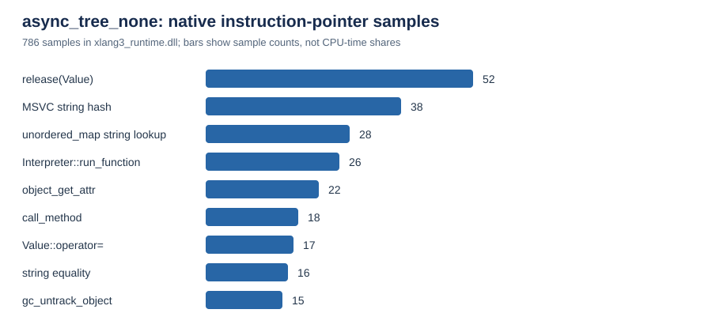

# `async_tree_none` native profile (2026-10-06)

## Finding

The safe-looking `LoadLocalAttr` shortcut was invalid: later IR can read the
temporary receiver register (`in.c`), including the `StoreAttr` in an augmented
assignment. Skipping that write made asyncio loop shutdown fail. The candidate
was removed, the Release binary was rebuilt from the restored source, and the
full Python 3.14.7 fixture runner passed.

Two separate diagnostics help narrow the remaining gap, but neither identifies
a single cause of the roughly 4.5-second run. A user-mode sample of the exact
pyperformance `NoneAsyncTree` body found frequent `Value` release/copy work,
string-key hashing, and `object_get_attr`. The opcode timer experiment did not
reach pyperf's timed workers because the runner omitted its environment flag
from worker inheritance. Its rows represent setup work and cannot attribute
the benchmark body's cost or rule out any opcode as a hotspot.

The earlier instrumented run did not record XLang3's native Task-step timers.
That absence was not evidence of a different Task-step path: a follow-up
observer around the event loop's `call_soon` confirmed that this benchmark
schedules the native `_asyncio.Task._step` callback 55,989 times. The reason
the timer probe missed it was the filtered worker environment; do not use those
missing timer rows to rule out Task dispatch as a hotspot.

## Pyperformance context

The fresh official pyperformance 1.14.0 fast control measured
`async_tree_none` at **4.50 s ± 0.04 s**. The saved CPython 3.14.7 result in the
97-case comparison is **227.4 ms**, putting XLang3 at about **19.8× the time**
on this case. The CPython result is the saved full-run reference, not a newly
paired run from this diagnostic session.

| Runtime / diagnostic | Time | Meaning |
| --- | ---: | --- |
| CPython 3.14.7 | 227.4 ms | Saved official fast-mode reference |
| XLang3 Release control | 4.50 s ± 0.04 s | Fresh official pyperformance fast run |
| XLang3 timing-probe run | 4.51 s | Debug score; timer flag did not reach the worker |

## Native sample points

The sampler captured **1,160** user-mode instruction-pointer samples during
one direct execution of the official benchmark body using
[`run_async_tree_none_body.py`](../../benchmarks/diagnostics/run_async_tree_none_body.py);
**786** landed in
`xlang3_runtime.dll`. Bars show sample counts, not CPU-time percentages. The
sample is useful for choosing targets, but it suspends the process and does
not provide call stacks or precise time attribution.

| Sampled symbol | Samples in runtime DLL |
| --- | ---: |
| `release(Value)` | 52 |
| MSVC string hash bytes | 38 |
| `unordered_map` string lookup | 28 |
| `Interpreter::run_function` | 26 |
| `object_get_attr` | 22 |
| `call_method` | 18 |
| `Value::operator=` | 17 |
| string equality | 16 |
| `gc_untrack_object` | 15 |

The [raw sample data](data/async-tree-current-native-samples-20261006.json)
contains module addresses and sample counts. The corresponding
[symbolizer output](data/async-tree-current-native-symbols-20261006.txt)
preserves the source locations.

## Scheduled Task callbacks

[`async_tree_call_soon_profile.py`](../../benchmarks/diagnostics/async_tree_call_soon_profile.py)
wraps `BaseEventLoop.call_soon` and counts callback types scheduled by the
official `NoneAsyncTree` body. It was run once under each runtime; wrapping the
event-loop method changes timing, so these are counts only.

| Scheduled callback | XLang3 | CPython 3.14.7 |
| --- | ---: | ---: |
| Task step | 55,989 `_asyncio.Task._step` | 55,989 `_asyncio.Task.TaskStepMethWrapper` |
| Task wakeup | 9,331 `_asyncio.Task._wakeup` | 9,331 `_asyncio.Task.task_wakeup` |
| `gather` done callback | 55,986 | 55,986 |
| Total `call_soon` schedules | 121,315 | 121,315 |

The workload creates the same number of scheduled operations under both
runtimes. CPython represents the task step with its dedicated native wrapper;
XLang3 schedules a bound native method. Callback caching and bound-argument
staging have both been tested without a repeatable end-to-end gain, so the
remaining targets are coroutine resume and Python `Handle` execution. The
matching schedule counts also show that the missing timer records came from
the probe setup, not from the benchmark bypassing native Task steps.

## Python frame profile and getter trial

[`async_tree_official_call_profile.py`](../../benchmarks/diagnostics/async_tree_official_call_profile.py)
ran the official 6-by-6 `NoneAsyncTree` body under `sys.setprofile` in both
runtimes. The profiler changes timings; counts identify repeated Python work,
not its CPU share.

| Runtime | Python `asyncio` call events | Visible `_asyncio` C-call events |
| --- | ---: | ---: |
| CPython 3.14.7 | 1,148,050 | 130,649 |
| XLang3 | 1,157,378 | 0 |

The top Python call counts match almost exactly: `BaseEventLoop.get_debug`
186,638; `_check_closed` 177,310; `call_soon`, `_call_soon`, and
`Handle.__init__` 121,315 each; `Handle._run` 121,314; `create_task` and
`ensure_future` 55,989 each; and `gather.<locals>._done_callback` 55,986.
XLang3 enters `asyncio.futures._get_loop` 9,335 times versus 4 in CPython, but
that difference is under one percent of the total event count. The native
`_asyncio` profile events are not comparable because XLang3 does not expose
its native calls through the same profile-event interface. The counts point
toward the cost of executing the same Python operations in XLang3, not a
large increase in Python frame count.

A VM trial inlined successful one-attribute Python method getters, including
`return self._debug`, with class/descriptor, instance-storage, trace, and
fallback guards. Its fixture passed under both runtimes, and the fixed Release
gate passed all 11 cases (largest ratio 1.036x). The official
`async_tree_none` result was **4.47 s ± 0.05 s** versus the saved current-main
control at **4.41 s**; pyperf showed no improvement. `many_optionals` and
`pickle` were also hidden by `pyperf compare_to` as not significant. The trial
was removed; its code is not retained as a performance win.

Profile outputs are preserved for [CPython 3.14.7](data/async-tree-official-call-profile-cpython314-20261006.txt)
and [XLang3](data/async-tree-official-call-profile-xlang3-20261006.txt). The
candidate results and comparisons are saved for [async_tree_none](data/async-tree-simple-getter-candidate-fast-20261006.json),
[`many_optionals`](data/argparse-simple-getter-candidate-fast-20261006.json),
and [`pickle`](data/pickle-simple-getter-candidate-fast-20261006.json), with
the [fixed Release gate](data/release-simple-self-attr-getter-gate-20261006.json).

## Opcode timing diagnostic

Correction: the timer flag was not inherited by pyperf's timed workers. The
runner forwarded `PYTHONPATH`, `PYTHONPYCACHEPREFIX`, and `XLANG3_PYTHON_LIB`,
but omitted `XLANG3_VM_OPCODE_TIMING`. Pyperf's `create_environ` filters out
other variables unless they are explicitly inherited. The raw log contains
one timer block before the benchmark starts; it cannot be used to attribute
the `async_tree_none` body. The reported 14 ns clock pair and rows below are
setup-process diagnostics, **not timings of the benchmark's VM work**.

| Opcode | Calls | Self time |
| --- | ---: | ---: |
| `ImportModule` | 403 | 55.2 ms |
| `ImportFrom` | 610 | 40.8 ms |
| `Call` | 19,895 | 36.7 ms |
| `CallMethod` | 9,113 | 15.0 ms |
| `CallModuleMethod` | 555 | 14.6 ms |
| `CallLocalMethod` | 4,823 | 5.5 ms |
| `LoadLocalAttr` | 21,270 | 2.8 ms |

These rows do not measure the timed worker. The raw
[timing log](data/async-tree-none-opcode-timing-20261006.log) retains every
opcode row. This explains why the native Task-step probes were absent despite
the independently verified Task callback counts. The probe source was removed
before rebuilding the ordinary Release binary.

The runner now accepts an explicit
`--inherit-worker-env XLANG3_VM_OPCODE_TIMING` for a separately built diagnostic
binary. A new worker-instrumented run is still required before making opcode
cost claims. Ordinary performance runs do not enable or inherit this flag by
default. The [worker-environment diagnosis](pyperf-worker-diagnostic-environment-20261006.md)
records the source evidence and reproduction.

## Rejected candidates and validation

An inline no-argument self-attribute getter measured three debug single-value
samples at 4.48, 4.42, and 4.37 s, against controls at 4.43, 4.37, and 4.42 s.
The distributions overlap; no change was retained. The raw control and
candidate files are [control 1](data/pyperformance-async-tree-self-attr-getter-control-debug-20261006.json),
[control 2](data/pyperformance-async-tree-self-attr-getter-control-debug-r2-20261006.json),
[control 3](data/pyperformance-async-tree-self-attr-getter-control-debug-r3-20261006.json),
[candidate 1](data/pyperformance-async-tree-self-attr-getter-candidate-debug-r1-20261006.json),
[candidate 2](data/pyperformance-async-tree-self-attr-getter-candidate-debug-r2-20261006.json), and
[candidate 3](data/pyperformance-async-tree-self-attr-getter-candidate-debug-r3-20261006.json).

The `LoadLocalAttr` shortcut was removed after the official fast benchmark
failed in loop shutdown and the full fixture runner failed on a subprocess
fixture. The restored Release executable passed the full fixture suite using
`C:\Python\Python314\python.exe tests/run_fixtures.py
build-repro/Release/xlang3.exe`. No engine optimization from these two trials
remains in the source. The Release control distribution is
[preserved here](data/pyperformance-async-tree-loadlocalattr-control-fast-r1-20261006.json);
the candidate's single debug value was 4.488 s, but it is not comparable to the
fast distribution. The candidate debug result is
[preserved here](data/pyperformance-async-tree-loadlocalattr-candidate-debug-20261006.json),
and the [failed candidate run log](data/pyperformance-async-tree-loadlocalattr-candidate-fast-failure-20261006.log)
shows the asyncio shutdown failure.

| Build | SHA-256 |
| --- | --- |
| Ordinary Release executable | `AA0FBB7F22F970D2809611A126D8B5780A46C777EC7E23204EE06BFABB559D64` |
| Ordinary Release runtime DLL | `F165447357BFD9369D873B2F5DDB86650D985300F88D160681E5D1D51652E9E1` |
| RelWithDebInfo sample executable | `ADDE6540D99DFDE45B725CD076503BB0E9923738A16B61381CDEA809194ACA56` |
| RelWithDebInfo sample runtime DLL | `7398591CF9F28E46B6BB0A29890411EF35CD33CAF8FDA4BE379266B335A63B2A` |

The next experiment should measure the cost of the high-frequency
`_check_closed` and Handle scheduling paths, plus native generator resume,
before choosing another inline pattern. The performance goal remains open.
