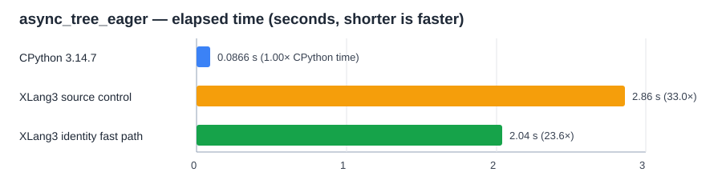

# Asyncio current-task dictionary identity fast path (2026-10-04)

## Result

The native `_asyncio` Task path now updates an existing `_current_tasks`
`DictObject` entry by exact loop-object identity. New entries, misses, mapping
subclasses, mapping proxies, and module-backed dictionaries still use the
generic mapping path. This avoids repeating generic hashing and key comparison
for every eager Task transition while preserving the Python-visible
`asyncio.tasks.current_task()` dictionary ABI.

The same-source pyperformance 1.14.0 `async_tree_eager --fast` A/B was
order-balanced:

| Build | Mean |
|---|---:|
| Generic current-task mapping, run 1 | 2.86 s ± 0.05 s |
| Identity fast path, run 1 | 2.06 s ± 0.04 s |
| Identity fast path, run 2 | 2.05 s ± 0.03 s |
| Generic current-task mapping, run 2 | 2.85 s ± 0.04 s |
| Final build with exact-dict guard | 2.04 s ± 0.04 s |

Pyperf reported the fast-mode samples as not stable enough to establish less
than 1% variation. The repeated control and candidate means were consistent;
both source-matched comparisons reported **1.39× faster**. The final guarded
build was **1.40× faster** than the first source control. These measurements
show a large gain in this benchmark, not a general speedup across
pyperformance.

The recorded CPython 3.14.7 result is 86.62 ms ± 1.69 ms. At 2.04 s, XLang3
still takes about **23.6× as long** on this case, so this closes part of the
gap but does not beat CPython.

## Why it helps

The VM profile counted 111,974 current-task dictionary mutations in one
eager-tree run. Generic mapping operations spent 857.8 ms there (about 7.66 µs
per mutation). With the identity-key path, the same scope spent 4.46 ms
(about 40 ns per mutation). Both profiles used a diagnostic `RelWithDebInfo`
binary with clock probes; their wall times are not performance scores.

Native Task registration remained a separate cost at about 400 ms for 55,987
Tasks in the refreshed diagnostic run. A follow-up split attributed 393 ms to calling
Python `WeakSet.add`; the [native Task WeakSet-elision trial](asyncio-native-task-weakset-elision-trial-20261004.md)
removes that redundant work in the same way CPython 3.14 does. The earlier
direct Task-constructor shortcut was removed because its repeated A/B did not
show a significant gain.

The fast path is deliberately narrow. It only updates or erases an already
present instance key in an exact built-in dict. A missing key falls back to
the ordinary operation, which validates and inserts it. Other mapping kinds
and dict subclasses keep their generic behavior. The helper comment in
`src/runtime/mapping.cpp` records this invariant for future changes.

## Validation

- `async_taskgroup_current_task.py` passed and produced the same output under
  XLang3 and CPython 3.14.7. It checks nested eager tasks, TaskGroups,
  `current_task()`, and `all_tasks()`.
- XLang3's `asyncio_scheduled_tasks_add_patch.py` fixture passed.
- `xlang3_interpreter_tests.exe` passed.
- The 11-case fixed Release regression gate passed with a 10% slowdown limit;
  the largest measured candidate/baseline ratio was 1.015×.
- The [full 97-definition comparison](../pyperformance-xlang3-all-97-current-task-identity-vs-cpython314-fast-20261004.md)
  attempted every definition: 45 completed and 52 failed or timed out. Of 49
  matched subtests, XLang3 was faster in five; the geometric mean CPython /
  XLang3 ratio was 0.16128×. `async_tree_eager` measured 2.049 s against
  CPython's 86.62 ms (0.042×, or about 23.6× the elapsed time). The full
  status and matched-subtest CSVs are linked from that report.

## Build identity and evidence

All XLang3 measurements used the same executable SHA-256:
`78759AC13404C2A05ED26F2ADA691E094BF7944C5C58952FC4635DD4116171AC`.
The source-matched generic-mapping runtime was
`0D003672C7C23F4F3A9C1499BAAC78DD4AB5E034994A649A39AD96DD2628F7C4`; the
source-matched fast-path runtime was
`480423B988C767A81FF162B85A1C15EEAC4FB472FFEC7623BF036ACC7922A075`. The
final guarded Release runtime was
`B2140EEA7EE8BCCDAEB247FDB66824468EB8D913C090B779E5ECE6BF86119B35`.

- [Source-control run 1](data/asyncio-current-task-dict-identity-source-control-r1-20261004.json) and [log](data/asyncio-current-task-dict-identity-source-control-r1-20261004.log)
- [Source-candidate run 1](data/asyncio-current-task-dict-identity-source-candidate-r1-20261004.json) and [log](data/asyncio-current-task-dict-identity-source-candidate-r1-20261004.log)
- [Source-candidate run 2](data/asyncio-current-task-dict-identity-source-candidate-r2-20261004.json) and [log](data/asyncio-current-task-dict-identity-source-candidate-r2-20261004.log)
- [Source-control run 2](data/asyncio-current-task-dict-identity-source-control-r2-20261004.json) and [log](data/asyncio-current-task-dict-identity-source-control-r2-20261004.log)
- [Final guarded candidate run](data/asyncio-current-task-dict-identity-final-candidate-20261004.json) and [log](data/asyncio-current-task-dict-identity-final-candidate-20261004.log)
- [Generic mutation profile](data/asyncio-current-task-dict-identity-profile-generic-mutation-20261004.log) and [fast-path profile](data/asyncio-current-task-dict-identity-profile-fastpath-20261004.log)
- [Fixed-baseline regression gate](data/asyncio-current-task-dict-identity-fixed-baseline-gate-20261004.json)
- CPython reference: [full CPython 3.14.7 pyperformance run](data/pyperformance-cpython314-clean-release-full-fast-20261002.json)
