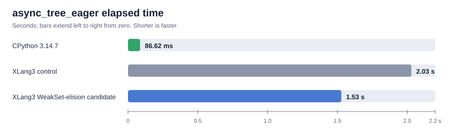

# Native asyncio Task WeakSet elision (2026-10-04)

## Result

Skipping the Python `WeakSet.add()` call for XLang3-native asyncio Tasks
reduced the official `async_tree_eager` time by about **25%**. Two same-source
Release comparisons measured **1.54 s** and **1.52 s** for the candidate,
versus **2.03 s** for the control; `pyperf compare_to` reported **1.32×** and
**1.33×** faster. CPython 3.14.7 measures 86.62 ms, so XLang3 is still about
**17.7× slower** on this workload.

## Diagnosis and implementation

An instrumented `RelWithDebInfo` run counted 55,987 native Task registrations:

| Registration work | Time |
|---|---:|
| Total registration | 399.992 ms |
| Python `WeakSet.add()` | 392.699 ms |
| Native intrusive-list insertion | 2.171 ms |

The WeakSet call accounted for 98.2% of the measured registration scope. It
created a Python weak reference and entered the interpreter once for every
native Task, even though XLang3 already keeps native Tasks in its intrusive
registry for `all_tasks()` and cleanup.

CPython 3.14 made this same distinction: native `asyncio.Task` instances use
an intrusive task list; the Python WeakSet remains for third-party Task
implementations. See the versioned [CPython 3.14.7 `_asynciomodule.c`](https://github.com/python/cpython/blob/v3.14.7/Modules/_asynciomodule.c)
and [`asyncio/tasks.py`](https://github.com/python/cpython/blob/v3.14.7/Lib/asyncio/tasks.py).
XLang3 now follows that split at its native `_asyncio` boundary. Python Task
fallback registration still calls `_py_register_task`, preserving dynamic
`WeakSet.add` behavior for non-native Tasks.

The fixture verifies both sides: native Tasks are in `asyncio.all_tasks()` but
not the Python WeakSet, and `_PyTask` instances remain in the WeakSet and see
an instance-patched `add` method. Its output matches CPython 3.14.7. The source
comment beside `register_native` records why native Tasks skip the Python
container.

## Measurements and validation

| Runtime | `async_tree_eager` | Speed ratio vs control |
|---|---:|---:|
| CPython 3.14.7 reference | 86.62 ms ± 1.69 ms | 23.4× faster |
| XLang3 control | 2.03 s ± 0.04 s | 1.00× |
| XLang3 candidate run 1 | 1.54 s ± 0.03 s | 1.32× faster |
| XLang3 candidate run 2 | 1.52 s ± 0.03 s | 1.33× faster |

All XLang3 runs used pyperformance 1.14.0 `--fast`, Python 3.14.7 standard
library and site-packages, and the same executable SHA-256
`78759AC13404C2A05ED26F2ADA691E094BF7944C5C58952FC4635DD4116171AC`. The
control runtime SHA-256 is
`B2140EEA7EE8BCCDAEB247FDB66824468EB8D913C090B779E5ECE6BF86119B35`; the
candidate runtime SHA-256 is
`8E8DF9A9029E97877A9D7417AC3797835F2452C770E211D1F166E69C301837D5`.
`pyperf compare_to` found the second control not significantly different
from the first.

- `xlang3_interpreter_tests.exe` passed.
- `async_taskgroup_current_task.py` passed under XLang3 and CPython 3.14.7.
- `asyncio_scheduled_tasks_add_patch.py` passed under both runtimes.
- The 11-case fixed Release regression gate passed at a 10% slowdown limit;
  the largest candidate/baseline ratio was 1.034×.
- The [full 97-definition comparison](../pyperformance-xlang3-all-97-task-weakset-elision-vs-cpython314-fast-20261004.md)
  attempted every case: 45 completed and 52 failed or timed out. Of 49 matched
  subtests, XLang3 was faster in five; the geometric mean CPython/XLang3 ratio
  was 0.15820×. `async_tree_eager` was 1.546 s against CPython's 86.62 ms
  (0.056×, or about 17.8× the elapsed time). The report links the complete
  status and subtest CSVs.

## Reproduction data

- [Control run 1](data/asyncio-task-weakset-elision-control-r1-20261004.json)
  ([log](data/asyncio-task-weakset-elision-control-r1-20261004.log))
- [Candidate run 1](data/asyncio-task-weakset-elision-candidate-r1-20261004.json)
  ([log](data/asyncio-task-weakset-elision-candidate-r1-20261004.log))
- [Candidate run 2](data/asyncio-task-weakset-elision-candidate-r2-20261004.json)
  ([log](data/asyncio-task-weakset-elision-candidate-r2-20261004.log))
- [Control run 2](data/asyncio-task-weakset-elision-control-r2-20261004.json)
  ([log](data/asyncio-task-weakset-elision-control-r2-20261004.log))
- [Fixed Release regression gate](data/asyncio-task-weakset-elision-fixed-baseline-20261004.json)
- [Registration profile log](data/asyncio-task-weakset-elision-registration-profile-20261004.log), collected with a clock-instrumented `RelWithDebInfo` binary (runtime SHA-256 `23C93B361D974312A2C2209CD640EBC35B442CA981AB4AE09B45DAC9652F6486`)
- [Full 97-definition pyperformance JSON](data/pyperformance-xlang3-all-97-task-weakset-elision-fast-20261004.json)
- [Full 97-definition pyperformance log](data/pyperformance-xlang3-all-97-task-weakset-elision-fast-20261004.log)
