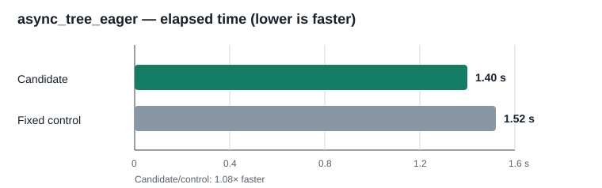

# Guarded simple-accessor inlining at the native asyncio call boundary

## Result

The native asyncio helper now recognizes a narrowly defined Python function
body in IR and evaluates it without creating a Python frame when native
`call_method()` invokes it with no arguments. The supported bodies are exact
attribute getters and `return self.attr is not None`. Two order-reversed runs
measured **1.39–1.40 s** for the candidate vs **1.52 s** for the fixed control.
After review found and fixed a public-`__dict__` precedence edge case, the
corrected candidate measured **1.40 s ± 0.03 s** against the same two-run
control aggregate at **1.52 s**, or **1.08× faster** in `pyperf compare_to`.

This is a native-call/VM optimization, not a C++ implementation of any
pure-Python asyncio method. The fast path reads the IR for the currently
resolved Python method, so subclass overrides and monkey-patches remain live.
When the body, attribute storage, descriptor precedence, class hooks, tracing,
profiling, monitoring, or debug state cannot be proven safe, the existing
Python call runs unchanged. The source comment beside the helper records this
boundary and why the guards matter.

## Measurements

All four official pyperformance runs used CPython 3.14.7 as the harness,
pyperformance 1.14.0, the same dependency site, and `--mode rigorous`. Order
was control-candidate, then candidate-control. Each JSON contains 41 pyperf
runs; the merged files were compared with `pyperf compare_to`.

| Measurement | Fixed control | Candidate | Candidate speedup |
|---|---:|---:|---:|
| Initial order: control → candidate | 1.52 s ± 0.03 s | 1.40 s ± 0.03 s | 1.09× |
| Initial reverse order: candidate → control | 1.39 s ± 0.02 s | 1.52 s ± 0.02 s | 1.09× |
| Corrected final candidate vs merged controls | 1.52 s | 1.40 s ± 0.03 s | 1.08× |

The control executable and runtime DLL are the preserved fixed Release
baseline. Their SHA-256 hashes remain `94F65647D7E3116A81CC7D1E7783D5E951E7A260101667177257F9266502E033`
and `C60087265E4A97FEF73EC4F9CDA28BCDE02A4291FA2E4ED760E4390DB9E9BDE5`.
The final corrected candidate executable and DLL hashes are `85F6FC5446C35F85E031B7866B470D85367C58AA42DF7D448E8DD708C6F2ECA5`
and `E53A7396951F1620DD55C21135924D9271A75FB073E09F5538505B707D6A4A41`.

## Correctness and regression checks

- The `asyncio_native_call_method_dispatch` fixture passes on XLang3 and
  CPython 3.14.7. It covers subclass accessor overrides, eager Task startup,
  instance/class method replacement, direct mutation through the loop's
  public `__dict__`, and confirmation that `sys.setprofile` still sees
  `get_debug` calls.
- CTest passed **55/55** tests.
- The 11-case Release regression gate passed against the fixed binary. Its
  largest candidate/control ratio was `subparsers` at **1.013×**, below the
  1.10 limit. See the saved gate JSON for every case and sample.

The optimization improves one of the largest benchmark gaps, but `async_tree`
remains far slower than CPython 3.14.7. The overall full-suite goal is still
open; this focused result must not be presented as an overall win over CPython.

## Reproduction evidence

- [Initial merged pyperf comparison](data/asyncio-simple-accessor-pyperf-compare-20261005.txt)
- [Corrected final candidate comparison](data/asyncio-simple-accessor-final-pyperf-compare-20261005.txt)
- Raw pyperf files and worker logs: `data/asyncio-simple-accessor-{control,candidate}-r{1,2}-20261005.{json,log}`
- [Merged control JSON](data/asyncio-simple-accessor-control-merged-20261005.json)
- [Merged candidate JSON](data/asyncio-simple-accessor-candidate-merged-20261005.json)
- [Corrected final candidate JSON](data/asyncio-simple-accessor-candidate-r3-20261005.json)
- [11-case fixed-baseline gate](data/asyncio-simple-accessor-fixed-baseline-gate-20261005.json)
- Python 3.14.7 accessor/override/profile fixture:
  [`asyncio_native_call_method_dispatch.py`](../../tests/fixtures/core/asyncio_native_call_method_dispatch.py)
