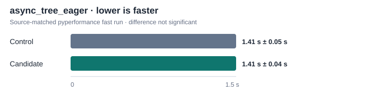

# Native asyncio Task loop lookup trial (2026-10-05)

## Result

The change was rejected. It removed the extra pure-Python
`asyncio.futures._get_loop` calls from XLang3's native Task step, but the
source-matched `async_tree_eager` comparison showed no significant timing
change. Do not reimplement or retry this path without new evidence.

## What the profile showed

With the same three-level, three-branch, five-iteration task tree, CPython
3.14.7 entered `_get_loop` 20 times. Before this trial, XLang3 entered it 85
times; the candidate entered it 20 times. Total Python asyncio call events
were 5,742 for CPython, 5,792 for control XLang3, and 5,727 for candidate
XLang3. The native CPython task step performs this lookup in C in
`_asynciomodule.c` (`get_future_loop`, CPython v3.14.7); subclasses still use
dynamic `get_loop()` dispatch and then `_loop` fallback.

## Matched timing

The candidate and control were built from the same checkout and differed only
in `asyncio_task.cpp`. Both used Python 3.14.7, pyperformance 1.14.0, the same
dependency site, and the `async_tree_eager` benchmark in fast mode.

| Build | Mean | Standard deviation |
|---|---:|---:|
| Control | 1.41 s | 0.05 s |
| Candidate | 1.41 s | 0.04 s |

`pyperf compare_to` marked the difference not significant. Both individual
files warn that the fast run has too few samples for a stable result. A
rigorous attempt stalled before producing a result, so there is no rigorous
claim for this trial.

## Correctness check

While evaluating the candidate, the `asyncio_native_call_method_dispatch`
fixture verified a Future subclass's overridden `get_loop()` was still called.
The candidate fixture suite passed. That added case was removed along with the
rejected implementation; the existing suite remains unchanged.

## Evidence

- [CPython 3.14.7 call profile](data/asyncio-task-loop-lookup-profile-cpython314-20261005.txt)
- [XLang3 control call profile](data/asyncio-task-loop-lookup-profile-control-20261005.txt)
- [XLang3 candidate call profile](data/asyncio-task-loop-lookup-profile-candidate-20261005.txt)
- [Control pyperf JSON](data/asyncio-task-loop-lookup-control-fast-20261005.json) and [log](data/asyncio-task-loop-lookup-control-fast-20261005.log)
- [Candidate pyperf JSON](data/asyncio-task-loop-lookup-candidate-fast-20261005.json) and [log](data/asyncio-task-loop-lookup-candidate-fast-20261005.log)
- [CPython `_asyncio` source](https://github.com/python/cpython/blob/v3.14.7/Modules/_asynciomodule.c#L294-L315)
