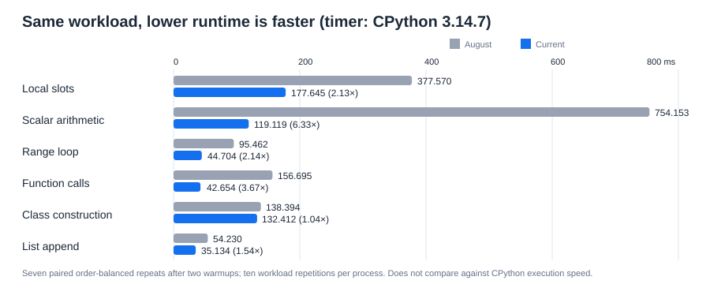

# August XLang3 vs current XLang3 with CPython 3.14.7

This is a focused comparison of the August Release-hoisted executable with the
current Release executable. Both ran the same six pure-XLang microbenchmarks;
CPython 3.14.7 supplied the outer process timer and the Python 3.14 standard
library path. This is not a CPython-versus-XLang3 result and it is not a full
pyperformance run.

Each benchmark process ran the workload ten times to reduce startup noise. We
performed two warmups, then seven order-balanced paired repeats, compared
stdout for equality, and report the median process time. The XLang3 interpreter
and runtime are native binaries; the test workloads are `.py` files run by
those binaries. `C:\Python\Python314\python.exe --version` reported Python
3.14.7.

## Results

Lower time is better. The ratio is current time divided by August time, so a
value below 1 means the current executable was faster.

| Workload | August | Current | Current / August | Current speedup |
|---|---:|---:|---:|---:|
| local slots | 377.570 ms | 177.645 ms | 0.470× | 2.13× |
| scalar arithmetic | 754.153 ms | 119.119 ms | 0.158× | 6.33× |
| range loop | 95.462 ms | 44.704 ms | 0.468× | 2.14× |
| function calls | 156.695 ms | 42.654 ms | 0.272× | 3.67× |
| class construction | 138.394 ms | 132.412 ms | 0.957× | 1.04× |
| list append | 54.230 ms | 35.134 ms | 0.648× | 1.54× |

The current build won all six cases, with the clearest gains in scalar
arithmetic, function calls, local slots, and range loops. These measurements
contradict the impression that the August build was faster on these workloads.
They do not explain the large current-vs-CPython gaps seen in the full suite;
the August build itself cannot run the full 3.14 pyperformance harness because
it lacks imports needed by the harness, including `time` and `datetime`.

## Build identity and raw data

- August source revision: `40382a008f730e7de3c912854347bf8147643079`.
- Current source revision: `7c4edaa1f5b97b0d0481737b70a91922ac97fec3`.
- August executable SHA-256: `7DEDF00C07BE04DD3E9C1ADC861374D24F543FD01F36BB8F2C79BC583CA659CF`.
- August runtime DLL SHA-256: `E6699951C18976CD88A8BB0106540202C40894375627836FF833025B49898DE0`.
- Current executable SHA-256: `F4929AF5873C995AE038A30F5DAF5AB361B321A8FE777F655C7DD3127158E68F`.
- Current runtime DLL SHA-256: `E4D81CF016BB520228AFFA495411476698F8274944E25F8261499AB606C53998`.
- Raw samples and exact command/script details: [`august-release-hoisted-vs-current-python314-repeated-20261004.json`](../../scratch/performance-trials/august-release-hoisted-vs-current-python314-repeated-20261004.json) and [`compare_august_current_repeated_314.py`](../../scratch/performance-trials/compare_august_current_repeated_314.py).

No August build files were modified. The current Release executable and runtime
remain the saved control build.
