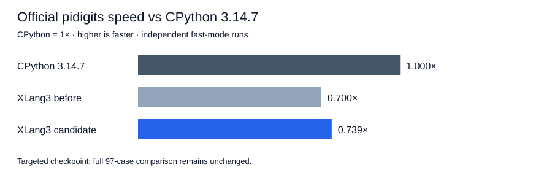

# Read-only bigint addition, subtraction and comparison — 2026-10-07

Fresh official `pidigits`: previous XLang3 **233.239 ms**, candidate **220.755 ms**, CPython **3.14.7 163.175 ms**. Nominal candidate gain is **1.057×**, or **5.35% less time**. Relative speed versus CPython is **0.739×**, with CPython at 1×. XLang3 still takes **1.353×** CPython's time.

## Source-backed reason and implementation

XLang3 cloned both integer operands before addition or comparison. Subtraction then cloned the right operand again to negate it. This imposed allocator and copy costs even when comparison could finish from signs or limb counts. The existing immutable `BigIntOperandView` now serves addition, subtraction and comparison when both operands are intrinsic Int64/Bool/BigInt values. Addition/subtraction allocate independent owned results; subtraction flips only the local view sign. Comparison reads the immutable limbs and publishes its bool after all reads.

CPython 3.14.7 also reads input digits directly: [comparison](https://github.com/python/cpython/blob/v3.14.7/Objects/longobject.c#L3322) and [addition/subtraction](https://github.com/python/cpython/blob/v3.14.7/Objects/longobject.c#L3440). This applies the same ownership principle to XLang3’s own generic arithmetic; no CPython pure-Python library algorithm was translated into C++.

If either input requires wrapper conversion, the original ordered owned conversion remains. A right-input hook can destroy the original left-input owner; the left snapshot must survive. Durable comments explain this fallback, why comparisons should not clone, why subtraction negates only a view, and why outputs must be independent before replacing input owners. The read-only view type remains distinct from mutable owned payloads.

Private read-only kernel templates accept original owned payloads or immutable views by const reference. Existing division/shift/parser callers do not construct temporary adapter views. The first by-value-adapter trial was rejected after official slowdown and seven alternating comparisons; its original source diff, binary identity and raw data are retained. The helper passing cost was a hypothesis for revision, not an established explanation of the entire slowdown.

## Correctness and fixed gate

Passed **364 core fixtures, 11 compatibility sections, 3 expected failures** and **8 C++/SDK/graph tests**. Forty signed C++ reference cases cover 8 operations and 3 output modes (**960 combinations**), including replacing either sole input owner. Separate retained-input checks, destructive conversion reentry for all three entry points, self-subtraction, bools, carry/borrow chains, and signed 64-bit promotion/compaction guard ownership and semantics. The Python fixture independently checks sign cases, six comparisons, equal separately constructed operands, zero, carry/borrow chains, bools and scalar boundaries.

The candidate produces exact CPython 2,000 pi digit bytes: SHA-256 `e7cb4bbb129d29f035c29cf1f088673788a82ebbbd61b466257e12ece4871aac`.

The complete default fixed gate passed with exit 0: **11 cases, 21 paired repeats, 5 warmups, 10% tolerance**. The accepted baseline is unchanged: exe SHA-256 `a5f5028c15e145edce645a5afc25c11fbce77f51e882312b1fbe06e63c72a4af`, DLL `bc1b9c0a8086f7e6fb0c037516dc9c1eea20427fa887e3aa623714bc5ef5da8d`.

## Measurement scope

The original diagnostic may overlap a separate xMind Release build and is retained only as historical diagnostic evidence. That build was observed live, then its process disappeared; a fresh `idle-r2` before diagnostic supplies the scored comparison. No build or other benchmark ran during subsequent controlled measurements.

Official previous-build, candidate and CPython runs share benchmark source, dependencies and compatibility hook. XLang3 ran at the unchanged path `D:\CantorAI\xlang3\build-repro\main-verify-20261006\Release\xlang3.exe` for both engine versions. The preserved previous DLL was temporarily restored there for before, and the candidate restored before after and again in controller cleanup. Module hashes matched and every phase verified unchanged executable/DLL hashes.

Official results are independent sequential fast-mode samples with stability warnings, not a paired significance test. Only affected official `pidigits` was rerun. The historical 97-case full-suite data, failures and aggregate remain unchanged; these targeted samples are not spliced into it.

## Isolated operator measurements

Median of five samples with **50,000 operations per sample**, including Python loop, assignment and operator dispatch. Equal bigint operands are separately constructed. Gain compares previous XLang3 to candidate; “vs CPython” is CPython time / candidate time, where values above 1× mean faster than CPython.

| Case | Before (µs) | Candidate (µs) | CPython 3.14.7 (µs) | Gain | vs CPython |
|---|---:|---:|---:|---:|---:|
| add-small-128 | 0.399 | 0.315 | 0.025 | 1.267× | 0.080× |
| add-big-128 | 0.450 | 0.383 | 0.025 | 1.173× | 0.065× |
| add-opposite-128 | 0.383 | 0.315 | 0.024 | 1.217× | 0.075× |
| subtract-small-128 | 0.400 | 0.295 | 0.023 | 1.355× | 0.077× |
| subtract-big-128 | 0.399 | 0.277 | 0.021 | 1.443× | 0.076× |
| subtract-opposite-128 | 0.471 | 0.358 | 0.025 | 1.314× | 0.071× |
| compare-small-128 | 0.197 | 0.112 | 0.016 | 1.760× | 0.147× |
| compare-big-128 | 0.203 | 0.116 | 0.020 | 1.755× | 0.169× |
| compare-equal-128 | 0.216 | 0.132 | 0.018 | 1.630× | 0.137× |
| add-small-1024 | 0.448 | 0.355 | 0.036 | 1.263× | 0.100× |
| add-big-1024 | 0.540 | 0.419 | 0.035 | 1.289× | 0.084× |
| add-opposite-1024 | 0.475 | 0.363 | 0.029 | 1.309× | 0.079× |
| subtract-small-1024 | 0.469 | 0.327 | 0.038 | 1.433× | 0.115× |
| subtract-big-1024 | 0.501 | 0.343 | 0.029 | 1.461× | 0.086× |
| subtract-opposite-1024 | 0.560 | 0.388 | 0.037 | 1.444× | 0.096× |
| compare-small-1024 | 0.205 | 0.112 | 0.018 | 1.840× | 0.159× |
| compare-big-1024 | 0.234 | 0.124 | 0.027 | 1.883× | 0.216× |
| compare-equal-1024 | 0.248 | 0.142 | 0.026 | 1.743× | 0.183× |
| add-small-4096 | 0.536 | 0.416 | 0.112 | 1.290× | 0.270× |
| add-big-4096 | 0.638 | 0.485 | 0.110 | 1.316× | 0.227× |
| add-opposite-4096 | 0.627 | 0.502 | 0.064 | 1.249× | 0.128× |
| subtract-small-4096 | 0.550 | 0.396 | 0.136 | 1.387× | 0.344× |
| subtract-big-4096 | 0.641 | 0.481 | 0.062 | 1.333× | 0.130× |
| subtract-opposite-4096 | 0.652 | 0.454 | 0.110 | 1.435× | 0.241× |
| compare-small-4096 | 0.221 | 0.112 | 0.017 | 1.973× | 0.152× |
| compare-big-4096 | 0.278 | 0.152 | 0.062 | 1.828× | 0.406× |
| compare-equal-4096 | 0.288 | 0.167 | 0.063 | 1.721× | 0.375× |

## Raw evidence

[Binary/source/input hash checkpoint](data/bigint-add-compare-reference-helper-checkpoint-20261007.json).

- [pyperformance-bigint-add-compare-reference-helper-pidigits-before-fast-20261007.json](data/pyperformance-bigint-add-compare-reference-helper-pidigits-before-fast-20261007.json)
- [pyperformance-bigint-add-compare-reference-helper-pidigits-before-fast-20261007.log](data/pyperformance-bigint-add-compare-reference-helper-pidigits-before-fast-20261007.log)
- [pyperformance-bigint-add-compare-reference-helper-pidigits-before-fast-20261007-provenance.json](data/pyperformance-bigint-add-compare-reference-helper-pidigits-before-fast-20261007-provenance.json)
- [pyperformance-bigint-add-compare-reference-helper-pidigits-after-fast-20261007.json](data/pyperformance-bigint-add-compare-reference-helper-pidigits-after-fast-20261007.json)
- [pyperformance-bigint-add-compare-reference-helper-pidigits-after-fast-20261007.log](data/pyperformance-bigint-add-compare-reference-helper-pidigits-after-fast-20261007.log)
- [pyperformance-bigint-add-compare-reference-helper-pidigits-after-fast-20261007-provenance.json](data/pyperformance-bigint-add-compare-reference-helper-pidigits-after-fast-20261007-provenance.json)
- [pyperformance-bigint-add-compare-reference-helper-pidigits-cpython3147-fast-20261007.json](data/pyperformance-bigint-add-compare-reference-helper-pidigits-cpython3147-fast-20261007.json)
- [pyperformance-bigint-add-compare-reference-helper-pidigits-cpython3147-fast-20261007.log](data/pyperformance-bigint-add-compare-reference-helper-pidigits-cpython3147-fast-20261007.log)
- [pyperformance-bigint-add-compare-reference-helper-pidigits-cpython3147-fast-20261007-provenance.json](data/pyperformance-bigint-add-compare-reference-helper-pidigits-cpython3147-fast-20261007-provenance.json)
- [bigint-add-compare-diagnostic-before-idle-r2-20261007.json](data/bigint-add-compare-diagnostic-before-idle-r2-20261007.json)
- [bigint-add-compare-diagnostic-after-r2-20261007.json](data/bigint-add-compare-diagnostic-after-r2-20261007.json)
- [bigint-add-compare-diagnostic-before-20261007.json](data/bigint-add-compare-diagnostic-before-20261007.json)
- [bigint-add-compare-reference-helper-validation-20261007.json](data/bigint-add-compare-reference-helper-validation-20261007.json)
- [bigint-add-compare-reference-helper-validation-20261007-fixtures.log](data/bigint-add-compare-reference-helper-validation-20261007-fixtures.log)
- [bigint-add-compare-reference-helper-validation-20261007-cpp.log](data/bigint-add-compare-reference-helper-validation-20261007-cpp.log)
- [release-bigint-add-compare-reference-helper-fixed-gate-20261007.json](data/release-bigint-add-compare-reference-helper-fixed-gate-20261007.json)
- [release-bigint-add-compare-reference-helper-fixed-gate-20261007.log](data/release-bigint-add-compare-reference-helper-fixed-gate-20261007.log)
- [pidigits-add-compare-reference-helper-body-correctness-20261007.json](data/pidigits-add-compare-reference-helper-body-correctness-20261007.json)
- [bigint-add-compare-operand-view-checkpoint-20261007.json](data/bigint-add-compare-operand-view-checkpoint-20261007.json)
- [bigint-add-compare-paired-body-followup-20261007.json](data/bigint-add-compare-paired-body-followup-20261007.json)
- [bigint-add-compare-other-kernel-followup-20261007.json](data/bigint-add-compare-other-kernel-followup-20261007.json)
- [bigint-add-compare-initial-trial-source-20261007.patch](data/bigint-add-compare-initial-trial-source-20261007.patch)

## Alternating body confirmation

Seven alternating complete-body comparisons on CPU [0] all favored the revised candidate: previous/candidate ratios **1.056–1.099×**, median **1.066×**. Every result verified the exact CPython digit hash. These are diagnostic confirmations of the official direction, not replacements for official scores or a full-suite aggregate. [Raw paired evidence](data/bigint-add-compare-paired-body-reference-helper-followup-20261007.json).

The earlier trial is explicitly [rejected and recorded](bigint-add-compare-operand-view-checkpoint-20261007.md). XLang3 remains slower than CPython on this case and the isolated operator comparisons. Further work must investigate shared runtime costs; `allocate_bigint_object` still separately allocates the object and its payload in addition to limb storage. That source observation does not establish how much full-workload time those allocations consume.
