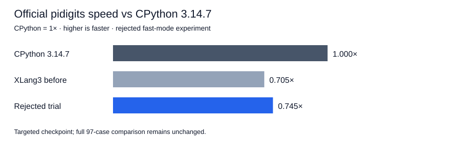

# Rejected combined bigint storage experiment — 2026-10-07

**Rejected experiment; fast samples only.** Official `pidigits`: previous XLang3 **245.262 ms**, candidate **231.974 ms**, CPython **3.14.7 172.916 ms**. Candidate gain is nominally **1.057×**, or **5.42% less time**. Speed versus CPython is **0.745×**, with CPython at 1×; XLang3 takes **1.342×** CPython's time.

## Allocation and ABI design

The previous `allocate_bigint_object` separately allocated `BigIntObject` and `BigIntPayload`, in addition to limb storage. The candidate embeds those two lifetime-coupled objects in one private `BigIntStorage` allocation. The public `BigIntObject` definition and opaque `impl` field remain unchanged; `impl` points to the embedded private payload. Compile-time standard-layout and offset assertions prove the object is the first member. Arithmetic kernels, operand guards and owned limb allocation are unchanged.

Nonempty bigints are constructed only by the private factory. Their destructor releases the limbs and deletes the containing storage once, without separately deleting the embedded payload. Null and default-empty public-helper behavior remains supported. Ordinary `new`/`delete` preserves cross-thread destruction without introducing a TLS object cache. Existing limb allocator behavior is unchanged. Reference counting, GC behavior, object-allocation counters and native import names are unchanged.

Source comments document the allocation saving, public-layout constraint, containing-object deletion rule and thread-lifetime constraint. This is generic native integer storage; no CPython pure-Python library algorithm was translated into C++.

## Correctness and measurement checks

The new lifetime tests first passed against the original 07674515 runtime, then against the candidate. They cover null/default-empty destruction, 128 bigints retained beyond their creating thread, consumption and replacement on another thread, immutability of retained aliases, compaction at the signed 64-bit boundary, and 1,000 allocation/retention/replacement cycles.

Candidate validation passed **364 core fixtures, 11 compatibility sections, 3 expected failures**, and **8 C++/SDK/graph tests**, including all existing arithmetic alias/reentry and serialization checks. The candidate reproduces exact CPython 2,000 pi digit bytes: SHA-256 `e7cb4bbb129d29f035c29cf1f088673788a82ebbbd61b466257e12ece4871aac`.

The complete unchanged default gate passed with exit 0: **11 cases, 21 paired repeats, 5 warmups, 10% tolerance**. Accepted baseline hashes remain exe `a5f5028c15e145edce645a5afc25c11fbce77f51e882312b1fbe06e63c72a4af`, DLL `bc1b9c0a8086f7e6fb0c037516dc9c1eea20427fa887e3aa623714bc5ef5da8d`.

Seven alternating complete-body comparisons on CPU [0] gave previous/candidate ratios **0.988–1.036×**, median **1.029×**. Every result verified the exact digit hash. These are diagnostics, not official suite scores.

## Scope and limitations

Both XLang3 versions ran at the unchanged `D:\CantorAI\xlang3\build-repro\main-verify-20261006\Release\xlang3.exe` path. The previous validated DLL was temporarily restored for before, with the candidate restored for after and in controller cleanup. Module hashes matched and each phase verified unchanged executable/DLL hashes. Official previous-build, candidate and CPython runs used the same benchmark source, dependency directory and compatibility hook; no build or concurrent measurement ran during these checks.

Official fast-mode samples remain directional evidence with stability warnings, rather than a paired significance test. Only affected official `pidigits` was rerun. Historical full 97-case results and failures remain unchanged; targeted measurements are not spliced into that aggregate.

## Result-allocation diagnostics

Median of five samples, **50,000 operations each**, including Python dispatch, loop and assignment overhead. Nonzero cases create bigint results; cancellation compacts to Int64 and controls for paths without bigint object allocation. “Gain” compares previous XLang3 to candidate; “vs CPython” is CPython time / candidate time.

| Case | Before (µs) | Candidate (µs) | CPython 3.14.7 (µs) | Gain | vs CPython |
|---|---:|---:|---:|---:|---:|
| add-one-64 | 0.308 | 0.285 | 0.024 | 1.084× | 0.086× |
| multiply-one-64 | 0.270 | 0.248 | 0.030 | 1.086× | 0.122× |
| cancel-64 | 0.227 | 0.236 | 0.017 | 0.962× | 0.074× |
| add-one-128 | 0.311 | 0.278 | 0.026 | 1.120× | 0.094× |
| multiply-one-128 | 0.273 | 0.257 | 0.030 | 1.066× | 0.118× |
| cancel-128 | 0.229 | 0.237 | 0.017 | 0.966× | 0.073× |
| add-one-1024 | 0.344 | 0.319 | 0.037 | 1.076× | 0.117× |
| multiply-one-1024 | 0.293 | 0.287 | 0.045 | 1.022× | 0.159× |
| cancel-1024 | 0.242 | 0.243 | 0.025 | 0.996× | 0.102× |
| add-one-4096 | 0.403 | 0.375 | 0.107 | 1.075× | 0.286× |
| multiply-one-4096 | 0.373 | 0.351 | 0.141 | 1.063× | 0.403× |
| cancel-4096 | 0.272 | 0.278 | 0.050 | 0.979× | 0.179× |

## Raw evidence

[Binary/source/input hash checkpoint](data/bigint-combined-storage-checkpoint-20261007.json).

- [pyperformance-bigint-combined-storage-pidigits-before-fast-20261007.json](data/pyperformance-bigint-combined-storage-pidigits-before-fast-20261007.json)
- [pyperformance-bigint-combined-storage-pidigits-before-fast-20261007.log](data/pyperformance-bigint-combined-storage-pidigits-before-fast-20261007.log)
- [pyperformance-bigint-combined-storage-pidigits-before-fast-20261007-provenance.json](data/pyperformance-bigint-combined-storage-pidigits-before-fast-20261007-provenance.json)
- [pyperformance-bigint-combined-storage-pidigits-after-fast-20261007.json](data/pyperformance-bigint-combined-storage-pidigits-after-fast-20261007.json)
- [pyperformance-bigint-combined-storage-pidigits-after-fast-20261007.log](data/pyperformance-bigint-combined-storage-pidigits-after-fast-20261007.log)
- [pyperformance-bigint-combined-storage-pidigits-after-fast-20261007-provenance.json](data/pyperformance-bigint-combined-storage-pidigits-after-fast-20261007-provenance.json)
- [pyperformance-bigint-combined-storage-pidigits-cpython3147-fast-20261007.json](data/pyperformance-bigint-combined-storage-pidigits-cpython3147-fast-20261007.json)
- [pyperformance-bigint-combined-storage-pidigits-cpython3147-fast-20261007.log](data/pyperformance-bigint-combined-storage-pidigits-cpython3147-fast-20261007.log)
- [pyperformance-bigint-combined-storage-pidigits-cpython3147-fast-20261007-provenance.json](data/pyperformance-bigint-combined-storage-pidigits-cpython3147-fast-20261007-provenance.json)
- [bigint-combined-storage-validation-20261007.json](data/bigint-combined-storage-validation-20261007.json)
- [bigint-combined-storage-validation-20261007-fixtures.log](data/bigint-combined-storage-validation-20261007-fixtures.log)
- [bigint-combined-storage-validation-20261007-cpp.log](data/bigint-combined-storage-validation-20261007-cpp.log)
- [release-bigint-combined-storage-fixed-gate-20261007.json](data/release-bigint-combined-storage-fixed-gate-20261007.json)
- [release-bigint-combined-storage-fixed-gate-20261007.log](data/release-bigint-combined-storage-fixed-gate-20261007.log)
- [pidigits-combined-storage-body-correctness-20261007.json](data/pidigits-combined-storage-body-correctness-20261007.json)
- [bigint-combined-storage-baseline-lifetime-20261007.json](data/bigint-combined-storage-baseline-lifetime-20261007.json)
- [bigint-combined-storage-baseline-lifetime-20261007.log](data/bigint-combined-storage-baseline-lifetime-20261007.log)
- [bigint-combined-storage-diagnostic-before-20261007.json](data/bigint-combined-storage-diagnostic-before-20261007.json)
- [bigint-combined-storage-diagnostic-after-20261007.json](data/bigint-combined-storage-diagnostic-after-20261007.json)
- [bigint-combined-storage-paired-body-followup-20261007.json](data/bigint-combined-storage-paired-body-followup-20261007.json)

## Rigorous resolution and decision

The fast comparison was noisy, and two of seven alternating body pairs favored the old build. A rigorous official comparison pinned the manager and all observed workers to CPU 0, using identical affinity for previous XLang3, candidate and CPython 3.14.7. `pyperf compare_to --table` reported **no statistically significant difference** between previous and candidate. This experiment establishes no official benchmark gain. The production change was reverted and the validated 07674515 DLL restored at the original run path. Generic lifetime tests and all raw evidence are retained.

[Rigorous comparison output](data/bigint-combined-storage-rigorous-comparison-20261007.txt); [rejected source diff](data/bigint-combined-storage-rejected-source-20261007.patch).

- [before rigorous samples](data/pyperformance-bigint-combined-storage-pidigits-before-rigorous-cpu0-20261007.json), [provenance and worker affinity observations](data/pyperformance-bigint-combined-storage-pidigits-before-rigorous-cpu0-20261007-provenance.json), [log](data/pyperformance-bigint-combined-storage-pidigits-before-rigorous-cpu0-20261007.log)

- [after rigorous samples](data/pyperformance-bigint-combined-storage-pidigits-after-rigorous-cpu0-20261007.json), [provenance and worker affinity observations](data/pyperformance-bigint-combined-storage-pidigits-after-rigorous-cpu0-20261007-provenance.json), [log](data/pyperformance-bigint-combined-storage-pidigits-after-rigorous-cpu0-20261007.log)

- [cpython3147 rigorous samples](data/pyperformance-bigint-combined-storage-pidigits-cpython3147-rigorous-cpu0-20261007.json), [provenance and worker affinity observations](data/pyperformance-bigint-combined-storage-pidigits-cpython3147-rigorous-cpu0-20261007-provenance.json), [log](data/pyperformance-bigint-combined-storage-pidigits-cpython3147-rigorous-cpu0-20261007.log)
