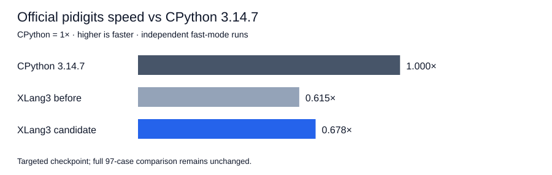

# Bigint division working buffers — 2026-10-07

Fresh official `pidigits`: previous XLang3 **263.436 ms**, candidate **239.171 ms**, CPython **3.14.7 162.087 ms**. The candidate is nominally **1.101× faster** than the previous XLang3 build, using **9.21% less time**. Its speed relative to CPython is **0.678×**, where CPython is 1×. XLang3 takes **1.476×** CPython's time.

## Change and ownership constraints

The previous generic bigint division cloned the already-owned dividend again, allocated a new remainder after every subtraction, and allocated a shifted divisor for every quotient bit. The candidate transfers the converted dividend into its remainder and mutates only the two private working buffers. No caller integer or borrowed operand view is changed. Operand conversion order remains unchanged, including callbacks that destroy the original left operand while converting the right operand. Negative floor division and remainder sign correction remain unchanged.

Performance comments beside the helpers and division entry point explain why private buffer reuse matters and which ownership constraints must survive future edits. This is generic runtime arithmetic; no CPython pure-Python library code was translated into C++.

## Correctness fixes found by the probe

The first baseline probe terminated with Windows status `3221225621` (`0xC0000095`): scalar `INT64_MIN / -1` attempted an overflowing signed hardware divide. Both runtime and VM paths now guard that boundary; the quotient promotes to bigint and the remainder is zero. The second probe recorded `divmod(bigint, 0)` raising `TypeError` because native arithmetic errors were cleared during special-method fallback. Intrinsic numeric zero divisors now preserve `ZeroDivisionError`. Both failed records are retained.

Validation passed: **363 core fixtures, 11 compatibility sections, 3 expected failures**, **8 C++/SDK/graph tests**, 432 signed Python division cases, and 36 C++ signed cases exercised with 108 output-alias combinations plus destructive conversion reentry. The final diagnostic validates 192 signed cases and scalar overflow/zero boundaries. The baseline diagnostic explicitly skips its two known failing boundaries, after retaining the failures; the timed operator workloads remain identical.

The candidate produced the exact same 2,000 pi digit bytes as CPython: SHA-256 `e7cb4bbb129d29f035c29cf1f088673788a82ebbbd61b466257e12ece4871aac`.

## Fixed gate and official measurement

The unchanged accepted Release baseline passed the complete default regression gate: 11 cases, 21 paired repeats, 5 warmups, 10% tolerance, exit 0. Baseline exe SHA-256 `a5f5028c15e145edce645a5afc25c11fbce77f51e882312b1fbe06e63c72a4af`; DLL `bc1b9c0a8086f7e6fb0c037516dc9c1eea20427fa887e3aa623714bc5ef5da8d`.

Official before, candidate and CPython runs used the same installed pidigits source, dependencies and compatibility hook. Both XLang3 measurements ran at `D:\CantorAI\xlang3\build-repro\main-verify-20261006\Release\xlang3.exe`; the preserved previous DLL was restored there for the before measurement, and the validated candidate DLL restored before the after measurement and again in controller cleanup. Native package hashes matched, and each timed phase verified unchanged binary hashes. No rebuild or concurrent measurement ran during these phases.

An old task-local stdin Python process was found consuming one CPU core with more than 18 hours of accumulated CPU time. It had no children or current live job handle and was terminated before new measurements. Its original stdin script cannot be recovered. Historical fast samples are retained and qualified; this checkpoint uses a fresh previous-build measurement instead of relying on their machine load.

These are independent fast-mode runs with stability warnings, not a paired significance result. Only affected official `pidigits` was rerun. The historical full 97-case comparison and its failures remain unchanged; these targeted results are not spliced into its aggregate.

## Isolated division diagnostics

Median of five samples, 1,000 operations each, including Python loop/assignment and builtin call overhead. “Gain” compares previous XLang3 to candidate. “vs CPython” uses CPython time / candidate time; greater than 1× means faster than CPython.

| Case | Before (µs) | Candidate (µs) | CPython 3.14.7 (µs) | Gain | vs CPython |
|---|---:|---:|---:|---:|---:|
| small-quotient-65-floor | 0.544 | 0.307 | 0.052 | 1.769× | 0.168× |
| small-quotient-65-divmod | 1.189 | 0.706 | 0.064 | 1.683× | 0.090× |
| wide-quotient-65-floor | 5.260 | 0.727 | 0.072 | 7.236× | 0.099× |
| wide-quotient-65-divmod | 10.886 | 1.594 | 0.089 | 6.829× | 0.056× |
| small-quotient-128-floor | 0.556 | 0.321 | 0.055 | 1.734× | 0.171× |
| small-quotient-128-divmod | 1.213 | 0.732 | 0.068 | 1.657× | 0.093× |
| wide-quotient-128-floor | 5.411 | 0.936 | 0.079 | 5.780× | 0.084× |
| wide-quotient-128-divmod | 11.249 | 2.093 | 0.107 | 5.375× | 0.051× |
| small-quotient-1024-floor | 0.821 | 0.499 | 0.145 | 1.644× | 0.290× |
| small-quotient-1024-divmod | 1.703 | 1.106 | 0.158 | 1.540× | 0.143× |
| wide-quotient-1024-floor | 8.243 | 3.389 | 0.227 | 2.432× | 0.067× |
| wide-quotient-1024-divmod | 16.794 | 6.966 | 0.245 | 2.411× | 0.035× |
| small-quotient-4096-floor | 1.373 | 0.965 | 0.525 | 1.423× | 0.543× |
| small-quotient-4096-divmod | 2.799 | 2.021 | 0.538 | 1.385× | 0.266× |
| wide-quotient-4096-floor | 18.281 | 10.188 | 0.807 | 1.794× | 0.079× |
| wide-quotient-4096-divmod | 36.719 | 20.275 | 0.820 | 1.811× | 0.040× |

## Raw evidence

[Checkpoint with binary/source/input hashes](data/bigint-division-working-buffer-checkpoint-20261007.json).

- [pyperformance-bigint-division-working-buffer-pidigits-before-fast-20261007.json](data/pyperformance-bigint-division-working-buffer-pidigits-before-fast-20261007.json)
- [pyperformance-bigint-division-working-buffer-pidigits-before-fast-20261007.log](data/pyperformance-bigint-division-working-buffer-pidigits-before-fast-20261007.log)
- [pyperformance-bigint-division-working-buffer-pidigits-before-fast-20261007-provenance.json](data/pyperformance-bigint-division-working-buffer-pidigits-before-fast-20261007-provenance.json)
- [pyperformance-bigint-division-working-buffer-pidigits-after-fast-20261007.json](data/pyperformance-bigint-division-working-buffer-pidigits-after-fast-20261007.json)
- [pyperformance-bigint-division-working-buffer-pidigits-after-fast-20261007.log](data/pyperformance-bigint-division-working-buffer-pidigits-after-fast-20261007.log)
- [pyperformance-bigint-division-working-buffer-pidigits-after-fast-20261007-provenance.json](data/pyperformance-bigint-division-working-buffer-pidigits-after-fast-20261007-provenance.json)
- [pyperformance-bigint-division-working-buffer-pidigits-cpython3147-fast-20261007.json](data/pyperformance-bigint-division-working-buffer-pidigits-cpython3147-fast-20261007.json)
- [pyperformance-bigint-division-working-buffer-pidigits-cpython3147-fast-20261007.log](data/pyperformance-bigint-division-working-buffer-pidigits-cpython3147-fast-20261007.log)
- [pyperformance-bigint-division-working-buffer-pidigits-cpython3147-fast-20261007-provenance.json](data/pyperformance-bigint-division-working-buffer-pidigits-cpython3147-fast-20261007-provenance.json)
- [bigint-division-leftover-process-20261007.json](data/bigint-division-leftover-process-20261007.json)
- [bigint-division-diagnostic-before-20261007.json](data/bigint-division-diagnostic-before-20261007.json)
- [bigint-division-diagnostic-before-r2-20261007.json](data/bigint-division-diagnostic-before-r2-20261007.json)
- [bigint-division-diagnostic-before-r3-20261007.json](data/bigint-division-diagnostic-before-r3-20261007.json)
- [bigint-division-diagnostic-after-r3-20261007.json](data/bigint-division-diagnostic-after-r3-20261007.json)
- [bigint-division-working-buffer-validation-20261007.json](data/bigint-division-working-buffer-validation-20261007.json)
- [bigint-division-working-buffer-validation-20261007-fixtures.log](data/bigint-division-working-buffer-validation-20261007-fixtures.log)
- [bigint-division-working-buffer-validation-20261007-cpp.log](data/bigint-division-working-buffer-validation-20261007-cpp.log)
- [release-bigint-division-working-buffer-fixed-gate-20261007.json](data/release-bigint-division-working-buffer-fixed-gate-20261007.json)
- [release-bigint-division-working-buffer-fixed-gate-20261007.log](data/release-bigint-division-working-buffer-fixed-gate-20261007.log)
- [pidigits-division-working-buffer-body-correctness-20261007.json](data/pidigits-division-working-buffer-body-correctness-20261007.json)
