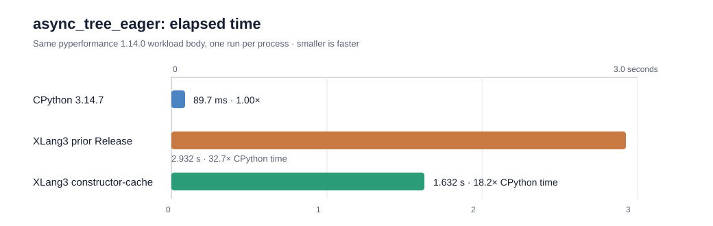

# `CALL_FUNCTION_EX` class-constructor cache: eager async tree

## Result

The Release candidate completed the unchanged pyperformance `async_tree_eager`
workload in a median **1.632 s**, down from **2.932 s** on the previous XLang3
Release candidate. A 21-pair order-balanced comparison measured candidate /
control at **0.5568×** (95% interval **0.5494–0.5587**), a repeatable **1.80×
speedup**. The official pyperformance 1.14.0 rigorous run measured **1.61 s ±
0.03 s** on the candidate. A separate 21-pair comparison with **CPython
3.14.7** measured **89.7 ms** for CPython and **1.629 s** for XLang3: XLang3 is
still **18.13× slower** (95% interval **17.89–18.50×**). The change materially
reduces this hotspot but does not meet the speed goal.

These direct measurements load the official pyperformance 1.14.0
`EagerAsyncTree` class and call its unchanged `run()` method once per process.
`measure_case_pair.py` adds only an in-process timer and a final timing line;
it alternates both runtime orders and verifies identical stdout. This provides
strong before/after evidence for the workload body. It is distinct from the
full pyperformance worker result, which must be rerun to refresh the complete
97-definition comparison.

## Diagnosis and change

The earlier instrumented VM profile recorded **65,318 class calls** through
`CALL_FUNCTION_EX` in one eager-tree workload: 55,987 `Task` calls and 9,331
`_GatheringFuture` calls. Repeated `CALL_FUNCTION_EX` sites already cached
ordinary Python function callees, but class calls repeated metaclass, `__new__`
and `__init__` resolution on every call.

The VM now caches the initializer for a repeated class call only after the
ordinary class path has resolved the call successfully. It only caches a
directly defined plain Python function or descriptor-bound native function.
The exact class identity, class version, metaclass identity and metaclass
version guard each hit. Argument binding and frame creation still happen on
every invocation. Inherited initializers and custom descriptors stay on the
generic path, and changing a class initializer invalidates the cache. The
design and fallback boundary are commented at the cache implementation in
[`xlang_vm_ops_call.h`](../../src/executor/xlang_vm/ops/xlang_vm_ops_call.h).

The new `call_ex_constructor_cache` fixture covers repeated starred
construction, replacement of a class's `__init__`, inherited initializer
mutation, and a descriptor whose `__get__` side effect must run every time.
Its output matches under XLang3 and CPython 3.14.7.

## Validation

- `xlang3_interpreter_tests.exe` passed.
- The new constructor-cache fixture passed and matched CPython 3.14.7.
- Official pyperformance 1.14.0 rigorous mode passed for `async_tree_eager` at
  **1.61 s ± 0.03 s**.
- All **11** cases in the fixed Release regression gate passed at 21 paired
  samples per case and five warmups. The `function_calls` case measured
  candidate / baseline **0.977×**; the full gate results are linked below.
- Release runtime DLL SHA-256:
  `74C62FEAA72F33CF2F4BA297D14DD1FA024A1A8D2D10558395549079F57CE43F`.
- All measurements used `C:\Python\Python314\python.exe` (Python 3.14.7) for
  the harness and CPython reference.

## Raw evidence

- [21-pair eager-tree before/after measurements](data/asyncio-call-ex-constructor-cache-eager-confirm-r21-20261004.json)
- [21-pair eager-tree comparison with CPython 3.14.7](data/asyncio-call-ex-constructor-cache-vs-cpython314-r21-20261004.json)
- [Official pyperformance 1.14.0 rigorous result](data/pyperformance-xlang3-async-tree-eager-call-ex-constructor-cache-rigorous-20261004.json)
- [Seven-pair triage measurement](data/asyncio-call-ex-constructor-cache-eager-triage-20261004.json)
- [Fixed Release regression gate](data/call-ex-constructor-cache-fixed-release-gate-rigorous-20261004.json)
