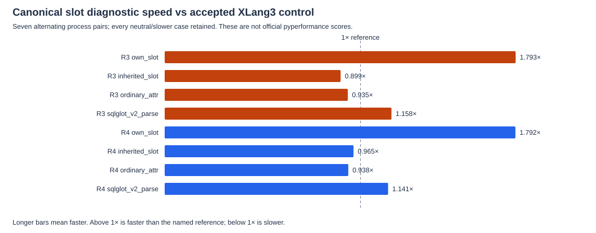
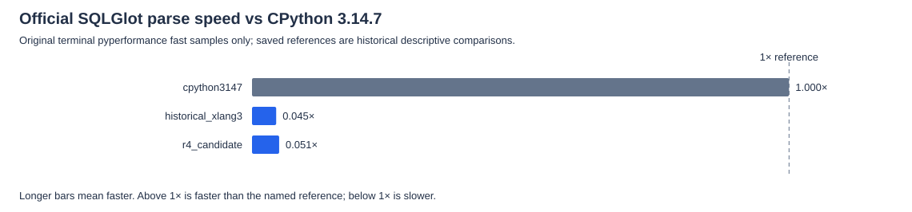

# Canonical slot read checkpoint — 2026-10-08

The runtime promotes proven initialized own slots to its existing class/version/index attribute cache. R4 also caches stable rejection of inherited, aliased and non-slot descriptor shapes. Missing/uninitialized storage, per-instance native hooks, invalid MRO and unsafe old owning cache values remain retryable. Changed descriptor installation clears weak property accessor flags before fresh guards and old-owner release. Owning Descriptor caches still clear on frame return. The Python benchmark/library code remains unchanged.

R3 was **rejected**: inherited-slot speed was **0.899×** the accepted XLang3 control, with **0/7** favorable pairs. Its own-slot improvement did not authorize acceptance. The original failed C++ run, repaired setup, complete rejected measurements, source snapshot and preserved Release manifest remain in the byte archive. R4 full validation status: **validated**. No acceptance is inferred from a diagnostic improvement alone.

Recorded full validation: 376 core fixtures, 11 compatibility sections and 3 expected-failure checks. 8 C++/SDK/graph tests are recorded; complete phase logs remain in the archive. The unchanged fixed gate passed: 11 cases, 21 paired repeats, five warmups and 10% tolerance.

## Paired diagnostics

Speed is reference time divided by runtime time: **1× means equal speed**, above 1× faster, below 1× slower. The control is the preserved accepted VM captured-lookup checkpoint. R3 and R4 CPython observations are separate five-sample references; they are never pooled into process pairs. Each XLang3 timing column is the median of seven process medians, with five samples per process. The paired speed column is the median of the seven within-pair ratios. CP-relative diagnostic speed is descriptive and unpaired.

All **600 raw samples** and **8 summary rows** remain, including inherited and ordinary controls. Both revisions use unchanged probes/work/checksums; SQLGlot uses its original body/input in a diagnostic runner. This does not score the full official benchmark or prove statistical significance.

| Revision | Case | CP reference ms | Control ms | Candidate ms | Paired speed vs control | Favorable pairs | Diagnostic speed vs CP |
|---|---|---:|---:|---:|---:|---:|---:|
| R3 | own_slot | 0.337 | 1.755 | 0.984 | 1.793× | 7/7 | 0.342× |
| R3 | inherited_slot | 0.322 | 1.762 | 1.961 | 0.899× | 0/7 | 0.164× |
| R3 | ordinary_attr | 0.327 | 1.025 | 1.089 | 0.935× | 0/7 | 0.301× |
| R3 | sqlglot_v2_parse | 0.977 | 21.351 | 18.558 | 1.158× | 7/7 | 0.053× |
| R4 | own_slot | 0.364 | 1.745 | 0.988 | 1.792× | 7/7 | 0.368× |
| R4 | inherited_slot | 0.306 | 1.781 | 1.834 | 0.965× | 1/7 | 0.167× |
| R4 | ordinary_attr | 0.317 | 1.019 | 1.087 | 0.938× | 1/7 | 0.291× |
| R4 | sqlglot_v2_parse | 1.003 | 21.479 | 19.020 | 1.141× | 7/7 | 0.053× |

R4 still has nominal slower controls: inherited reads are 0.965× with 1/7 favorable pairs, and ordinary reads are 0.938× with 1/7 favorable pairs. These results do not show that all regressions were eliminated. The ordinary attribute path warms InstanceAttr and bypasses descriptor eligibility; retain its unchanged no-regression gate. A change in its timing cannot be attributed to the negative marker from source inspection alone.

## Original official pyperformance

Only measured `values` from terminal original pyperformance JSON contribute here. Calibration and warmups remain in the raw archive but are excluded from means. The saved 20261007 full-fast CPython 3.14.7 and XLang3 references are historical; the historical XLang3 binary is **not** the accepted alternating-pair control. R4 appears only after successful terminal original SQLGlot validation with matching candidate hashes. Failed or partial candidate output is preserved without a speed score.

| Runtime/reference | Mean ms | Speed vs CPython 3.14.7 | Time vs CPython | Samples | Instability warning |
|---|---:|---:|---:|---:|---|
| cpython3147 | 0.9883 | 1.000× | 1.00× | 20 | False |
| historical_xlang3 | 21.9464 | 0.045× | 22.21× | 20 | True |
| r4_candidate | 19.5479 | 0.051× | 19.78× | 20 | True |

These reused official references give descriptive comparisons, not alternating official-pair significance. This checkpoint is not a new complete 97-case run or a whole-suite CPython win. No diagnostic, IR inspection, profiling or incomplete GC work is substituted for official scores.

## Evidence

- [Every diagnostic sample](data/canonical-slot-paired-samples-20261008.csv)
- [All diagnostic summary rows and per-pair ratios](data/canonical-slot-paired-summary-20261008.csv)
- [Original official measurement values](data/canonical-slot-official-samples-20261008.csv)
- [Official means, variation and speed ratios](data/canonical-slot-official-summary-20261008.csv)
- [Complete comparison, hashes and validation record](data/canonical-slot-checkpoint-comparison-20261008.json)
- [Byte-preserved raw sources/logs/results manifest](data/canonical-slot-20261008-sources/manifest.json)

All archived file copies retain their complete original bytes, with SHA-256 and lengths. Reference/control/candidate identities remain separate. Build and run paths stay fixed; benchmark comparison uses CPython 3.14.7 at `C:\Python\Python314\python.exe`.
