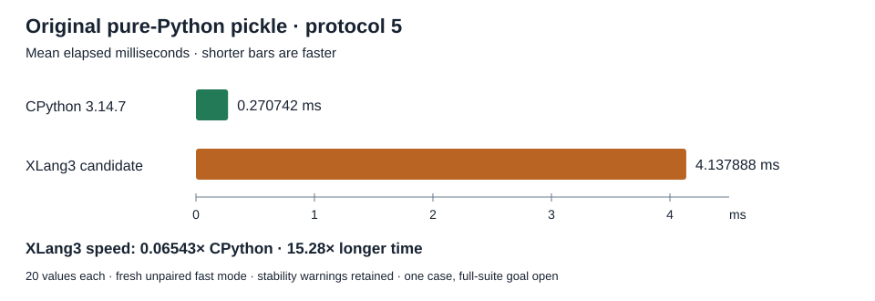

# Dictionary scalar append: runtime index trial

The candidate preserves an already-fresh runtime hash index across exact native integer/string insertion. In the preserved R4 build, each insertion left that index stale; a subsequent native `dict.get()` could hash every stored key again. The public DLL diagnostic reproduced 64 stale transitions and refreshed tables with 2,080 total entries. This is index-state evidence, not a measured speedup. [Investigation](pickle-memo-index-freshness-investigation-20261008.md).

The change remains in XLang3's generic dictionary runtime. CPython 3.14.7's `pickle.py` stays Python, and the benchmark continues to block `_pickle`. The executable remains `build-repro/main-verify-20261006/Release/xlang3.exe`.

## Safety and performance design

Only a previously complete runtime table may be extended. The new entry's location is appended to its hash bucket, with insertion order and the existing search/equality/overwrite paths preserved. Stale tables remain stale. Freshness counts are invalidated before allocation and restored after the authoritative entry and indexes are complete. Owned copies retain the container and incoming key/value through reallocation, including borrowed and entry-aliased arguments.

Integer flat-index growth can inspect a stored custom key's native attribute hook. Across that callback boundary, runtime freshness is restored only when a current positive intrinsic-key certificate excludes callback-bearing keys. Mixed dictionaries can extend their runtime buckets between growth boundaries. A negative intrinsic certificate remains negative. The runtime comments document both the avoided repeated rebuilding and these guard/publication requirements.

The first scratch proposal was held before application because it missed that growth boundary. The revised public C++ regression lets a native getter clear runtime buckets during flat growth and checks that the setter leaves them stale until an ordinary lookup rebuilds them.

## Actual candidate validation

| Check | Recorded state |
| --- | --- |
| Parent preservation | 114 recorded inputs and all 178 Release files preserved; fixed baseline177 unchanged |
| Release build | Succeeded at the existing build path |
| Registered C++ suite | Passed with final test helper |
| Affected Python fixtures | All nine passed with strict original output |
| Full correctness | 398 core / 11 compatibility sections / 3 expected failures passed; all 9 CTests and both native SQLite APIs passed |
| Paired original-body screen | Median 1.380379× faster than preserved R4; bootstrap 95% interval 1.345227×–1.398242×; all seven pairs favored candidate |
| Fixed regression gate | All 11 default cases passed, 21 repeats / 5 warmups / unchanged 10% threshold against the fixed accepted baseline |
| Original official benchmark | Both XLang3 and fresh CPython 3.14.7 completed all 20 fast-mode values; XLang3 remains 15.283507× slower on this case |

The first C++ run failed the new borrowed-reference test because its identifier string was auto-interned and immortal, while the assertion required a reference-count increase. The final test uses a mortal payload, explicitly checks mortality, and retains the exact ownership/refcount/alias/freshness assertions. The runtime DLL did not change during this test-only correction. The failed run is retained. [Failed run](data/dict-scalar-append-runtime-index-cpp-preliminary-20261008.json), [final focused checks](data/dict-scalar-append-runtime-index-r3-focused-20261008.json), [final build](data/dict-scalar-append-runtime-index-r3-build-terminal-20261008.json).

The initial full-fixture attempt inherited the benchmark's `PYTHONIOENCODING=utf-8`, overriding the default stream error settings checked by `sys_startup_config`. It stopped at that fixture. Clearing the override made the unchanged startup fixture pass; the subsequent clean full run completed successfully. Both attempts remain preserved. The full correctness runs occurred before the paired screen while timing was blocked; they validate the same recorded candidate, with no intervening engine changes. [Environment failure](data/dict-scalar-append-runtime-index-r3-full-fixtures-invalid-environment-20261008.json), [current correctness receipt](data/dict-scalar-append-runtime-index-r3-correctness-20261008.json).

The paired manager's actual preflight refused a live external `MSBuild.exe` worker (PID 32704). It launched zero timing children, retained the refusal, and verified no pinned hash drift. The existing process guard remains unchanged. This is a measurement blocker, not a failed speed result. [Timing preflight](data/dict-scalar-append-original-body-paired-preflight-20261008.json).

The external worker subsequently exited. With unchanged recorded inputs and Release files, the seven paired original-body runs completed: all 14 children passed byte-signature/roundtrip checks, all observed timing watches were valid, and final source/Release/control hashes matched. No sample was trimmed or replaced. The median ratio corresponds to about 27.56% less time. This establishes a useful signal against preserved XLang3 R4, not an official pyperformance score or a CPython win. [Actual paired result](data/dict-scalar-append-original-body-paired-20261008.json).

| Pair | R4 seconds | Candidate seconds | R4 / candidate speed |
| --- | ---: | ---: | ---: |
| 1 | 4.708640 | 3.294510 | 1.429238× |
| 2 | 4.373565 | 3.251172 | 1.345227× |
| 3 | 4.427386 | 3.342790 | 1.324458× |
| 4 | 4.785904 | 3.437864 | 1.392116× |
| 5 | 4.555914 | 3.258315 | 1.398242× |
| 6 | 4.544787 | 3.292419 | 1.380379× |
| 7 | 4.517893 | 3.342663 | 1.351585× |

The decision was frozen before application: seven alternating parent/candidate pairs of the unchanged original body, 2,460 dumps per child, retaining all 14 results. The median parent/candidate ratio must exceed 1.05 and its bootstrap 95% lower bound must exceed 1.0. Retention also requires complete correctness, the unchanged default11 gate against the fixed baseline (21 repeats, five warmups, 10% threshold), and the original official `pickle_pure_python` benchmark. A failed or missing gate prohibits an engine commit. A useful result on this case does not establish a full-suite CPython win.

The source inventory contains 115 recorded inputs, not every compiled repository source. The measured candidate continues to include the previously documented unowned dirty-build inputs. This trial does not repair the separately recorded numeric-subclass, generic callback-reentry or overwrite-publication defects.

## Fresh CPython 3.14.7 comparison

The final controller completed with status `trial_validated`, exit 0 and all recorded hashes unchanged. It reused the complete correctness results for the identical source115 / Release178 candidate, then ran the unchanged fixed gate and the original official `pickle_pure_python` benchmark on both runtimes. All observed process watches were valid. [Terminal validation](data/dict-scalar-append-runtime-index-r3-validation-20261008.json), [fixed gate](data/dict-scalar-append-runtime-index-r3-validation-20261008-fixed-gate.json).

| Runtime | Mean time | Sample standard deviation | Speed versus CPython | Time versus CPython |
| --- | ---: | ---: | ---: | ---: |
| CPython 3.14.7 | 0.270742 ms | 0.009241 ms | 1.000000× | 1.000000× |
| XLang3 candidate | 4.137888 ms | 0.084717 ms | 0.065430× | 15.283507× |

Speed = CPython time / XLang3 time: above 1× means faster, below 1× means slower. The time column uses the inverse ratio. Both runtimes use the same original benchmark definition, protocol 5, 20 inner dumps, compatibility hook and shared dependency site. `_pickle` is blocked and `pickle.py` stays Python. Pyperf calibrates outer loops independently (XLang3 2, CPython 32); reported values are normalized by those loops. [Raw XLang3 result](data/dict-scalar-append-runtime-index-r3-validation-20261008-official-xlang3-pickle-fast.json), [raw CPython result](data/dict-scalar-append-runtime-index-r3-validation-20261008-official-cpython3147-pickle-fast.json).

These are fresh, sequential, unpaired fast-mode official runs. Both emit a sample-stability warning, retained in their raw stdout. Their duration ratio describes this case; it is not an incremental speedup estimate or a complete 97-case result. The seven paired original-body runs establish the optimization's 1.38× gain against preserved XLang3 R4. The earlier R4 official 5.460743 ms and its saved CPython 0.257498 ms were a different comparison and must not be substituted for this fresh pair.

Fast arithmetic, indexed local variables and inexpensive `X::Value` operations do not guarantee fast combined Python workloads. This investigation identifies a concrete counterexample: dictionary append made a second index stale, so a following lookup could rescan the growing table. Preserving the table removes that repeated work, but the remaining call, attribute, container and allocation costs still need measurement. Earlier 6.33× arithmetic and 3.67× call improvements in the [August comparison](august-vs-current-python314-microbench-20261004.md) compare current XLang3 with August XLang3; they do not establish equivalent CPython wins.

Exact raw receipts, controllers, preserved proposals, parent/candidate recorded source snapshots and their SHA256 inventory are included in the [checkpoint publication manifest](data/dict-scalar-append-checkpoint-publication-20261008.json). The full-suite CPython performance goal remains open.
