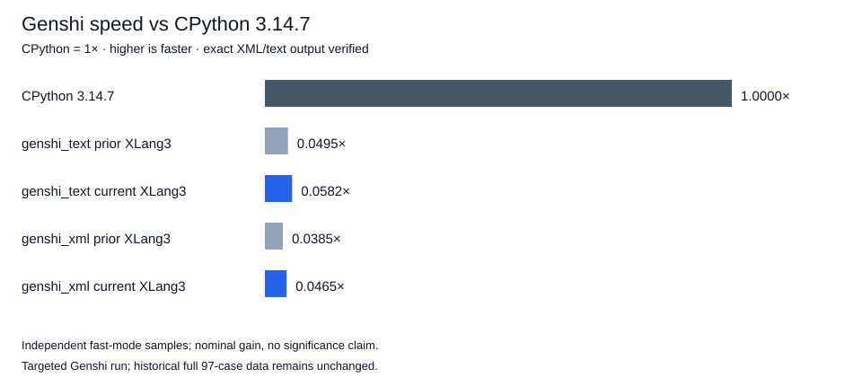

# Live eval namespaces and Genshi rendering — 2026-10-07

Explicit-dict `eval` now executes against the supplied globals instead of copying them into a synthetic module. Callback mutations, globals identity, and later reads by returned functions match CPython 3.14.7. Genshi and the Python library code remain unchanged; the work improves generic compiler/VM/runtime paths.

## Official Genshi comparison

| Case | Prior valid XLang3 | Current XLang3 | CPython 3.14.7 | Nominal gain | Speed vs CPython |
|---|---:|---:|---:|---:|---:|
| genshi_text | 411.791 ms | 349.834 ms | 20.375 ms | 1.177× (15.0% less time) | 0.0582× |
| genshi_xml | 1144.191 ms | 947.103 ms | 44.084 ms | 1.208× (17.2% less time) | 0.0465× |

Higher speed is better; CPython is 1×. XLang3 remains slower than CPython on both cases. These are independent fast-mode samples with stability warnings, so the gain is nominal. The prior sample is the already-valid XML checkpoint, not the incorrect 273-character result. Both current runtimes use the same official benchmark, dependency site, and compatibility hook. This targeted run is not a fresh full-suite result; the historical 97-case dataset remains unchanged.

Seven alternating-order pairs per variant, three complete renders per process, favor the candidate in all 14 pairs. Median body gain is **1.091× for text** and **1.045× for XML**. These exact-output-checked body probes corroborate the direction of improvement; they are diagnostics, not official pyperformance scores or a claim that the larger fast-mode gain is statistically established.

## Runtime design and comments

- The supplied dict remains live execution storage; exact-dict name hits use the existing string index without constructing a temporary Python string key. Misses retain the generic path and subclass hooks.
- Dict globals have no module version counter, so cached binding values are not reused across mutation. Explicit locals are consulted on each entry-code load and receive walrus writes; nested functions retain their normal live globals.
- Frames select and own their builtin namespace at entry. Functions use their captured namespace when the globals dictionary later replaces `__builtins__`; mutation of the captured dict remains visible.
- Dynamically compiled code resolves `len` as a callable before evaluating arguments. Its generic call keeps native-call specialization available and honors globals, locals, and custom builtins. Ordinary module lowering retains the existing Len instruction. The policy is fully represented in emitted IR and reset after lowering.
- `globals()`, function `__globals__`, frame `f_globals`/`f_locals`/`f_builtins`, and frame-local refresh preserve the corresponding live namespaces.
The code comments explain why snapshot copying and unversioned value caches are invalid, where indexed name lookup avoids allocation, and why captured builtins differ from live global bindings. This checkpoint covers the tested explicit-dict eval behavior; it does not assert complete eval/exec conformance.

## Validation

**366 core fixtures, 11 compatibility sections, 3 expected failures**, and **8 C++/SDK/graph tests** passed. The new fixture is generated against installed CPython **3.14.7** and covers callback/global mutation, namespace identity, source/AST custom len, captured builtin replacement/mutation, empty builtin dictionaries, callee evaluation order, walrus stores/loads, dynamic locals, and unwind after failure.

The complete fixed gate passed with exit 0: **11 cases, 21 paired repeats, 5 warmups, 10% tolerance**. Baseline hashes and thresholds are unchanged. Exact Genshi XML/text output hashes and 1,000 rows/10,000 cells remain identical to CPython.

The executable path remains `D:\CantorAI\xlang3\build-repro\main-verify-20261006\Release\xlang3.exe`. No build or competing measurement overlapped correctness/benchmark runs. Raw intermediate failing fixture checks are retained separately from final successful validation.

## Evidence

[Checkpoint with source/binary/input hashes](data/eval-live-namespace-checkpoint-20261007.json).

- [pyperformance-live-eval-genshi-xlang3-fast-20261007.json](data/pyperformance-live-eval-genshi-xlang3-fast-20261007.json)
- [pyperformance-live-eval-genshi-xlang3-fast-20261007.log](data/pyperformance-live-eval-genshi-xlang3-fast-20261007.log)
- [pyperformance-live-eval-genshi-xlang3-fast-20261007-provenance.json](data/pyperformance-live-eval-genshi-xlang3-fast-20261007-provenance.json)
- [pyperformance-live-eval-genshi-cpython3147-fast-20261007.json](data/pyperformance-live-eval-genshi-cpython3147-fast-20261007.json)
- [pyperformance-live-eval-genshi-cpython3147-fast-20261007.log](data/pyperformance-live-eval-genshi-cpython3147-fast-20261007.log)
- [pyperformance-live-eval-genshi-cpython3147-fast-20261007-provenance.json](data/pyperformance-live-eval-genshi-cpython3147-fast-20261007-provenance.json)
- [eval-live-namespace-validation-r3-20261007.json](data/eval-live-namespace-validation-r3-20261007.json)
- [eval-live-namespace-validation-r3-20261007-fixtures.log](data/eval-live-namespace-validation-r3-20261007-fixtures.log)
- [eval-live-namespace-validation-r3-20261007-cpp.log](data/eval-live-namespace-validation-r3-20261007-cpp.log)
- [release-live-eval-fixed-gate-20261007.json](data/release-live-eval-fixed-gate-20261007.json)
- [release-live-eval-fixed-gate-20261007.log](data/release-live-eval-fixed-gate-20261007.log)
- [eval-live-namespace-genshi-correctness-20261007.json](data/eval-live-namespace-genshi-correctness-20261007.json)
- [pyperformance-pyexpat-namespace-genshi-final-xlang3-fast-20261007.json](data/pyperformance-pyexpat-namespace-genshi-final-xlang3-fast-20261007.json)
- [eval-live-namespace-baseline-20261007.json](data/eval-live-namespace-baseline-20261007.json)
- [eval-live-namespace-trial-precheck-20261007.json](data/eval-live-namespace-trial-precheck-20261007.json)
- [eval-live-namespace-trial-precheck-r2-20261007.json](data/eval-live-namespace-trial-precheck-r2-20261007.json)
- [eval-live-namespace-validation-20261007.json](data/eval-live-namespace-validation-20261007.json)
- [eval-live-namespace-validation-r2-20261007.json](data/eval-live-namespace-validation-r2-20261007.json)

- [Alternating-order paired body runs](data/eval-live-namespace-genshi-paired-body-20261007.json)
