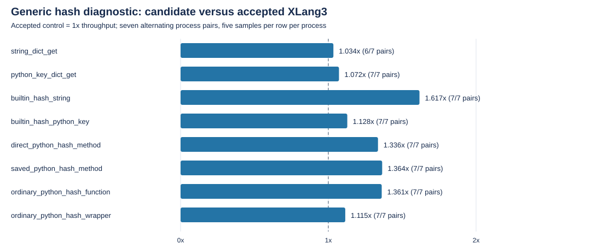
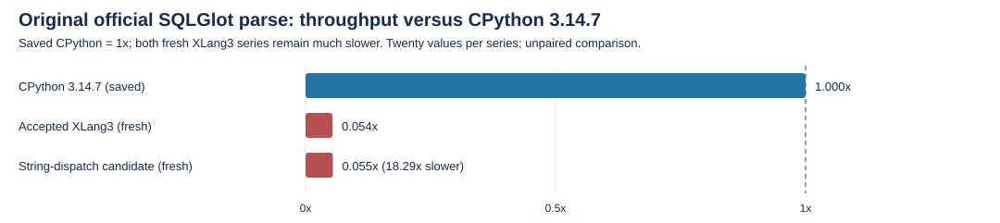

# Exact string hash dispatch evidence — 2026-10-08

The cached-string `hash()` diagnostic improved **1.617x** versus the accepted XLang3 control. The original official SQLGlot parse comparison is **neutral**: its nominal control/candidate ratio is 1.0159x, with candidate CV 5.69% and an instability warning. This is a focused runtime improvement, with no whole-suite or CPython win claim.

Exact StringObject hashing now reads the existing immutable hash cache before integer-payload conversion. This avoids four guaranteed failed generic attribute lookups. Python str subclasses, numeric payload instances and their callbacks retain the ordinary path. No Python library body was replaced.

Speed convention: 1x is equal throughput; greater than 1x is faster. Diagnostic ratios use the median of seven control/candidate ratios, each based on the five within-process samples. All eight rows, 560 paired values and 40 historical CPython values are retained; no outlier is removed. CPython diagnostic references are historical and unpaired.

| Diagnostic path | CP historical us/op | Control us/op | Candidate us/op | Paired speed, control=1x | Faster pairs |
|---|---:|---:|---:|---:|---:|
| string_dict_get | 0.0312 | 0.0990 | 0.0959 | 1.034x | 6/7 |
| python_key_dict_get | 0.0807 | 3.0680 | 2.8700 | 1.072x | 7/7 |
| builtin_hash_string | 0.0509 | 0.6186 | 0.3810 | 1.617x | 7/7 |
| builtin_hash_python_key | 0.1044 | 2.2687 | 2.0076 | 1.128x | 7/7 |
| direct_python_hash_method | 0.0656 | 1.0151 | 0.7598 | 1.336x | 7/7 |
| saved_python_hash_method | 0.0668 | 0.9820 | 0.7179 | 1.364x | 7/7 |
| ordinary_python_hash_function | 0.0671 | 0.9988 | 0.7378 | 1.361x | 7/7 |
| ordinary_python_hash_wrapper | 0.1185 | 2.6262 | 2.3600 | 1.115x | 7/7 |

The string dictionary lookup is a comparison control; one of seven pairs was slower despite the nominal median above 1x. Improvements in Python-key rows include their original Python call/frame work, not isolated native primitive time.

| Original sqlglot_v2_parse | Mean +/- SD (ms) | CV | Max (ms) | Values |
|---|---:|---:|---:|---:|
| cpython3147_saved | 0.9883 +/- 0.0108 | 1.09% | 1.0050 | 20 |
| control | 18.3641 +/- 0.3682 | 2.00% | 19.5007 | 20 |
| candidate | 18.0767 +/- 1.0283 | 5.69% | 22.2379 | 20 |

The candidate remains **18.29x slower** than saved CPython 3.14.7 on the original official parse case (0.055x throughput). Both fresh XLang3 logs retain pyperf's instability warnings. Fresh control/candidate official runs are sequential, unpaired series; the ~1.59% nominal difference is not evidence of a meaningful end-to-end gain.

Scope and provenance: the accepted control is the preserved 9de05e0d checkpoint. The candidate is the String-dispatch build with already pending SQLite R5/R6 work; this report does not attribute an entire runtime comparison to one source hunk. Receipts identify the exact timed EXE/DLL bytes even after the fixed live build path is rebuilt. The control official receipt also hashes the current workspace String candidate source; that entry is not claimed as the source compiled into the control binary.

Correctness status at this component measurement: CPython passed the unchanged five-group hash fixture. The accepted XLang3 control passed its first three groups and failed preservation of a custom __hash__ exception. That pre-existing failure is retained, and a separate exception-preservation proposal addresses it without weakening the fixture. Combined correctness/gate validation belongs to the later combined checkpoint; this component report is not an accepted complete checkpoint.

[Raw paired receipt](data/exact-string-hash-dispatch-20261008-sources/doc/performance/data/exact-string-hash-paired-20261008.json) · [Exact compiled String source](data/exact-string-hash-dispatch-20261008-sources/compiled-string-source/value_hash.cpp)

The archive preserves explicit source, scripts, JSON receipts and full log bytes without trimming. Official values come only from terminal original pyperformance JSON; diagnostic values and historical CPython references remain separate.
