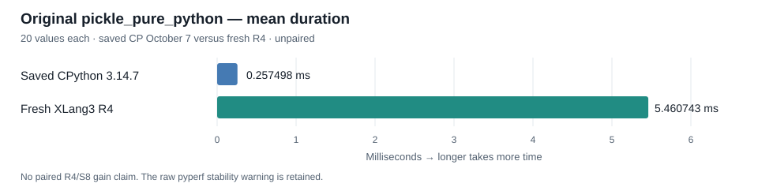

# Frame locals retirement checkpoint — October 8, 2026

The repair updates an already materialized `f_locals` dictionary when its physical function frame returns or unwinds. A frame captured before later assignments previously kept its early dictionary after retirement. The unchanged CPython reference passed while preserved S8 failed; the repaired build passes the original four-group fixture, retained-mapping and extra-key cases, and the public C++ ownership checks. [Original reference](data/runtime-frame-context-cpython3147-s8-correctness-r2-20261008.json), [retained/extra references](data/frame-locals-retained-cpython3147-s8-reference-20261008.json), [current focused result](data/frame-locals-retirement-r4-focused-20261008.json).

Retirement builds an owned final dictionary before swapping entries into the retained mapping. It removes deleted local names, preserves extra keys outside the function's visible local names, and invalidates all affected dictionary indexes. Displaced owners retire after the frame registry is unlocked, allowing finalizer reentry. Module/eval namespace aliases and logical frame projections keep their existing paths. This is a bounded retirement repair: automatic live proxy updates between arbitrary assignments, repeated recapture identity, optimized free/cell writeback, and complete CPython `FrameLocalsProxy` behavior remain outside its scope. [Reviewed proposal and ownership proof](data/frame-locals-retirement-r4-checkpoint-20261008/frame-locals-retirement-r4-proposed-20261008-provenance.json).

The fixed Release build completed successfully. Its current ten focused phases were required as a prerequisite; the following cross-suite checks then ran fresh, without reusing S8 correctness results. [Build record](data/frame-locals-retirement-r4-build-terminal-20261008.json), [full validation](data/frame-locals-retirement-r4-full-validation-20261008.json).

| Check | Actual result |
| --- | --- |
| Current focused checks | All 10 passed, including original4/retained1/extra1 and C++ lifetime/alias coverage |
| Core, compatibility, expected failures | 398 / 11 sections / 3 passed |
| Registered CTests and SQLite APIs | All 9 CTests and both APIs passed |
| Fixed accepted baseline gate | Exit 0; unchanged 11 cases, 21 repeats, 5 warmups, 10% threshold |
| Original `pickle_pure_python` | Complete 20 values; protocol 5, `inner_loops=20`, original `--pure-python` definition |
| Integrity | Current 111 recorded source files, Release178, fixed baseline177 and preserved parent tree unchanged |

The original benchmark still shows a large performance gap. Its pinned Python setup blocks `_pickle` and rejects accelerated pickle. Both rows below contain 20 values; CPython's row is saved October 7 evidence and the R4 row is fresh, so this is an unpaired comparison. The pyperf stability warning remains in the [raw output](data/frame-locals-retirement-r4-full-validation-20261008-official-pickle-pure-python.stdout.log).

| Original benchmark | Saved CPython 3.14.7 mean | Fresh XLang3 R4 mean ± sample SD | CP/X speed |
| --- | ---: | ---: | ---: |
| `pickle_pure_python` | 0.257498 ms | 5.460743 ± 0.117816 ms | 0.047154× |

XLang3 takes 21.20694 times the saved CPython time. No paired R4-versus-S8 gain was measured, and no new full97 result or overall CPython parity is claimed. [Saved CP row](data/pyperformance-cpython3147-live-eval-full-fast-20261007.json), [fresh official row and metadata](data/frame-locals-retirement-r4-full-validation-20261008-official-pickle-pure-python-fast.json), [gate report](data/frame-locals-retirement-r4-full-validation-20261008-fixed-gate.json). Both timing watchers reported no observed overlap or scanner errors; their raw one-second observations are preserved, including the documented between-poll limitation.

The 111 recorded source files are pinned by the [registered source inventory](data/frame-locals-retirement-r4-registered-source-20261008.json). The owned commit consists of `src/runtime/runtime.cpp`, its new public C++ helper, and the helper's registration in `tests/cpp/interpreter_tests.cpp`. The measured build also contains preserved pre-existing local dirty bytes; clean main plus these three files alone is not claimed to reproduce the measured DLL byte for byte. The accepted source snapshot and Release178 are preserved locally, with their [hash-only manifest](data/frame-locals-retirement-r4-checkpoint-20261008/validated-control-manifest.json); binaries are excluded from Git publication. The [publication manifest](data/frame-locals-retirement-r4-checkpoint-20261008/publication-manifest.json) pins every archived inspection source, controller, reference and raw result without rewriting their bytes.
