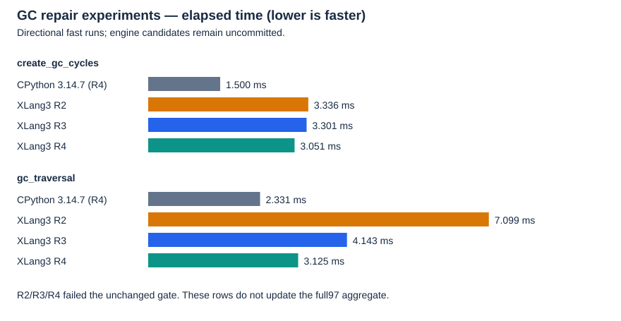
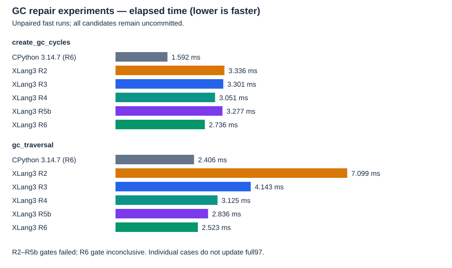

# Generic cycle discovery and scan cost, 2026-10-09

Ordinary unreachable instance/container cycles were missing from XLang3's collector discovery. The candidate adds a generic owning-edge graph pass and passes fresh correctness validation, but R2, R3, R4 and R5b fail the unchanged fixed performance gate, and R6 is inconclusive. R6 reduces original traversal time to 2.523 ms from the first repaired version's 7.099 ms across separate fast runs. It remains slower than its fresh CPython 3.14.7 reference and is uncommitted. No engine acceptance or whole-suite speed win is established by these results.

The existing accepted `95feaff2` engine and fixed `build-repro/Release` baseline remain preserved. GitHub `aef4dc0b` records the original independent missing-cycle reproduction and the previously rejected frame-context experiment. The generic GC candidate remains uncommitted.

## Repair and ownership rules

The specialized class/weakref/native collector did not enumerate the generic tracked list/instance heap. The new private `gc_plain_cycles.h` pass snapshots supported storage objects under VM serialization, counts their owning edges, and propagates external-root reachability. It subtracts exactly one snapshot pin per object. Borrowed Values contribute no incoming ownership; repeated owning references contribute their entire multiplicity. Modules, frames, functions and native payloads retain external ownership through their refcounts.

Weakrefs, finalizers, native instance payloads and opaque cleanup owners are conservative boundaries. The pass propagates those boundaries backward before clearing any storage. It allocates retirement capacity before mutation, publishes the complete empty graph and coherent container indexes, then releases moved ownership while class metadata remains pinned. The outer collection guard prevents cleanup from reentering collection. Unsynchronized builds with global VM locking disabled do not use the new graph pass. This is not a claim of complete native/finalizer cycle collection parity.

All Python library bodies remain Python. This is a generic runtime repair in XLang3's own native `gc` module, not a native translation of a pure-Python library or reuse of CPython's DLLs.

## Measurements so far

Each version runs the complete unchanged 11-case fixed Release gate: 21 repeats, five warmups, 10% tolerance, original case source hashes. The gate retains its fresh regression confirmation. Every affected original benchmark runs afterward, including when the gate fails. Original `gc_collect` and `gc_traversal` definitions run through the same shared dependency site and runner in CPython 3.14.7 and XLang3, fast mode, 20 scored values per case. These are separate directional fast runs, not paired confidence intervals or a new full97 aggregate.

| Version | Graph work | Fixed gate: GC candidate/baseline time | Gate result |
| --- | --- | ---: | --- |
| R2 | Lookup each owning edge; rescan storage for reachability | 3.438× | Failed |
| R3 | Group consecutive equal owning targets; preserve multiplicity | 1.791× | Failed |
| R4 | Also reuse unique forward adjacency for reachability | 1.412× | Failed |
| R5b | Also compare bounded groups of four equal owning Values using SSE2 on x86-64 | 1.220× | Failed |
| R6 | Also store unique adjacency in one contiguous indexed edge buffer | 1.117× | Inconclusive |

| Original benchmark | R2 CPython 3.14.7 | R2 XLang3 | R3 CPython 3.14.7 | R3 XLang3 |
| --- | ---: | ---: | ---: | ---: |
| `create_gc_cycles` (definition `gc_collect`) | 1.5255 ms | 3.3363 ms | 1.5173 ms | 3.3011 ms |
| `gc_traversal` | 2.3086 ms | 7.0990 ms | 2.3336 ms | 4.1426 ms |

Grouping reduces observed traversal time by about 1.714× against the repaired R2 XLang3, but R3 still takes about 1.775× its fresh CPython reference's time. Cycle creation/collection remains about 2.176× CPython's time. No engine change can be committed while the fixed gate fails or remains missing.

| Original benchmark, R4 fresh fast runs | CPython 3.14.7 | XLang3 R4 | CPython time / XLang3 time |
| --- | ---: | ---: | ---: |
| `create_gc_cycles` | 1.4999 ms | 3.0506 ms | 0.492× |
| `gc_traversal` | 2.3313 ms | 3.1251 ms | 0.746× |

The speed ratio is CPython time divided by XLang3 time: above 1× favors XLang3, below 1× favors CPython. R4 takes about 2.034× CPython's cycle creation/collection time and 1.341× its traversal time. R2-to-R4 traversal improves nominally by 2.272× across separate runs; this is not a paired statistical claim. R4's complete gate also retains an inconclusive `list_append` result at nominal 0.996× candidate/baseline time, alongside the confirmed GC regression. Neither result is a gate pass.

[All 240 original scored values](data/gc-generic-cycles-r2-r3-r4-scored-values-20261009.csv) retain each version's own CPython reference and XLang3 run.

R4 removes the second storage scan: unique forward edges are captured alongside reverse edges during counting, and reachability visits those edges. Counting still includes every owning reference, and retirement still moves every stored Value. Comments in the helper explain why reachability deduplication must not become ownership deduplication.

| Original benchmark, R5b fresh fast runs | CPython 3.14.7 | XLang3 R5b | CPython time / XLang3 time |
| --- | ---: | ---: | ---: |
| `create_gc_cycles` | 1.5733 ms | 3.2767 ms | 0.480× |
| `gc_traversal` | 2.5858 ms | 2.8360 ms | 0.912× |

R5b's fresh CPython traversal values have substantial variability (sample standard deviation 0.3353 ms); the ratio is directional, not a significant win or a paired result. Its fixed gate confirms the GC regression; the other ten gate cases pass. The R5b engine is unchanged from the first R5 build, while the test checks child-list size before reading its first element, so a broken reachability implementation produces an assertion rather than undefined behavior.

| Original benchmark, R6 fresh fast runs | CPython 3.14.7 | XLang3 R6 | CPython time / XLang3 time |
| --- | ---: | ---: | ---: |
| `create_gc_cycles` | 1.5915 ms | 2.7362 ms | 0.582× |
| `gc_traversal` | 2.4061 ms | 2.5227 ms | 0.954× |

R6's first GC gate attempt confirms a regression at 1.142× (95% interval 1.117–1.163×). Its fresh confirmation is inconclusive at 1.117× (1.085–1.168×), crossing the unchanged 1.10 acceptance boundary. The complete gate therefore exits 2; the other ten cases pass. All three measured phases have valid activity observations and unchanged source/binary pins. The two original definitions complete on both runtimes with all 80 scored values retained. Neither the near-CPython traversal ratio nor the inconclusive gate is an accepted win.

[All 400 original scored values through R6](data/gc-generic-cycles-r2-r6-scored-values-20261009.csv) retain each version's own CPython reference; [all 520 instrumented phase rows](data/gc-generic-cycles-r4-r5b-phase-values-20261009.csv) remain separate from official scores.

The packed-run helper checks the complete 16-byte Value representation, including flags, and admits only non-null owning object references. Four unaligned SSE2 loads occur only within the sequence bounds. Scalar tails, mixed elements and other architectures retain the ordinary path. Equal owning references still add their full multiplicity; borrowed lanes are never converted into owners. C++ fixtures cover short and long runs, boundary tails, borrowed/scalar interruptions, externally rooted descendants and tuple/list cycles.

## Phase attribution and current experiment

The temporary R4 and R5b diagnostics have now completed on idle observation windows. Five fresh processes each execute the unchanged fixed GC workload's four collections. The table contains median phase durations across 20 collections per version. These are instrumented diagnostic timings, not official benchmark scores or performance-gate acceptance. Printing is excluded from the next individual phase; the enclosing `plain_total` includes diagnostic output, so phase medians must not be added to reconstruct a scored total.

| Phase, median microseconds | R4 | R5b |
| --- | ---: | ---: |
| Existing specialized collector | 1417.50 | 1312.05 |
| Generic snapshot | 37.45 | 30.25 |
| Generic node construction | 96.40 | 80.30 |
| Generic owning-edge scan | 1012.00 | 643.80 |
| Generic reachability | 9.05 | 8.00 |
| Generic graph teardown | 50.70 | 50.55 |
| Generic snapshot release | 21.05 | 17.95 |
| Enclosing generic pass, including diagnostic output | 1483.95 | 1056.45 |

The owning-edge scan remains the largest individual phase of the new pass. Cached reachability is already a small cost in this workload. R6 therefore changes adjacency construction: one vector stores unique edges and integer links to each source's children and target's parents. It reserves initial capacity, avoids separate growing vectors per node, and preserves the ownership counts, unsafe backward closure and external-root forward closure. Links identify vector positions and survive vector reallocation; they point to earlier indices or the end sentinel. Code comments record both the allocation rationale and the distinction between unique topology and ownership multiplicity.

R6 source142/Release178 are preserved after its terminal measurements. The next R7 experiment replaces per-node pointer-hash allocations with a local bounded registry-index table. It checks actual pointer identity and lazily rebuilds the exact pointer map on any lookup mismatch. Sparse or untracked indexes select hashing immediately. Snapshot pins keep objects alive but do not freeze indexes: another thread's cached-zero-object teardown may compact the registry. Synthetic unregistered-header tests exercise that movement without corrupting the live registry, along with weakref-bit masking, index collisions, huge sparse slots, missing objects and an empty graph. R7 has compiled; correctness and performance validation remain pending. Its proposed mechanism is not scored as a gain.

## Correctness and provenance

R2, R3, R4, R5b and R6 each pass fresh CPython/XLang3 oracle transcripts, 406 core fixtures, 11 compatibility sections, three expected-failure checks, nine selected CTests and both SQLite API checks. Tests cover unseeded instance/list/dict/mixed/slotted/cell cycles, duplicate ownership, borrowed refs, external native roots, another thread's VM root, opaque cleanup boundaries and pending/handled exception identity. Fixture identity checks use a non-owning marker in addition to addresses, avoiding a false failure when `gc.get_objects()` allocates a list at a reclaimed address.

The first R2 attempt had a C++ test link failure from using an internal unexported snapshot helper. The integration repair tests through registered `gc.get_objects()` instead, without introducing a new export; collection sequencing is explicit. The earlier failed build inputs and raw log remain available. No benchmark ran on that failed build.

Before each subsequent engine edit, complete Release178 and source142 maps were authenticated and copied into separate controls. R2 and R3 controls are correctness-passing, performance-failing experimental controls, not accepted baselines. The fixed baseline177 was unchanged throughout. These are selected-source inventories from a dirty worktree; they do not prove a clean-checkout reproduction. Unrelated working files were protected rather than included in the engine change.

R4's first timing launch was refused before any phase because another project's `ctest.exe` and reusable `MSBuild.exe` worker were present. Its invalid/preflight receipt is retained. The follow-up waiter was stopped before launching timing; only the owned waiting manager was terminated, not another project's process. The reusable worker had an exited parent and unchanged CPU counters. An activity-aware watcher was prepared to admit only that exact dormant identity, checking cumulative CPU counters, children and parent presence throughout each phase. The worker exited before admission, so **no dormant-worker exception was used in the actual R4 timing**. All observed build/test tools still invalidate that capture; original gate workloads and settings are unchanged.

After the terminal R4 measurements, exact source142/Release178 were preserved before a temporary diagnostic added phase clocks to the collector. Two initial attempts were refused before launching any child because the other project's tests restarted. A later activity-guarded window completed the diagnostic. Exact normal R4 sources and binaries were restored; a late exit-callback `__file__` metadata error prevented the restoration receipt from being written, so an independent receipt authenticated the already completed restoration without repeating the measurements. R5b's subsequent diagnostic completed and restored its normal source142/Release178 automatically. Its callback captures the controller hash before interpreter shutdown. Temporary stderr instrumentation is inactive in the current R6 build.

R6's first readiness waiter launched no measurement phase and was stopped only to update admission from an exited cached-worker identity to the current orphaned MSBuild worker. The same guard requires an absent parent, stable identity and cumulative CPU counters, no new children, and no other observed build/test activity. It does not reset counters between measured phases. The current activity manager retains the original gate and benchmark settings.

## Evidence

- R2: [application](data/gc-generic-cycles-applied-source-r2-20261009.json), [successful build](data/gc-generic-cycles-build-r2-20261009.json), [correctness](data/gc-generic-cycles-correctness-20261009.json), [gate and original scores](data/gc-generic-cycles-performance-20261009.json).
- R3: [application](data/gc-generic-cycles-applied-source-r3-20261009.json), [build](data/gc-generic-cycles-build-r3-20261009.json), [correctness](data/gc-generic-cycles-correctness-r3-20261009.json), [gate and original scores](data/gc-generic-cycles-performance-r3-20261009.json).
- R4: [application](data/gc-generic-cycles-applied-source-r4-20261009.json), [build](data/gc-generic-cycles-build-r4-20261009.json), [correctness](data/gc-generic-cycles-correctness-r4-20261009.json), [initial preflight refusal](data/gc-generic-cycles-performance-r4-20261009.json).
- R4 terminal [gate and original scores](data/gc-generic-cycles-performance-r4-activity-20261009.json), [independent static review](data/gc-generic-cycles-r4-static-review-20261009.json), [stopped pre-timing wait](data/gc-generic-cycles-performance-r4-idle-wait-stopped-20261009.json).
- Temporary diagnostic [application](data/gc-generic-cycles-phase-diagnostic-applied-20261009.json), [build](data/gc-generic-cycles-phase-diagnostic-build-20261009.json), [first refusal](data/gc-generic-cycles-phase-diagnostic-20261009.json), [second refusal](data/gc-generic-cycles-phase-diagnostic-idle-20261009.json), [exact R4 restoration](data/gc-generic-cycles-r4-restored-after-diagnostic-refusals-20261009.json).
- Completed R4 [phase diagnostic](data/gc-generic-cycles-phase-diagnostic-window-20261009.json) and [independent restoration verification](data/gc-generic-cycles-phase-window-restoration-verified-20261009.json).
- R5b [application](data/gc-generic-cycles-applied-source-r5b-20261009.json), [build](data/gc-generic-cycles-build-r5b-20261009.json), [correctness](data/gc-generic-cycles-correctness-r5b-20261009.json), [gate and original scores](data/gc-generic-cycles-performance-r5b-20261009.json), [phase diagnostic](data/gc-generic-cycles-r5b-phase-diagnostic-20261009.json), [normal restoration](data/gc-generic-cycles-r5b-after-phase-restored-20261009.json).
- R6 [application](data/gc-generic-cycles-applied-source-r6-20261009.json), [build](data/gc-generic-cycles-build-r6-20261009.json), [fresh correctness](data/gc-generic-cycles-correctness-r6-20261009.json), [stopped pre-timing wait](data/gc-generic-cycles-performance-r6-pre-timing-wait-stopped-20261009.json).
- R6 terminal [gate and original scores](data/gc-generic-cycles-performance-r6-activity-20261009.json).

The earlier full97 report is unchanged: individual repaired GC results do not turn its recorded failures into completed cases. The overall performance goal remains unfinished. Completed phase attribution, R5b's measured scan change, and R6's fresh correctness are concrete progress; they do not establish goal completion.
