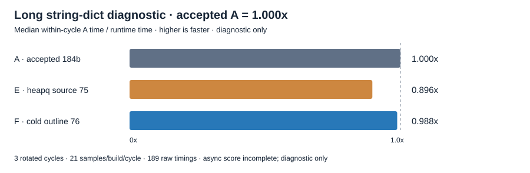
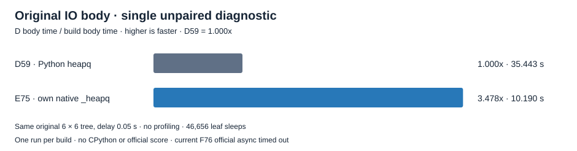

Checkpoint evidence: own _heapq and cold VM metadata, October 8, 2026

Source76 passed full correctness and the fixed performance gate. The original
async_tree_io benchmark then timed out at its unchanged 300-second full-case cap;
the terminal outer receipt is **failed_full_validation**, not fully validated.
There is no completed async score or overall CPython speed win. This report
records evidence; engine acceptance and staging remain root decisions.

XLang3 now supplies its own native `_heapq`, preserving the import/API boundary
used by the unchanged Python `heapq.py`. The six component targets cover the
native implementation, builtin registration, existing build source list, and
public C++ proof registration. Exact CPython 3.14.7 comparison passed 12 fixture
groups and 6 deterministic comparison trace/digest rows. The freshly built F
candidate also passed those same outputs, the unchanged 7-group constructor
lifetime fixture, and the complete existing interpreter C++ target. This is
the focused reference result; the resumed full correctness and gate are recorded below.

The second component moves 232 cold metadata-proof lines into the existing
xlang_interpreter.cpp compilation unit. The cached atomic owner check stays
inline. The moved body is identical after indentation normalization, including
LoadException ownership retirement, handler-bypass rejection, inner-loop carry
protection, metadata publication/CAS retry, and all strict lifetime tests.
Comments explain why cold proof growth belongs outside the dispatch translation
unit. The two component targets change no IR format, class/frame storage layout,
dictionary algorithm, CMake registration, or Python library source.

The source-backed investigation found no LoadException in the actual dictionary
diagnostic IR and no changed liveness/argument-transfer behavior. The C/D native
comparison found a 48-byte run_function address shift, unchanged 99,744-byte span,
and 92-byte growth in the cold proof. Its first 19,862 instructions through byte
99,148 match relative offsets and structure **after external 64-bit address
normalization**; 149 switch-table targets also retain relative destinations.
There are 5,407 raw differences in that prefix. This is not byte identity or proof
of a specific CPU mechanism. It motivated the controlled cold-body separation.

The chart is the unchanged string_dict_get long diagnostic, with accepted A as
1.000x. Each child uses 262,144 operations per sample, 16,384 warmup operations,
and 21 samples; 3 rotated A/E/F cycles retain 189 raw timings. Values below 1x are
slower than accepted A. These are XLang3 build comparisons, not whole
pyperformance scores or CPython ratios.

| Paired comparison | Median speed | Three within-cycle ratios |
|---|---:|---|
| E relative to accepted A |0.896256x |0.911985,0.896256,0.890856 |
| F relative to accepted A |0.987997x |1.012390,0.987997,0.974817 |
| F relative to E |1.102360x |1.110095,1.102360,1.094248 |

F recovers most of the measured E slowdown. F is still approximately 1.2% slower
than accepted A by this median; its three cycles straddle 1x. The comparison
does not isolate every linker/compiler effect or establish an overall runtime
win. All raw values and split stdout/stderr are retained without trimming.

One unprofiled original IOAsyncTree(False) body completed in 35.442885 seconds on
preserved D59, where _heapq was absent and unchanged heapq.py supplied Python
heappush/heappop. A separate saved E75 run with XLang3's own native _heapq took
10.190379 seconds, an observed D/E ratio of 3.478073x. Both used the unchanged
6-level, 6-branch, 0.05-second-delay tree with 46,656 leaf sleeps, including one
asyncio.run loop setup/teardown, and identical Python workload/library hashes.

This supports a material native-module improvement on that original body, but
it is a single unpaired build comparison. It is not an official pyperformance
score, a CPython comparison, a measurement of F76, or isolation of all compiler
and layout effects. D itself was a correctness-passing, performance-held build.

The first full-validation attempt passed 11 focused checks and all nine CTests,
then an idle guard stopped it when external CMake/MSBuild appeared. Its failed
receipts remain unchanged. The resumed controller reused exactly 13 passed rows
only after checking matching commands, source/binary hashes and raw output/logs;
it did not relabel that original interruption as a successful full run.

The resumed inner validation passed both direct SQLite APIs, 386 core fixtures,
11 compatibility sections and 3 expected failures. The unchanged 11-case,
21-repeat, five-warmup fixed gate exited 0. Original SQLite and SQLGlot fast runs
each completed with all 20 raw values. These are completed checks of source76.

The final original async_tree_io manager exited 1: its child reported
"async_tree_io exceeded 300 seconds" and "No benchmark was run". The outer
controller's separate 360-second timeout did not fire. Raw stdout/stderr and
the one-second external-process watcher are retained. That watcher found no
compiler/CTest overlap or scanner error, although processes entirely between
observations remain outside its guarantee. No final async benchmark JSON or
partial JSON was produced (the controller's partial inventory is empty), so
this failed definition receives no timing score. The whole outer run is
terminal and source/binary hash-stable with full_validated=false.

The checkpoint depends on 35 owned source/test paths across the native SQLite
cache, dictionary fast-path and exception/observer fixes, inherited and
cross-activation constructor guards, exception snapshot retirement, own heapq,
and cold metadata separation. The eight heapq/outline component paths alone
are insufficient. The separate owned manifest pins all 35 paths and excludes
unowned perf counters, generator/contextvars/iteration changes and unrelated
fixtures. It proposes 32 whole-file paths and three HEAD-derived registration
blobs that preserve unrelated whitespace and line endings. The full 76-input
compiled inventory includes dependencies and is not a 76-file staging list.

No fresh full97 measurement of F76 has been run here. The diagnostic chart and
the historical 10.190379-second E body above remain separate from the failed
official async score. The exact CPython comparison version remains 3.14.7.

Completed receipts:

- [Source76](data/cold-frame-metadata-outline-applied-source-20261008.json)
- [Fresh targeted checks](data/cold-metadata-outline-focused-20261008.json)
- [A/E/F raw diagnostic](data/cold-metadata-outline-long-three-way-20261008.json)
- [Historical E original IO body](data/heapq-native-original-io-body-20261008.json)
- [Exact CPython 3.14.7 heap reference](data/heapq-native-r2-cpython3147-reference-20261008.json)
- [Resumed inner correctness/gate/SQL receipt](data/heapq-cold-metadata-outline-full-resume-r3-20261008-inherited-full.json)
- [Terminal outer async failure](data/heapq-cold-metadata-outline-full-resume-r3-20261008.json)
- [Preserved D original IO body](data/before-heapq-original-io-d-control-20261008.json)
