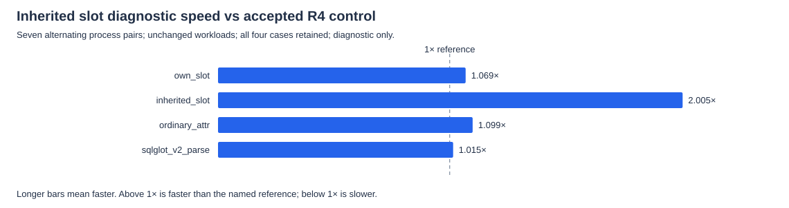
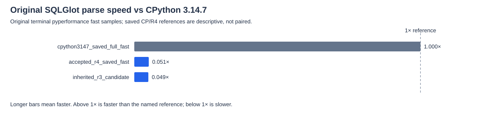

# Inherited slot declaration proof checkpoint — 2026-10-08

The initialized inherited-slot diagnostic improved **2.005×** versus accepted R4, with **7/7** favorable process pairs. The unchanged original SQLGlot-body diagnostic was **1.015×**, with **5/7** favorable pairs. The SQLGlot result is neutral: this trial does **not** establish a material parse improvement from the strong inherited-slot microbenchmark gain.

The runtime records immutable own declaration occurrences before inherited-name deduplication. Cold inherited promotion requires known history throughout the validated MRO, exactly one declaration, canonical descriptor owner/identity and matching owner/raw/effective receiver index. Existing own-slot proof remains. Native/serialized/late layout changes without history stay generic. Missing storage, aliases, duplicate/foreign declarations, hooks and lifetime cleanup keep their original dispatch. No pure-Python library implementation was replaced with C++.

R2 built successfully but its displaced-index proof was rejected during review **before runtime tests or measurements**. R3 requires the raw descriptor index to equal the receiver's effective index: generic VM reads check raw missing storage and may call `__getattr__` before name remapping. Its CPP fixture verifies that branch across nine real local/module VM reads, then the initialized-raw remapped result. R2 source/proposal/build evidence and the R3 correction/reviews/builds remain byte-preserved; R2 has no speed score or acceptance claim.

Candidate full validation status: **validated**. Full validation records 376 core fixtures, 11 compatibility sections, 3 expected-failure checks and 8 C++/SDK/graph tests. Fixed gate: pass (11 cases, 21 pairs, five warmups, unchanged 10% tolerance).

## Paired diagnostics

**1× means equal speed**, above 1× faster, below 1× slower. The control is preserved accepted R4 commit `e2a752f6`, with its complete 140-file manifest verified before and after measurement. All **300 samples and four rows** are retained. CPython observations are separate five-sample references and are not pooled into XLang3 pairs. Each XLang3 time is the median of seven process medians, each containing five samples. Paired speed is the median of seven within-pair ratios; CP-relative diagnostic speed is unpaired/descriptive. These are not official pyperformance scores or significance tests.

| Case | CP reference ms | R4 control ms | Candidate ms | Paired speed vs R4 | Favorable pairs | Diagnostic speed vs CP |
|---|---:|---:|---:|---:|---:|---:|
| own_slot | 0.325 | 0.990 | 0.918 | 1.069× | 7/7 | 0.354× |
| inherited_slot | 0.333 | 1.835 | 0.905 | 2.005× | 7/7 | 0.368× |
| ordinary_attr | 0.339 | 1.093 | 1.000 | 1.099× | 7/7 | 0.339× |
| sqlglot_v2_parse | 0.960 | 18.734 | 18.429 | 1.015× | 5/7 | 0.052× |

The ordinary and own-slot rows are retained controls. Their observed movement does not identify its cause or justify attributing all improvement to inherited lookup. The full fixed Release gate remains required.

## Original official SQLGlot benchmark

Only measurement `values` from terminal original pyperformance fast JSON contribute to means. Warmups/calibration remain in the archive. The saved CPython full-fast reference and accepted R4 fast result are separate historical observations; candidate official results appear only after validated full correctness/gate phases with matching binary/source identities. Failed/partial output stays archived without a speed score. Instability warnings remain visible, and these reused references do not support paired significance claims.

| Runtime/reference | Mean ± sample SD ms | Speed vs CPython 3.14.7 | Speed vs accepted R4 | Samples | Instability warning |
|---|---:|---:|---:|---:|---|
| cpython3147_saved_full_fast | 0.9883 ± 0.0108 | 1.000× | 19.780× | 20 | False |
| accepted_r4_saved_fast | 19.5479 ± 1.7722 | 0.051× | 1.000× | 20 | True |
| inherited_r3_candidate | 20.1071 ± 3.5708 | 0.049× | 0.972× | 20 | True |

The candidate original SQLGlot measurement has 17.8% sample variation, a 31.405 ms maximum, and instability-warning flag True. Together with the neutral paired body, these observations do not establish a reliable end-to-end parse gain.

This is one generic runtime checkpoint, not a new complete 97-case run or a whole-suite CPython win. The SQLGlot body remains unchanged. CPython stays version **3.14.7** at `C:\Python\Python314\python.exe`; build/run paths remain fixed.

## Evidence

- [Every diagnostic sample](data/inherited-slot-proof-paired-samples-20261008.csv)
- [All four diagnostic rows and seven ratios](data/inherited-slot-proof-paired-summary-20261008.csv)
- [Original official measurement samples](data/inherited-slot-proof-official-samples-20261008.csv)
- [Official means, variation and ratios](data/inherited-slot-proof-official-summary-20261008.csv)
- [Comparison, hashes and complete validation record](data/inherited-slot-proof-comparison-20261008.json)
- [Original-byte sources/logs/results/controls/reviews manifest](data/inherited-slot-proof-20261008-sources/manifest.json)

All raw archived copies preserve complete original bytes, lengths and SHA-256, including earlier failures. The 19 tested source/probe/controller hashes refer to compiled working bytes; separate Git-normalized LF copies for all 11 changed proposal targets have their own hashes and verified Git clean-filter blob identities. They do not replace the working-byte evidence. The archive stores Release manifests and verifies live control/candidate binaries; it does not duplicate binaries into documentation. Reference/control/candidate identities remain separate.
