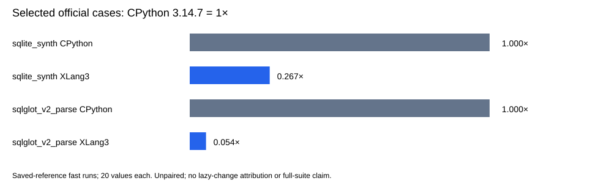

# Lazy per-Interpreter fallback globals trial

Decision: **rejected**. The paired callback probe is mixed and does not establish an overall gain. String-key dictionary lookup regresses to **0.865×** control speed (about 15.5% longer by this ratio); all seven pairs favor the control, with six settled ratios spanning 0.849×–0.885×. The intended native Python callback rows show descriptive 1.042× (Python-key dict) and 1.029× (Python-key hash), with 1.045× for the ordinary wrapper. These values are observations, not significance claims.

The change defers construction of each Interpreter fallback unordered_map until an actual fallback store. The MSVC map normally allocates its sentinel and initial buckets on construction; ordinary module/dict-backed callbacks need neither. The candidate preserves global lookup order, per-Interpreter legacy fallback ownership and deletion-before-finalizer version changes. This source hypothesis does not directly explain the string-key lookup regression.

The complete fixed regression gate passed all 11 cases with unchanged 21 paired repeats, 5 warmups and 10% tolerance. Correctness passed 381 core fixtures, 11 compatibility sections and 3 expected failures, seven focused paths, 9 configured CTests and two direct SQLite API checks. Existing strict CPython 3.14.7 reference fixtures remain pinned. Passing this gate does not erase the separate diagnostic regression.

The existing C++ interpreter target covers lazy materialization, fallback isolation/persistence, module/dict/builtin precedence, nested reentry, cleanup reentry and host/fallback ownership during C++ exception unwind. Its actual working source hash is `d7573bee561b650583c955518df3e33f2d41afb957b4b5cc0abea7f10bf903a8`; the compiled interpreter registration hash is `a58811867318b8fc58350a4c340757fbda467f30b27f7bd0a7544112d54c1cbf`. Exact seven changed source files and the 40-file validation inventory are preserved.

| Callback diagnostic | Median pair control / candidate |
|---|---:|
| string_dict_get | 0.865× |
| python_key_dict_get | 1.042× |
| builtin_hash_string | 0.986× |
| builtin_hash_python_key | 1.029× |
| direct_python_hash_method | 0.995× |
| saved_python_hash_method | 0.983× |
| ordinary_python_hash_function | 0.994× |
| ordinary_python_hash_wrapper | 1.045× |

Seven alternating pairs retain five raw samples per row/process, 16,384 operations per sample and all checksums: 560 timings. Each displayed ratio is the median of seven within-pair median-time ratios, **not** the ratio of pooled medians. Ratios above 1× favor the candidate. No confidence interval or significance test is supplied, and no samples/outliers are removed.

## Selected official comparisons with saved CPython 3.14.7

These two original fast-mode benchmarks completed with all 20 measured values per runtime. CPython was measured October 7; the candidate is fresh. The comparison is unpaired and cannot attribute changes to the lazy storage trial. CPython mean time / XLang3 mean time is shown with CPython = 1×. This checkpoint does **not** include a new full 97-definition pyperformance run.

| Benchmark | Runtime | Mean ± sample SD (ms) | CV | Speed vs CPython |
|---|---|---:|---:|---:|
| sqlite_synth | cpython3147_saved | 0.001833 ± 0.000011 | 0.60% | 1.000× |
| sqlite_synth | xlang3_candidate | 0.006871 ± 0.000649 | 9.44% | 0.267× |
| sqlglot_v2_parse | cpython3147_saved | 0.988288 ± 0.010773 | 1.09% | 1.000× |
| sqlglot_v2_parse | xlang3_candidate | 18.188532 ± 0.178905 | 0.98% | 0.054× |

[Official raw values](data/interpreter-lazy-globals-trial-20261008-official-values.csv), [variation](data/interpreter-lazy-globals-trial-20261008-official-summary.csv), [paired raw values](data/interpreter-lazy-globals-trial-20261008-paired-values.csv), and [all pair ratios](data/interpreter-lazy-globals-trial-20261008-paired-summary.csv) retain the full observations.

Exact source identities, terminal validation, fixed-gate/raw phase logs, official JSON, saved CPython receipts, callback logs and the Release build log are in the [owned manifest](data/interpreter-lazy-globals-trial-20261008-manifest.json). Candidate executable/DLL identities are pinned without adding binaries to Git. The seven changed source files are archived and listed explicitly. Held/rejected exports include documents only in the owned staging list; source staging requires an accepted decision.

Saved CPython executable/DLL, benchmark Python sources and compatibility hook are pinned by the reused receipts. Dependency METADATA does not prove every historical package/data byte. Existing SQLite GC-edge and conservative cursor-reentrancy limits remain in the raw validation receipt. No whole-suite or overall CPython win is claimed.

Official warning lines (full logs archived):

> WARNING: the benchmark result may be unstable
> * Not enough samples to get a stable result (95% certainly of less than 1% variation)
> Use --quiet option to hide these warnings.
