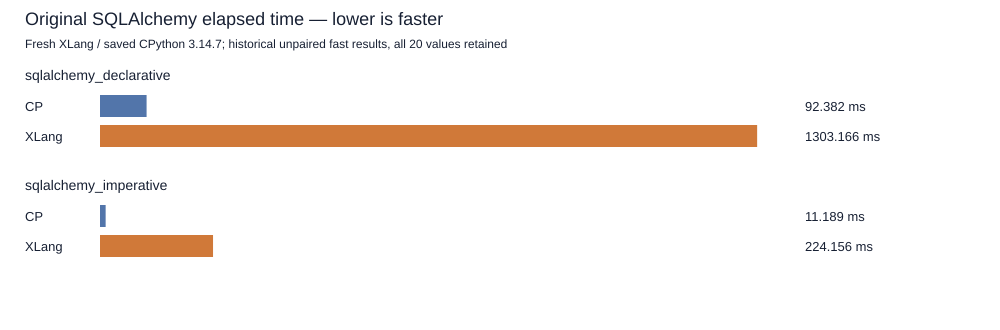

# Eager-comprehension lambda capture correctness checkpoint

SQLAlchemy's unchanged Python module uses a lambda containing an eager comprehension. The compiler must capture outer names used in that lambda and consistently address hidden comprehension aliases. A second defect left an escaping lambda's comprehension target in a local register while its closure read a cell. The R5 compiler prepass prepares a cell only for a captured target, and the store/delete lookup uses the resolved alias. The pure Python library stays unchanged.

The preserved R3 candidate failed the first-iterable shadowing group. R4 fixed that lookup and passed five groups, then failed the escaping dict-lambda group. These are unsuccessful engine candidates, retained with their source and binary identities. Initial R5 strict execution passed all eight groups but its controller rejected the normal `--dump-ir` debug line on stderr; that original harness refusal is retained separately. The complete focus receipt authenticates two public CPP checks from the same exact build and 20 normal Python fixture invocations with exact stdout and empty stderr.

R5 passed the strict eight-group fixture and all 22 focused checks. The independent IR eligibility receipt compares 16 complete noncapturing fused function blocks byte for byte with the preserved R4 IR. Captured dict function 27 now stores its target cell before creating the closure. The nested capture IR retains the cell-aware `ForRangeConstLocalNext` path. This is compiler correctness evidence; it is not a speed measurement.

Fresh same-candidate correctness completed 401 core cases, 11 compatibility sections, three expected failure cases, nine selected CTest tests and two native SQLite API checks. The terminal correctness receipt is preserved. The exporter requires a later terminal same-candidate receipt with the complete default 11-case gate passing at 21 repeats, five warmups and a 0.10 threshold before creating this publication preview. It does not repeat those successful correctness checks.

Official SQLAlchemy outcomes below come only from the later terminal receipt. Completed XLang results use the original benchmark and workload. The saved CPython 3.14.7 reference contains 20 values for each SQL case and is historical and unpaired. Its recorded executable, library, benchmark, TOML, runner, hook and dependency identities are authenticated; that coverage is not a complete inventory of all transitive files. Warnings and unsuccessful XLang attempts remain raw evidence. No isolated speed attribution or CPython performance win is implied.

The measured candidate is the exact source128 worktree and Release178 identified in the receipts, against the unchanged fixed Release177 baseline. This checkpoint owns six live changes: compiler lowering, cache magic, two fixture runners, the strict fixture and its expected output. Other dirty source bytes are preserved and excluded from staging. Prior published source119, parser124 and property126 archives plus the six current source deltas identify the recorded source subset; the subset and binary receipts do not imply a clean checkout alone reproduces all results. No runtime binaries or COFF objects are published here.

The earlier full-suite comparison remains a separate historical run: 97 attempted cases, 73 completed and 24 failed. This checkpoint is not a fresh full97 run and does not update that matrix or its denominator.

Default gate: all 11 cases passed with unchanged 21/5/0.10 settings.

| Case | Runtime | Complete | Mean (ms) | X/CP time |
|---|---|---:|---:|---:|
| sqlalchemy_declarative | cpython3147 | True | 92.382147 |  |
| sqlalchemy_declarative | xlang3 | True | 1303.165940 | 14.106253 |
| sqlalchemy_imperative | cpython3147 | True | 11.189017 |  |
| sqlalchemy_imperative | xlang3 | True | 224.156165 | 20.033588 |

[Official values](data/lambda-eager-comprehension-capture-r5-checkpoint-20261009-official-values.csv), [outcomes and failures](data/lambda-eager-comprehension-capture-r5-checkpoint-20261009-official-outcomes.csv), [default-gate summary](data/lambda-eager-comprehension-capture-r5-checkpoint-20261009-fixed-gate-summary.csv), [all gate arrays](data/lambda-eager-comprehension-capture-r5-checkpoint-20261009-fixed-gate-values.csv).

