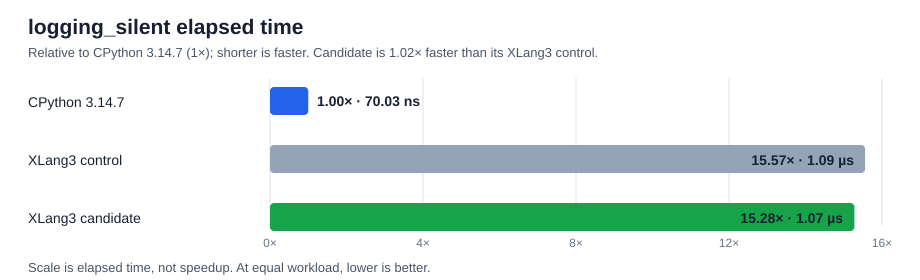

# Empty `*args`/`**kwargs` call-frame fast path — 2026-10-04

The XLang3 argument binder now has a narrow path for calls that pass exactly the required positional prefix to a function whose final parameters are `*args, **kwargs`. It binds the supplied values directly, then constructs a fresh empty tuple and dict for the variadic parameters. This preserves Python's observable container behavior while skipping the general keyword and overflow scan.

The targeted official `logging_silent` case improved **1.02×** in pyperformance's fast mode. The call still takes about **15.3× CPython 3.14.7's time**, so this is a small call-frame improvement, not a resolution of the larger performance gap.

## Measurements

| Runtime | `logging_silent` mean | Std. dev. | Relative elapsed time |
|---|---:|---:|---:|
| CPython 3.14.7, full reference | 70.03 ns | — | 1.00× |
| XLang3 control | 1.09 µs | 0.01 µs | 15.57× CPython time |
| XLang3 candidate | 1.07 µs | 0.01 µs | 15.28× CPython time |

`pyperf compare_to` finds the candidate **1.02× faster** for `logging_silent`; the `logging_format` and `logging_simple` subtests show no significant difference. Both XLang3 runs used pyperformance 1.14.0 fast mode, ten measured runs, two values per run, and identical dependencies. The candidate and control were run sequentially on the same machine.

The official benchmark source is CPython's unchanged Python `logging` module. Its `Logger.debug()` accepts `*args, **kwargs`; when debug logging is disabled, the function calls `isEnabledFor()` and returns. CPython's warmed bytecode uses `LOAD_ATTR_METHOD_WITH_VALUES` and `CALL_PY_EXACT_ARGS` for that nested method call. XLang3's VM already caches the method lookup, but the call frame still passed through the general argument binder. The new fast path is in generic XLang3 frame binding; it does not implement or replace any part of `logging.py` in C++.

## Validation

- The full `tests/run_fixtures.py` suite passed under Python 3.14, including a fixture that mutates each call's `kwargs` and verifies that separate calls receive distinct dicts and empty `args` tuples.
- `xlang3_interpreter_tests.exe` and `xlang3_runtime_value_tests.exe` passed.
- The 11-case fixed Release gate passed. `function_calls` was the largest slowdown at 1.066×, under the 1.10 threshold; `subparsers` was 1.077×.
- The fixed Release executable and runtime DLL were not modified.

## Reproduction artifacts

- Candidate pyperf data: [`logging-varargs-fastpath-candidate-fast-20261004.json`](data/logging-varargs-fastpath-candidate-fast-20261004.json).
- Control pyperf data: [`logging-varargs-fastpath-control-fast-20261004.json`](data/logging-varargs-fastpath-control-fast-20261004.json).
- Fixed Release gate: [`logging-varargs-fastpath-fixed-baseline-gate-20261004.json`](data/logging-varargs-fastpath-fixed-baseline-gate-20261004.json).
- XLang3 and CPython call profiles: [`XLang3`](data/logging-silent-xlang3-call-profile-20261004.txt), [`CPython 3.14`](data/logging-silent-cpython314-call-profile-20261004.txt). These profiles count the same 10 `debug()` and 10 `isEnabledFor()` Python calls; instrumentation affects timing and is not used for the pyperf comparison.
- CPython 3.14 full reference: [`pyperformance-cpython314-clean-release-full-fast-20261002.json`](data/pyperformance-cpython314-clean-release-full-fast-20261002.json).

Candidate executable SHA-256: `A2FD8EBAABC2E04F473715A4B1950915B9F3A6709189A1F211B0B3810E5CDDF4`.
Candidate runtime DLL SHA-256: `15C654845FB52B492D02AD4036FCC4FEDDD7959E6C70A6F2D61D45C25E6696D6`.

The broader 97-case comparison, including this candidate's predecessor, is in [the full XLang3 vs CPython report](pyperformance-xlang3-native-gc-traversal-vs-cpython314-fast-20261004.md). That run completed 48 cases, failed or timed out on 49, and measured an overall geometric mean of 0.17041× CPython/XLang3 speedup. This focused binder trial does not change those full-run figures.
