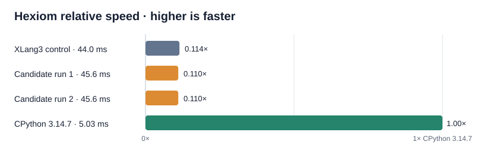

# Exact-int `min`/`max` generator consume trial (2026-10-06)

## Result

Rejected and removed. The candidate let native `min()` and `max()` absorb
exact-int generator yields inside the active VM entry, avoiding a saved
continuation and one `Value` allocation per yielded integer. Non-int yields
fell back to the ordinary comparison path with the consumed prefix's extreme
retained as its seed. A focused fixture covered min/max results, `None` sent
back into a generator, mixed-type comparison errors, `default`, and `key`.

The controlled official pyperformance 1.14.0 `hexiom` comparison did not show
a gain. One XLang3 control measured **44.0 ms ± 0.7 ms**; two candidate runs
both measured **45.6 ms** (± 4.1 ms and ± 5.1 ms). `pyperf compare_to`
classified each candidate run as **1.04× slower** than the control. Both
candidate runs contained a 70.6 ms maximum sample, so the absolute penalty is
noisy, but there is no measured improvement to justify this extra yield-state
and fallback code. The source change and fixture were removed.

| Runtime/build | Mean ± standard deviation | Relative speed |
| --- | ---: | ---: |
| CPython 3.14.7 | 5.03 ms ± 0.10 ms | 1.00× |
| XLang3 control | 44.0 ms ± 0.7 ms | 0.114× CPython |
| XLang3 candidate, run 1 | 45.6 ms ± 4.1 ms | 0.110× CPython |
| XLang3 candidate, run 2 | 45.6 ms ± 5.1 ms | 0.110× CPython |

The feature's guard was limited to unobserved, synchronous, one-argument
generator inputs with no `key` or `default`; generic dynamic comparisons and
their exceptions stayed on the original path. The test passed, but a correct
fast path is not retained when the official workload does not improve.

## Build and raw evidence

Both controlled XLang3 builds used the same checked-out source state, with the
candidate containing only this trial's min/max fast path. Both used the
repository Windows pyperf compatibility shim, pyperformance 1.14.0, and the
Python 3.14.7 dependency site. The control was measured first, followed by two
candidate runs. The existing CPython 3.14.7 hexiom result is from the matching
rigorous comparison recorded in the preceding sum-generator report.

| Build | Executable SHA-256 | Runtime DLL SHA-256 |
| --- | --- | --- |
| XLang3 control | `4D3C183BF084201370A4EBC0E53D8643F8D23B4DFDF664B7B0F6BBAF6EC2A0F7` | `C13287ADA66CC9DAB7E8F02B432E41BFE4D25C6CB34C22B9CCC749B343548506` |
| XLang3 candidate | `FBBC87B91411C81AB9B8856636E184488E9D097B9ED40887F68E915CFBAC6E52` | `37A839629892C05E31F0AF2253811480C3B9CDFFA7110CCF0530673A11C550DD` |

- [Control pyperf JSON](data/pyperformance-hexiom-minmax-control-rigorous-20261006.json)
- [Candidate run 1 JSON](data/pyperformance-hexiom-minmax-candidate-controlled-rigorous-20261006.json)
- [Candidate run 2 JSON](data/pyperformance-hexiom-minmax-candidate-r2-controlled-rigorous-20261006.json)
- [CPython 3.14.7 reference JSON](data/pyperformance-hexiom-sumgen-cpython314-rigorous-20261006.json)

The restored Release executable passed the complete Python fixture runner.
The overall performance goal remains open; the full comparison still shows
large gaps in async task/frame execution and pure-Python workloads. The next
trial should remove a larger amount of shared VM work and clear a matched
Release A/B gate before any source change is retained.
