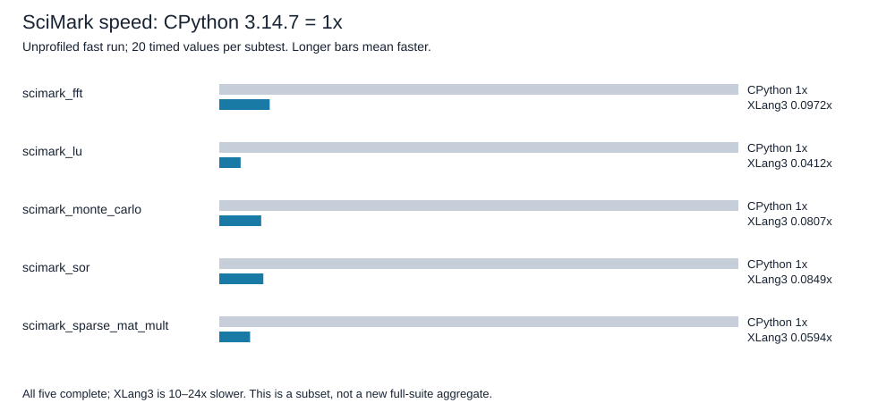
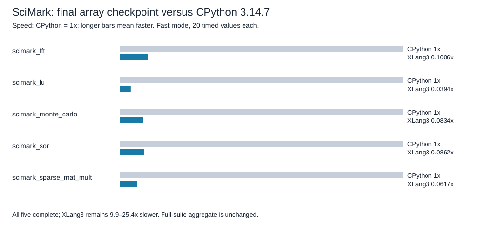

# Native array shared storage and SciMark checkpoint

The first complete official SciMark run after shared array storage and strided memoryviews finishes all five subtests. XLang3 remains slower than CPython 3.14.7 in every subtest. This is evidence of a compatibility repair and remaining runtime overhead; there is no previous successful XLang3 SciMark mean from which to calculate an official before/after gain.

## Official measurements

Unprofiled fast-mode values from [XLang3 raw data](data/pyperformance-xlang3-native-array-shared-strided-scimark-fast-20261007.json) and the [CPython 3.14.7 reference](data/pyperformance-cpython314-clean-release-full-fast-20261002.json). Both use the official unchanged Python SciMark definitions. Calibration and warmups are excluded. The XLang3 definition completed with exit 0 under the same 300-second complete-case cap that previously ended in a slice TypeError. Each mean contains 20 timed values. Stability warnings remain in the raw log; these are fast measurements, without a significance claim.

| Subtest | CPython seconds | XLang3 seconds | XLang3 speed, CPython = 1x | XLang3 time / CPython |
|---|---:|---:|---:|---:|
| scimark_fft | 0.2505606 | 2.5787591 | 0.0972x | 10.29x |
| scimark_lu | 0.0766407 | 1.8619045 | 0.0412x | 24.29x |
| scimark_monte_carlo | 0.0602609 | 0.7463971 | 0.0807x | 12.39x |
| scimark_sor | 0.1052482 | 1.2394998 | 0.0849x | 11.78x |
| scimark_sparse_mat_mult | 0.0032494 | 0.0547148 | 0.0594x | 16.84x |

Speed is CPython time divided by XLang3 time: below 1x is slower. The final column is the inverse, describing how much longer XLang3 takes.

## Runtime identity and scope

[Run provenance](data/pyperformance-xlang3-native-array-shared-strided-scimark-fast-20261007-provenance.json) records source parent `f2e76b14`, uncommitted array changes, identical start/end executable and DLL hashes, and the fixed candidate run path. The executable SHA-256 is `72F50BADAC38DCDD8E2FBD9DA5DF7958AA65D0E7E996CDF2586E9B8A35E1D603`; runtime DLL is `2D2D4813D3FF4771E1AD4D0CEBBA7109DC5879F2F1C4102384B32D8A4C2EE4A4`.

The later serialization and native consumer audit changes are a separate build awaiting fresh validation. These timings describe the earlier measured build, not that later build. The frozen all-97 report is unchanged; do not substitute these subset results into its aggregate.

## Generic defect repaired

Native array scalar reads previously copied the entire array from a separate published bytearray. Scalar writes and append republished another whole buffer. The candidate uses one authoritative bytearray, publishes metadata once, retains storage and result-class references for collection, and guards resizing while views are exported. Generic memoryview slices now preserve exporter identity, signed physical strides, writes and independent export lifetimes instead of returning readonly snapshots.

The final pre-consumer-audit diagnostic measures 256 reads of index zero after construction. On a 65,536-element array, the median fell from 2.2361 ms to 0.08860 ms, about 25.24x faster than the original XLang3 control. CPython took 0.00740 ms. This short diagnostic isolates removal of size-dependent copying and is not an official suite score or a CPython win.

The complete fixtures, all eight selected C++/SDK/serialization tests and [complete fixed regression gate](data/release-native-array-shared-strided-fixed-gate-20261007.json) passed for the measured pre-consumer-audit build. The gate retains all 11 cases, 21 paired repeats, five warmups and the unchanged 10% threshold/baseline. Later engine changes require a new gate before any commit.

CPython implements `array` and the audited buffer consumers natively. XLang3 implements its own counterparts, while SciMark and pure-Python libraries remain Python. Performance comments in storage, slice and buffer paths explain the invariants to preserve.

## Final consumer-audit build: complete validation

The later build also completed all five official SciMark subtests with 20 timed values each, exit 0 at the same 300-second cap. Start/end executable, DLL and native hashlib package hashes match in the [final provenance](data/pyperformance-xlang3-native-array-final-consumers-scimark-fast-20261007-provenance.json). [Raw final values](data/pyperformance-xlang3-native-array-final-consumers-scimark-fast-20261007.json) and [all five rows as CSV](data/native-array-final-consumers-scimark-20261007-subtests.csv) are preserved separately from the earlier phase.

| Subtest | CPython seconds | Final XLang3 seconds | XLang3 speed, CPython = 1x | XLang3 time / CPython |
|---|---:|---:|---:|---:|
| scimark_fft | 0.2505606 | 2.4915596 | 0.1006x | 9.94x |
| scimark_lu | 0.0766407 | 1.9469581 | 0.0394x | 25.40x |
| scimark_monte_carlo | 0.0602609 | 0.7225054 | 0.0834x | 11.99x |
| scimark_sor | 0.1052482 | 1.2213980 | 0.0862x | 11.60x |
| scimark_sparse_mat_mult | 0.0032494 | 0.0526619 | 0.0617x | 16.21x |

The final [full fixture and C++ validation record](data/native-array-final-consumer-validation-20261007.json) and [unchanged full default regression gate](data/release-native-array-final-consumers-fixed-gate-20261007.json) all return 0. Additional direct IPC coverage initially used the abstract stream without a storage provider; the test was corrected to use the real BlockStream. The [final eight-test rerun](data/native-array-final-consumer-ipc-cpp-sdk-r2-20261007.log) passes, including forward and reverse logical byte order. Only the test executable was rebuilt afterward; the measured engine hashes remain unchanged. No additional engine rerun is implied by that test-only build.

## Next measured bottleneck: subscription dispatch

The [dispatch diagnostic](../../benchmarks/diagnostics/native_subscription_dispatch_probe.py) keeps construction and native method binding outside timing. Each case uses 100,000 operations and seven samples. Medians in nanoseconds per operation:

| Path | CPython 3.14.7 | XLang3 final array build |
|---|---:|---:|
| array_getitem | 36.63 | 410.24 |
| array_saved_getitem | 48.84 | 244.58 |
| list_getitem | 27.14 | 117.72 |
| array_setitem | 35.55 | 467.95 |
| array_saved_setitem | 60.33 | 230.24 |
| list_setitem | 21.79 | 92.81 |

XLang3 subscription reads are about 1.68x slower than calling a saved native getter; writes are about 2.03x slower than the saved native setter. CPython subscriptions are faster than saved method calls. The source shows generic native lookup/binding on the XLang3 subscription path. This motivates guarded native special-method dispatch, while preserving subclass overrides, dynamic class mutation, callbacks and pending exceptions. The diagnostic is evidence for where to optimize, not a suite-speed claim.
