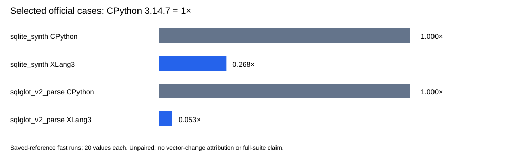

# Native bound-method zero-argument checkpoint

The seven-pair callback probe is **neutral overall**. Median paired speed ratios span 0.989×–1.022× across eight rows. No significant speed gain is claimed; the Python-key hash row is a descriptive 1.022×. The change removes one small native argument-vector allocation while preserving normal dispatch and owned function/self lifetimes.

The complete fixed regression gate passed all 11 cases with unchanged 21 paired repeats, 5 warmups and 10% tolerance. Correctness passed 381 core fixtures, 11 compatibility sections and 3 expected failures, seven focused paths, 9 configured CTests and two direct SQLite API checks. The native callback fixture passed all six groups against exact CPython 3.14.7.

The original C++ audit called an unexported private collector and failed to link. The actual repaired helper invokes the registered `gc.collect` API; its exact working hash is `ef1c0aa7cfb9dcf67b498c619eadd99b2e8c383f0c82e4abb63f83faf3484e7c`. The repaired source bytes and both build logs are preserved.

| Callback diagnostic | Median pair control / candidate |
|---|---:|
| string_dict_get | 0.997× |
| python_key_dict_get | 1.012× |
| builtin_hash_string | 0.989× |
| builtin_hash_python_key | 1.022× |
| direct_python_hash_method | 1.016× |
| saved_python_hash_method | 1.001× |
| ordinary_python_hash_function | 1.000× |
| ordinary_python_hash_wrapper | 1.001× |

Seven alternating pairs retain five raw samples per row/process, 16,384 operations per sample and all checksums: 560 timings. Each displayed ratio is the median of seven within-pair median-time ratios, **not** the ratio of pooled medians. Ratios above 1× favor the candidate. No confidence interval or significance test is supplied, and no samples/outliers are removed.

## Selected official comparisons with saved CPython 3.14.7

These two original fast-mode benchmarks completed with all 20 measured values per runtime. CPython was measured October 7; the candidate is fresh. The comparison is unpaired and cannot attribute changes to the vector optimization. CPython mean time / XLang3 mean time is shown with CPython = 1×. This checkpoint does **not** include a new full 97-definition pyperformance run.

| Benchmark | Runtime | Mean ± sample SD (ms) | CV | Speed vs CPython |
|---|---|---:|---:|---:|
| sqlite_synth | cpython3147_saved | 0.001833 ± 0.000011 | 0.60% | 1.000× |
| sqlite_synth | xlang3_candidate | 0.006839 ± 0.000275 | 4.02% | 0.268× |
| sqlglot_v2_parse | cpython3147_saved | 0.988288 ± 0.010773 | 1.09% | 1.000× |
| sqlglot_v2_parse | xlang3_candidate | 18.730449 ± 0.731807 | 3.91% | 0.053× |

[Official raw values](data/native-bound-zero-args-checkpoint-20261008-official-values.csv), [variation](data/native-bound-zero-args-checkpoint-20261008-official-summary.csv), [paired raw values](data/native-bound-zero-args-checkpoint-20261008-paired-values.csv), and [all pair ratios](data/native-bound-zero-args-checkpoint-20261008-paired-summary.csv) retain the full observations.

Exact source identities, terminal validation, fixed-gate/raw phase logs, official JSON, saved CPython receipts, callback logs and failed/successful build logs are in the [owned manifest](data/native-bound-zero-args-checkpoint-20261008-manifest.json). Candidate executable/DLL identities are pinned without adding binaries to Git. The seven changed source files are listed explicitly; unrelated dirty work is excluded from the owned staging list.

Saved CPython executable/DLL, benchmark Python sources and compatibility hook are pinned by the reused receipts. Dependency METADATA does not prove every historical package/data byte. Existing SQLite GC-edge and conservative cursor-reentrancy limits remain in the raw validation receipt. No whole-suite or overall CPython win is claimed.

Official warning lines (full logs archived):

> WARNING: the benchmark result may be unstable
> * Not enough samples to get a stable result (95% certainly of less than 1% variation)
> Use --quiet option to hide these warnings.
> WARNING: the benchmark result may be unstable
> * Not enough samples to get a stable result (95% certainly of less than 1% variation)
> Use --quiet option to hide these warnings.
