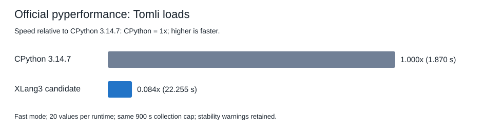
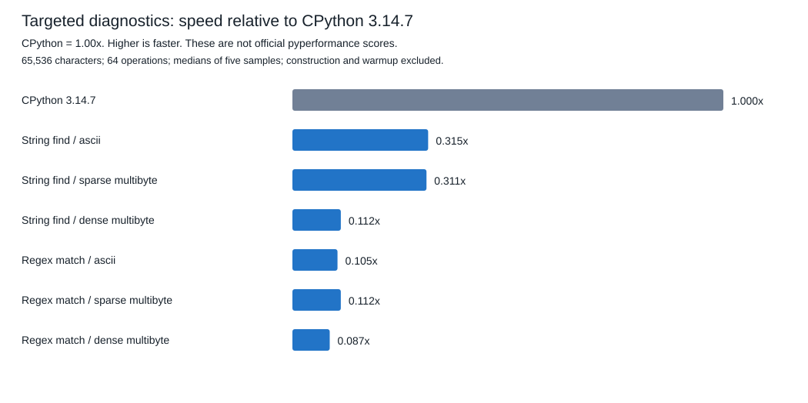

# Shared Unicode metadata and native string/regex positions

This candidate removes repeated whole-source scans and copies from generic
immutable-string indexing, slices, native search, and native regex matches.
CPython 3.14.7 remains the reference. With a matching 900-second complete-case
allowance, official Tomli completes with all 20 values in both runtimes:
**CPython 1.870011 s; XLang3 22.254785 s**.
XLang3 is **0.08403x CPython speed**, or about **11.90x slower**.
No CPython win or whole-suite gain is claimed.

## Official Tomli outcomes

| Candidate phase | Complete-case cap | Outcome |
|---|---:|---|
| Preserved full-run checkpoint `003b3882` | 300 s | Timeout; no score |
| Unicode indexing, length, slices | 300 s | Timeout; no score |
| Plus cache-backed native string search | 300 s | Timeout; no score |
| Plus borrowed native Unicode regex subjects and cached captures | 300 s | Calibration and three measured workers complete; timeout; no score |
| Fresh CPython 3.14.7 reference | 900 s | Complete; 20 values; mean 1.870011 s |
| Final candidate | 900 s | Complete; 20 values; mean 22.254785 s |

The cap applies to the entire worker collection, including calibration and
warmups. It is not a per-parse time. A timeout does not yield a numeric old/new
speed factor. Increasing the deadline does not establish a 300-second
completion or change the frozen all-97 failure list. The two longer-cap runs
use the same fast-mode workload, measurement settings, dependency site, and
Windows pyperf compatibility shim, with no timing probes enabled.

Both longer-cap runs carry fast-mode sample stability warnings. Their complete
[comparison CSV](data/native-unicode-regex-tomli-comparison-20261007.csv) and
[comparison JSON](data/native-unicode-regex-tomli-comparison-20261007.json)
exclude calibration and warmups from the mean. The old timed-out versions have
no mean to compare, so this checkpoint does not claim an official old/new speed
factor. It establishes a current official score while the fixed-operation
probes establish the eliminated scaling defects.

## Source-level cause and design

The official input contains 16,824,157 UTF-8 bytes, 16,824,037 characters, and
68 non-ASCII characters. A few Unicode characters made otherwise ASCII scalar
reads scan the complete source for its length and then scan its prefix for
an offset. Short Unicode slices allocated a whole-source offsets vector,
reserving about 134.6 MB for this input even for a two-character result.
Native search independently repeated the count and position scans. Regex
matching copied the complete Unicode source, repeatedly converted capture
positions, and copied it again into successful Match objects.

StringObject now stores a lazily published immutable Unicode index in the old
flags/padding word, retaining the old header size and payload offset. ASCII
positions remain direct and allocate no Unicode metadata. Non-ASCII strings
up to 64 bytes retain small scans. Larger strings cache their length and use
at most 128 sparse cumulative UTF-8 corrections, or checkpoints every 128
characters for dense Unicode. Forward and inverse position conversions share
that metadata. Concurrent readers publish only complete indexes; a losing
builder frees its allocation. String destruction releases the index.

Native search uses the shared count and positions for bounds, results, and
empty-needle counts. Native regex extends its existing in-place match path to
exact immutable Unicode subjects, retaining the source in each Match and
using cached positions for captures, group extraction, and expansion.
Mutable buffers, subclasses, and deferred lookbehinds retain their fallback.
This changes XLang3's native runtime and `_sre`, leaving Tomli's Python parser
and all CPython pure-Python library code intact. Performance comments sit at
the metadata layout, cache publication, slice handling, search bounds, and
regex borrowing paths so future changes preserve these properties.

## Targeted scaling diagnostics

Construction, content checks, and warmup are outside diagnostic timing. Each
row has five raw samples and a verified result checksum. Indexing uses 256
operations; search and regex use 64. These medians are not pyperformance
scores, statistical significance tests, or whole-suite speed factors.
`Old X / new X` measures the diagnostic improvement over the saved relevant
candidate/control. `CP / new X` expresses CPython-relative speed: **1x is
parity, above 1x favors XLang3, below 1x favors CPython**.

Selected 65,536-character rows:

| Diagnostic | Text | Old X | New X | Old X / new X | CP / new X |
|---|---|---:|---:|---:|---:|
| last_scalar | ascii | 0.0799 ms | 0.0918 ms | 0.87x | 0.102x |
| length | ascii | 0.0218 ms | 0.0251 ms | 0.87x | 0.251x |
| tail_slice | ascii | 0.0755 ms | 0.0888 ms | 0.85x | 0.178x |
| last_scalar | sparse_multibyte | 41.7069 ms | 0.1059 ms | 393.83x | 0.116x |
| length | sparse_multibyte | 19.6190 ms | 0.0265 ms | 740.34x | 0.226x |
| tail_slice | sparse_multibyte | 42.5168 ms | 0.0932 ms | 456.19x | 0.202x |
| last_scalar | dense_multibyte | 43.0496 ms | 0.1525 ms | 282.29x | 0.081x |
| length | dense_multibyte | 21.4694 ms | 0.0261 ms | 822.58x | 0.238x |
| tail_slice | dense_multibyte | 66.5402 ms | 0.1401 ms | 474.95x | 0.146x |
| find_tail | ascii | 19.6524 ms | 0.0127 ms | 1547.44x | 0.315x |
| find_tail | sparse_multibyte | 19.6017 ms | 0.0135 ms | 1451.98x | 0.311x |
| find_tail | dense_multibyte | 23.0483 ms | 0.0365 ms | 631.46x | 0.112x |
| regex match/captures | ascii | 0.2294 ms | 0.2428 ms | 0.94x | 0.105x |
| regex match/captures | sparse_multibyte | 27.9178 ms | 0.2467 ms | 113.16x | 0.112x |
| regex match/captures | dense_multibyte | 42.2845 ms | 0.3200 ms | 132.14x | 0.087x |

The complete [72 index/search rows](data/native-unicode-index-search-scaling-comparison-20261007.csv)
and [nine regex rows](data/native-unicode-regex-scaling-comparison-20261007.csv)
retain all input sizes, checksums, source file names, medians, and both ratios.
Index control is preserved checkpoint `52f3472a`; search control is the first
Unicode candidate; regex control is the second candidate. Large diagnostic
speedups are relative to old XLang3, and do not mean XLang3 beats CPython.

The short ASCII rows showed a nominal slowdown, so a separate long paired
follow-up measured 1,000,000 operations per process, with 21 alternating-order
pairs against the preserved `52f3472a` Release control and unchanged binary
hashes. Candidate/control median time ratios are scalar 0.99558x, length 1.00959x, tail_slice 1.01217x (about -0.4%, +1.0%, and +1.2%).
This does not confirm the apparent 13–15% short-sample slowdown. The raw
[long paired JSON](data/native-unicode-ascii-paired-20261007.json),
[log](data/native-unicode-ascii-paired-20261007.log), and
[probe](../../benchmarks/diagnostics/native_unicode_ascii_paired_probe.py)
retain every sample, operation count, source hash, and runtime identities.
The fixed default gate and baseline remain unchanged.

## Correctness and fixed baseline

The final candidate passes the complete fixture suite and all eight selected
C++/SDK/serialization tests. The new Unicode fixture also passes on CPython
3.14.7 and tests scalar/slice/search boundaries, negative and huge steps,
surrogates, aliases, subclasses, native method calls, capture spans, empty and
repeated groups, expansion, retained source lifetime, and mixed regex operand
rejection. C++ checks preserve the StringObject layout, race first publication
from four threads, round-trip all dense offsets, and retain selected results
after source destruction. Existing zero-step slice exception and subclass
length-dispatch defects found by the fixture were fixed rather than weakening
its assertions.

The [full fixed regression gate](data/release-native-unicode-regex-fixed-gate-20261007.json)
passes with all 11 default cases, 21 paired repeats, five warmups, and the
unchanged 10% tolerance. Accepted baseline executable/DLL hashes are unchanged.
The [gate log](data/release-native-unicode-regex-fixed-gate-20261007.log),
[C++/SDK log](data/native-unicode-regex-cpp-sdk-serialization-20261007.log),
[validation metadata](data/native-unicode-regex-validation-20261007.json),
and [compiled source identities](data/native-unicode-index-search-regex-source-20261007.json)
record the tested candidate. The fixture log is empty on success; its exit 0
is recorded in validation metadata.

## Evidence and scope

- [Detailed source audit](tomli-unicode-indexing-source-audit-20261007.md).
- [Preserved control](data/native-unicode-index-preserved-control-20261007.json).
- [First candidate timeout](data/pyperformance-xlang3-native-unicode-index-tomli-fast-20261007.log) and [provenance](data/pyperformance-xlang3-native-unicode-index-tomli-fast-20261007-provenance.json).
- [Second candidate timeout](data/pyperformance-xlang3-native-unicode-search-tomli-fast-20261007.log) and [provenance](data/pyperformance-xlang3-native-unicode-search-tomli-fast-20261007-provenance.json).
- [Final 300-second timeout](data/pyperformance-xlang3-native-unicode-regex-tomli-fast-20261007.log) and [provenance](data/pyperformance-xlang3-native-unicode-regex-tomli-fast-20261007-provenance.json).
- [Candidate complete JSON](data/pyperformance-xlang3-native-unicode-regex-tomli-fast-cap900-20261007.json), [log](data/pyperformance-xlang3-native-unicode-regex-tomli-fast-cap900-20261007.log), and [provenance](data/pyperformance-xlang3-native-unicode-regex-tomli-fast-cap900-20261007-provenance.json).
- [Fresh CPython complete JSON](data/pyperformance-cpython3147-native-unicode-regex-tomli-fast-cap900-20261007.json), [log](data/pyperformance-cpython3147-native-unicode-regex-tomli-fast-cap900-20261007.log), and [provenance](data/pyperformance-cpython3147-native-unicode-regex-tomli-fast-cap900-20261007-provenance.json).

This focused follow-up does not replace the [complete all-97 report](pyperformance-xlang3-native-string-checkpoint-full-fast-20261007.md)
or mix new scores into its frozen JSON/chart. Remaining parser/VM overhead and
full-suite failures still require work. The performance goal remains active.
