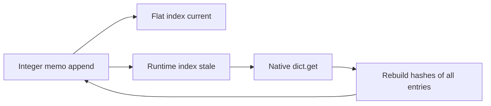

# Pure-Python pickle: scalar append and runtime index freshness

The current R4 build has a source-supported dictionary cost that a public DLL probe reproduces: appending an integer key updates the flat integer index but leaves the runtime hash index stale. A subsequent native `.get()` can rebuild the runtime index by hashing every stored key. This explains how an indexed runtime can still perform quadratic work on an append/read sequence. Its effect on the original pickle benchmark has not yet been isolated by a candidate comparison.

The unchanged original pure-Python pickle body completed once on CPython 3.14.7 and once on the fixed XLang3 Release executable. Both produced identical serialized byte signatures, passed roundtrips and preserved their inputs. The separate native capture completed with 206 samples and unchanged recorded sources and Release artifacts. These are unscored diagnostics; they do not replace the official result or establish a new speedup. [Body receipt](data/pickle-frame-locals-retirement-r4-original-body-r2-20261008.json), [sampling receipt](data/pickle-frame-locals-retirement-r4-native-sampling-20261008.json).

## Actual paths

`pickle.py` calls `self.memo.get(id(obj))` from `save()` and inserts `self.memo[id(obj)] = (idx, obj)` from `memoize()`. The exact-dictionary VM `SetItem` path calls `mapping_set_item()`. Its early scalar append paths update the flat integer/string tables and `indexed_entry_count`; the runtime and intrinsic certificate counts remain at the old entry count. Native `dict.get()` calls `mapping_get_item_runtime()`, where an integer key has no flat-integer lookup shortcut. The stale counts deny the intrinsic lookup path, and `ensure_runtime_hash_index()` rebuilds all stored hashes.

The fresh containing-range attribution found three exclusive locations and 45 overlapping stack occurrences in `ensure_runtime_hash_index`; native `dict_get_method_impl` occurred in 48 stacks. These inclusive counts overlap and are not additive CPU shares. Matching used the current image and compiled object bytes with explicit relocation masks; compatible aliases remain preserved. [Initial private-range attribution](data/pickle-frame-locals-retirement-r4-native-coff-attribution-20261008.json), [format-aware extension](data/pickle-frame-locals-retirement-r4-format-aware-native-coff-attribution-20261008.json).

The extension checked all 149 object paths/hashes, parsed 85 classic AMD64 COFF objects and explicitly reported 64 opaque MSVC `/GL` objects as unsupported. It provides no native-function matches from unsupported objects. The 30-byte range with seven leaf samples remains unnamed under the unchanged 32-byte matching minimum. The first extended parser failure remains preserved separately. [Parser diagnosis](data/pickle-frame-locals-retirement-r4-extended-coff-parser-failure-20261008.json).

## Current DLL state probe

A standalone public API probe warms each dictionary's runtime index, appends one new exact integer key, then reads it through `mapping_get_item_runtime()`. It checks every result and index state. The successful probe delay-loads and verifies the fixed Release DLL by its absolute path before its first runtime call; an earlier failed probe could encounter an old sibling DLL and supplies no current-runtime result.

| Observed state | Count |
| --- | ---: |
| Appends with a fresh runtime index immediately before insertion | 64 |
| Runtime indexes stale immediately after insertion | 64 |
| Sum of entry counts in tables refreshed by subsequent reads | 2,080 |
| Returned values | All correct |

The last count sums the refreshed table cardinalities; it is not an instrumented count of hash calls, a timing result or a benchmark speedup. Current recorded source111, Release178 and fixed baseline177 hashes were checked unchanged. [Successful probe](data/dict-scalar-append-freshness-diagnostic-r3-20261008.json).

## Bounded candidate and decision

Maintain an already-fresh runtime bucket incrementally after an exact scalar append. Preserve an already-current intrinsic certificate, including a rejected certificate, only by extending it with a proved native key. Stale tables remain stale. Publish freshness after the owned authoritative entry, bucket and flat index are complete; invalidate before allocation or mutation. Preserve key ordering, first-key identity, equality dispatch, overwrite behavior and existing delete/clear/recycle/swap invalidation.

This is distinct from the existing tuple/bytes intrinsic index and the held `DictSet` construction design. It changes XLang3's native dictionary runtime; `pickle.py` remains Python. Existing unrelated numeric-subclass and callback-reentry defects remain recorded. No candidate has been applied or measured at this investigation checkpoint.

The decision was frozen before any candidate edit or timing: retain all seven order-balanced parent/candidate original-body pairs; require median parent/candidate speed above 1.05 and bootstrap 95% lower bound above 1.0. Any retained change must also pass focused semantics, complete correctness, the unchanged default11 fixed gate (21 repeats, five warmups, 10%) and the original official pure-Python pickle definition. No result from this case proves a full97 improvement.

Source111 is a recorded subset, not all compiled repository inputs. This target additionally pins `mapping.cpp` (`81dc9042…`), `mapping.h` (`43f8bbc9…`) and `value.cpp` (`18be33a5…`) before editing. The measured build retains the previously documented dirty-build provenance limitations. The fixed candidate run path remains `build-repro/main-verify-20261006/Release/xlang3.exe`.
