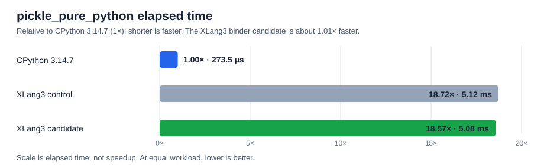

# Fixed positional frame binding with defaults — 2026-10-04

The VM argument binder now fast-paths calls that pass positional arguments to a fixed positional signature. It directly assigns those arguments and reads any omitted defaults from the function's current defaults tuple. Keyword calls, argument expansion, variadic signatures, missing required arguments, and excess arguments continue through the general binder. Reading defaults at call time preserves changes to `function.__defaults__`.

The unchanged `pickle.py` workload is a useful target because CPython 3.14's pure-Python Pickler calls methods such as `_Framer.commit_frame()` and `_Pickler.save()` with omitted positional defaults thousands of times. This optimization changes only XLang3 frame binding; it does not add a C++ implementation of `pickle.py` or modify the Python library.

The two order-reversed pyperformance fast comparisons show a repeatable but small improvement in `pickle_pure_python`, about **1.01×**. It remains roughly **18.6× slower** than CPython 3.14.7.

## Measurements

| Order | Control | Candidate | Candidate speedup |
|---|---:|---:|---:|
| Control then candidate | 5.13 ± 0.04 ms | 5.09 ± 0.04 ms | 1.01× |
| Candidate then control | 5.11 ± 0.07 ms | 5.07 ± 0.04 ms | 1.01× |

`pyperf compare_to` classified both paired fast runs as 1.01× faster for `pickle_pure_python`. `unpickle_pure_python` was not significantly changed. Runs used pyperformance 1.14.0, CPython 3.14.7 as the manager, and the same dependency site. These fast-mode results support a small gain, not a large end-to-end improvement.

For scale, the full CPython 3.14.7 reference is 273.5 µs. The two XLang3 candidate results average 5.08 ms, or about 18.6× the CPython elapsed time. The subsequent full 97-case run completed measurements for 48 definitions and recorded 49 failures or timeouts. Across 52 matched subtests it reports a CPython/XLang3 geomean of **0.16972×** (higher favors XLang3), versus **0.17041×** on the preceding full candidate; the aggregate change is within run noise and does not establish an overall gain. See the [complete Python 3.14.7 comparison and horizontal chart](../pyperformance-xlang3-fixed-positional-binder-vs-cpython314-fast-20261004.md), with every definition retained in the [all-97 status table](pyperformance-xlang3-fixed-positional-binder-vs-cpython314-fast-20261004-all-97-status.csv).

## Validation

- The new fixture covers required and optional positional arguments, methods, and mutation of `__defaults__`; it passed.
- The complete `tests/run_fixtures.py` suite passed under Python 3.14.
- `xlang3_interpreter_tests.exe` and `xlang3_runtime_value_tests.exe` passed.
- The 11-case fixed Release regression gate passed. `function_calls` was the slowest at 1.069× and `subparsers` at 1.084×, both under the 1.10 limit.
- The fixed Release executable and runtime DLL were not modified.

## Reproduction artifacts

- First-order pyperf data: [control](data/pickle-pure-default-binder-control-fast-20261004.json), [candidate](data/pickle-pure-default-binder-candidate-fast-20261004.json).
- Reverse-order pyperf data: [control](data/pickle-default-binder-control-r2-fast-20261004.json), [candidate](data/pickle-default-binder-candidate-r2-fast-20261004.json).
- Fixed Release gate: [`pickle-default-binder-fixed-baseline-gate-20261004.json`](data/pickle-default-binder-fixed-baseline-gate-20261004.json).
- CPython 3.14.7 reference: [`pyperformance-cpython314-clean-release-full-fast-20261002.json`](data/pyperformance-cpython314-clean-release-full-fast-20261002.json).

Candidate executable SHA-256: `2AE30FA9A56B11E9BF3298D5A48CA33357C9FF93C097FD29A8B9D485769A1E63`.
Candidate runtime DLL SHA-256: `C58DC9AEFD3E4F1F017A23E90715553050910974189D80C75415A5D2A897B081`.

The full run artifacts for this executable are [here](data/pyperformance-xlang3-fixed-positional-binder-full-fast-20261004.json) and [here](data/pyperformance-xlang3-fixed-positional-binder-full-fast-20261004.log). The preceding full comparison remains available [here](../pyperformance-xlang3-native-gc-traversal-vs-cpython314-fast-20261004.md).
