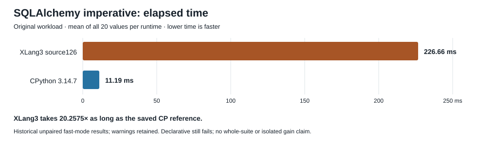

# Callable property getter correctness checkpoint

Ordinary property attribute access now accepts additional callable getter forms through the existing general runtime call path. The existing Function and NativeFunction fast branches remain unchanged. A callable instance such as `operator.attrgetter` worked through a direct getter call, explicit `property.__get__` and `getattr`, but failed through ordinary `obj.property`. The four-child CPython 3.14.7/XLang3 reproducer retained that disagreement before the fix. The correction is in VM runtime dispatch.

The new fallback owns the selected getter and receiver across the call and publishes a completed result afterward. It preserves runtime execution suspension, callback reentry and pending exceptions. The five owned files comprise one VM header, two additive fixture registrations, and a new fixture/expected output. CPython 3.14.7 and the candidate passed all six permanent semantic groups, covering callable forms, replacement/deletion, exception identity and traceback, selected-owner lifetime, and profile/trace frames. All ten fresh focused phases passed.

Fresh validation passed 400 core fixtures, 11 compatibility sections, three expected failure cases, nine selected CTests and two native SQLite API checks. The unchanged default 11-case gate passed with 21 repeats, five warmups and a 10% threshold against the fixed accepted baseline. Untimed CTest raw watcher flags remain preserved with a separate semantic result; no correctness timing was accepted. Timed gate and official watchers, cleanup, post-idle guards and all hashes were valid.

The original SQLAlchemy imperative benchmark now completes: all 20 XLang3 values have mean **226.661290 ms**. Its saved CPython 3.14.7 reference has 20 values with mean **11.1890175 ms**. XLang3 takes about **20.2575 times as long** (CP/X speed ratio 0.0493645). This is a historical, unpaired fast-mode comparison; warnings are retained. It is not an isolated speedup measurement or a CPython win.

| Original official case | Current XLang3 | Saved CPython 3.14.7 |
| --- | --- | --- |
| SQLAlchemy imperative | Completed 20 values; mean 226.661290 ms | Completed 20 values; mean 11.1890175 ms |
| SQLAlchemy declarative | Failed later: `NameError: free variable 'getters' is not defined`; no score | Completed 20 values; mean 92.3821475 ms |

Declarative gets past the repaired property call and fails in the lambda/comprehension path at `sqlalchemy/engine/result.py:48`. Its failed streams and missing-score identity are preserved. The terminal controller status remains `trial_validation_failed`, with `correctness_passed=true` and `full_validated=false`. The two saved CP reference rows were authenticated against their original commands, streams, JSON, strict watches and 360 recorded interpreter/benchmark/dependency identities; CP was not rerun. That identity coverage is not a complete stdlib, native-extension or transitive-file inventory.

The separate date diagnostic passed on CPython and XLang3. It made 64 explicit reducer calls and 64 explicit state constructors, checked canonical class/state identity, and measured no elapsed time. It did not run the original pickle body or estimate how much workload time dates consume. Its child, controller, proof and both raw outputs are included as untimed boundary evidence only.

The candidate is the exact source126 worktree and Release178 in the applied/build/focus/validation receipts. This checkpoint owns only the five files above. Other dirty sources remain preserved and excluded. The published UTF8 source119 and parser124 archives supply parent bytes; this package adds only the current five source files. Those inventories and binary manifests identify the measured build without claiming that a clean main checkout alone reproduces its timings. No runtime binaries or objects are published. The earlier 97-case comparison remains an older run; there was no new full97 run here.

Evidence: [terminal validation](data/property-callable-getter-validation-20261009.json), [applied source](data/property-callable-getter-applied-source-20261009.json), [focused checks](data/property-callable-getter-focused-20261009.json), [CP six-group reference](data/property-callable-getter-cpython-reference-20261009.json), [new imperative values](data/property-callable-getter-official-xlang3-values-20261009.csv), [saved CP 40 values](data/triple-string-closing-comment-official-cpython-values-20261008.csv), [gate summary](data/property-callable-getter-fixed-gate-summary-20261009.csv), [all gate arrays](data/property-callable-getter-fixed-gate-values-20261009.csv), [untimed date diagnostic](data/date-native-boundary-untimed-diagnostic-20261009.json), [publication manifest](data/property-callable-getter-checkpoint-publication-20261009.json).
