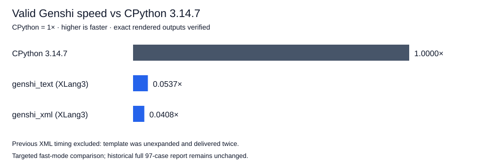

# Native XML namespaces and incremental parsing — 2026-10-07

XLang3 now renders the actual Genshi XML workload correctly. XML output matches CPython 3.14.7 exactly: **112,017 characters, 1,000 rows, 10,000 cells**, SHA-256 `61096eb9fee3ea72a4615a57e653bca545efacbad8aa8d522bb954d66d9421bc`. Text output remains **112,018 characters**, SHA-256 `c2e6154871cc315eadf1536e6b5f4679e3eee7aa6ed6ac3b9ea2e927ef2de810`.

The previous XML output had 273 characters and zero rows/cells, including the template twice. Its apparent 50.9× speed advantage remains **invalid and excluded**. A before/after speed ratio would compare different work and is not reported.

## What changed

The native parser now keeps a committed input cursor, element stack and positions across `Parse` calls. Complete events are delivered once; incomplete tags resume quote scanning rather than replaying earlier tokens. Comments and CDATA preserve incomplete-token search progress. A final empty chunk finishes prior input without rendering it twice. Whitespace outside the document element is excluded from character data, and CDATA is not entity-decoded.

Namespace declarations create element-scoped bindings. Start declarations precede the element callback; end declarations follow it in reverse order and restore parent bindings. Element and prefixed attribute names expand through namespace URI/local name; default namespaces do not qualify ordinary attributes. Namespace-prefix triplets, ordered attributes, disabled versus empty separator, unbound/duplicate names, reserved namespace bindings and invalid separator errors are covered by reference fixtures. Unicode name bytes are retained.

Comments explain the once-only cursor, incomplete-token scan cost, namespace scope restoration, default-attribute rule and outside-root whitespace behavior. Genshi and Python XML library algorithms remain Python. The changed code is XLang3’s own native `pyexpat` counterpart; no CPython native binary is used.

[CPython 3.14.7 native parser interface](https://github.com/python/cpython/blob/v3.14.7/Modules/pyexpat.c). Actual fixture expectations were generated with the installed **CPython 3.14.7**; that runtime rejects embedded NUL separators despite the rolling documentation describing a zero-byte separator.

## Validation

- **365 core fixtures, 11 compatibility sections, 3 expected failures**, and **8 C++/SDK/graph tests** passed.
- Four previously failing bounded native event probes now match CPython exactly.
- The new fixture covers final-empty input, split tags/entities, shadowed/undeclared default namespaces, ordered attributes and namespace triplets, Unicode names, quoted `>`, outside-root whitespace, CDATA, post-final errors, duplicate/unbound names, reserved bindings and bad separators.
- Exact XML and text output hashes, row/cell counts and loaded Genshi module paths are retained in the correctness record.
- Complete fixed gate passed with exit 0: **11 cases, 21 paired repeats, 5 warmups, 10% tolerance**. Accepted baseline hashes remain exe `a5f5028c15e145edce645a5afc25c11fbce77f51e882312b1fbe06e63c72a4af`, DLL `bc1b9c0a8086f7e6fb0c037516dc9c1eea20427fa887e3aa623714bc5ef5da8d`.

## Valid official Genshi comparison

| Case | CPython 3.14.7 | XLang3 | Speed vs CPython | XLang3 time / CPython time |
|---|---:|---:|---:|---:|
| genshi_text | 22.094 ms | 411.791 ms | 0.0537× | 18.64× |
| genshi_xml | 46.676 ms | 1144.191 ms | 0.0408× | 24.51× |

Higher speed is better; CPython is 1×. These independent fast-mode samples carry stability warnings. Both runtimes used the same installed benchmark source, dependencies and compatibility hook. The executable path remains `D:\CantorAI\xlang3\build-repro\main-verify-20261006\Release\xlang3.exe`; binary hashes stayed unchanged during measurements. No concurrent build or benchmark ran.

XLang3 is still much slower on the valid workload. The benchmark constructs its template before starting the rendering timer, so parser fixes establish correct work but do not directly optimize the timed Python rendering loop. The next performance investigation must profile shared runtime operations in that loop. Existing parser limitations beyond these tests remain; this checkpoint does not claim complete Expat conformance.

Only the official `genshi` definition (XML and text subtests) was rerun. The historical full 97-case dataset and aggregate remain unchanged; these targeted samples are not spliced into it.

## Raw evidence

[Checkpoint with hashes](data/pyexpat-namespace-incremental-checkpoint-20261007.json).

- [pyperformance-pyexpat-namespace-genshi-final-xlang3-fast-20261007.json](data/pyperformance-pyexpat-namespace-genshi-final-xlang3-fast-20261007.json)
- [pyperformance-pyexpat-namespace-genshi-final-xlang3-fast-20261007.log](data/pyperformance-pyexpat-namespace-genshi-final-xlang3-fast-20261007.log)
- [pyperformance-pyexpat-namespace-genshi-final-xlang3-fast-20261007-provenance.json](data/pyperformance-pyexpat-namespace-genshi-final-xlang3-fast-20261007-provenance.json)
- [pyperformance-pyexpat-namespace-genshi-final-cpython3147-fast-20261007.json](data/pyperformance-pyexpat-namespace-genshi-final-cpython3147-fast-20261007.json)
- [pyperformance-pyexpat-namespace-genshi-final-cpython3147-fast-20261007.log](data/pyperformance-pyexpat-namespace-genshi-final-cpython3147-fast-20261007.log)
- [pyperformance-pyexpat-namespace-genshi-final-cpython3147-fast-20261007-provenance.json](data/pyperformance-pyexpat-namespace-genshi-final-cpython3147-fast-20261007-provenance.json)
- [pyexpat-namespace-incremental-final-validation-20261007.json](data/pyexpat-namespace-incremental-final-validation-20261007.json)
- [pyexpat-namespace-incremental-final-validation-20261007-fixtures.log](data/pyexpat-namespace-incremental-final-validation-20261007-fixtures.log)
- [pyexpat-namespace-incremental-final-validation-20261007-cpp.log](data/pyexpat-namespace-incremental-final-validation-20261007-cpp.log)
- [release-pyexpat-namespace-incremental-final-fixed-gate-20261007.json](data/release-pyexpat-namespace-incremental-final-fixed-gate-20261007.json)
- [release-pyexpat-namespace-incremental-final-fixed-gate-20261007.log](data/release-pyexpat-namespace-incremental-final-fixed-gate-20261007.log)
- [pyexpat-namespace-final-correctness-20261007.json](data/pyexpat-namespace-final-correctness-20261007.json)
- [pyexpat-namespace-streaming-baseline-20261007.json](data/pyexpat-namespace-streaming-baseline-20261007.json)
- [pyexpat-namespace-incremental-reference-20261007.json](data/pyexpat-namespace-incremental-reference-20261007.json)
- [pyexpat-namespace-incremental-reference-final-20261007.json](data/pyexpat-namespace-incremental-reference-final-20261007.json)
- [pyexpat-namespace-incremental-precheck-20261007.json](data/pyexpat-namespace-incremental-precheck-20261007.json)
- [pyexpat-namespace-incremental-precheck-r2-20261007.json](data/pyexpat-namespace-incremental-precheck-r2-20261007.json)
- [pyexpat-namespace-incremental-validation-20261007.json](data/pyexpat-namespace-incremental-validation-20261007.json)
- [pyexpat-namespace-incremental-validation-20261007-fixtures.log](data/pyexpat-namespace-incremental-validation-20261007-fixtures.log)
- [pyexpat-namespace-incremental-validation-20261007-cpp.log](data/pyexpat-namespace-incremental-validation-20261007-cpp.log)
- [release-pyexpat-namespace-incremental-fixed-gate-20261007.json](data/release-pyexpat-namespace-incremental-fixed-gate-20261007.json)
- [release-pyexpat-namespace-incremental-fixed-gate-20261007.log](data/release-pyexpat-namespace-incremental-fixed-gate-20261007.log)
- [pyperformance-pyexpat-namespace-genshi-xlang3-fast-20261007.json](data/pyperformance-pyexpat-namespace-genshi-xlang3-fast-20261007.json)
- [pyperformance-pyexpat-namespace-genshi-xlang3-fast-20261007.log](data/pyperformance-pyexpat-namespace-genshi-xlang3-fast-20261007.log)
- [pyperformance-pyexpat-namespace-genshi-xlang3-fast-20261007-provenance.json](data/pyperformance-pyexpat-namespace-genshi-xlang3-fast-20261007-provenance.json)
- [pyperformance-pyexpat-namespace-genshi-cpython3147-fast-20261007.json](data/pyperformance-pyexpat-namespace-genshi-cpython3147-fast-20261007.json)
- [pyperformance-pyexpat-namespace-genshi-cpython3147-fast-20261007.log](data/pyperformance-pyexpat-namespace-genshi-cpython3147-fast-20261007.log)
- [pyperformance-pyexpat-namespace-genshi-cpython3147-fast-20261007-provenance.json](data/pyperformance-pyexpat-namespace-genshi-cpython3147-fast-20261007-provenance.json)
