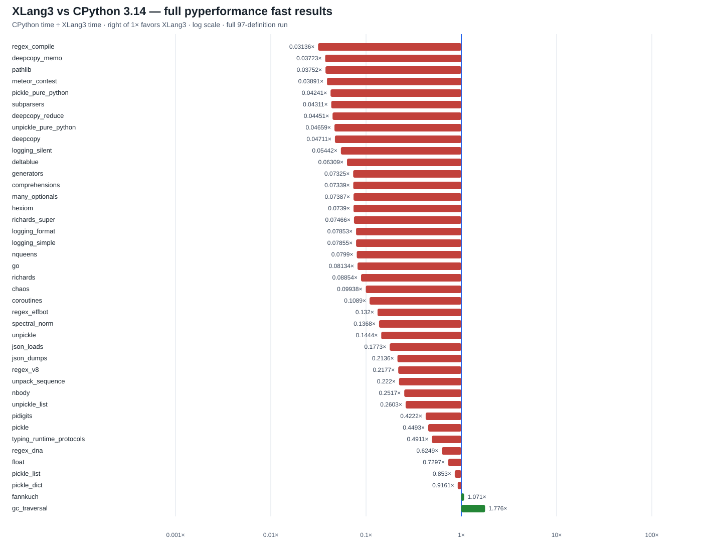

# XLang3 vs CPython 3.14: refreshed full pyperformance run

This report records a fresh all-97 pyperformance 1.14.0 run of the current
XLang3 Release build against the saved CPython 3.14.7 reference. All 97
definitions were attempted. XLang3 completed 37 definitions and failed or hit
the per-case timeout in 60; partial subtest measurements from those failed
definitions are retained. The comparison matched 41 subtests: XLang3 is faster
in 2 and slower in 39. The geometric speed ratio is **0.134×** (CPython time
divided by XLang3 time), or about **7.45× slower** across the matched set.

A ratio above 1× means XLang3 is faster. The aggregate uses only the 41 matched
subtests; it does not assign artificial timings to failed cases.

The complete 97-definition status, including every failure reason, is in the
[status CSV](data/pyperformance-xlang3-await-inline-full-fast-20261001-all-97-status.csv).
The [subtest CSV](data/pyperformance-xlang3-await-inline-full-fast-20261001-subtests.csv)
contains all available CPython and XLang3 timings and the per-subtest ratios.

## Run details

- XLang3: Release, Python 3.14.7 compatibility version. Executable SHA-256:
  `E48508CF1BFC5249BA13A7013835CA413A65901199D2013727F955D89D6ED807`.
  Runtime DLL SHA-256:
  `9CB44B6DD0DF822369D30299B6B1924CCEE84B21BC24DB943DD52D499CDDB3CD`.
- CPython: 3.14.7, using the saved
  [`pyperformance-cpython314-full-fast-gc-root-20260929.json`](data/pyperformance-cpython314-full-fast-gc-root-20260929.json)
  reference.
- Suite: pyperformance 1.14.0, fast mode, all 97 definitions, 120-second
  per-case timeout. The compatibility shim was placed on `PYTHONPATH` for the
  XLang worker to work around the Windows `psutil` ABI mismatch.
- The runner returned exit code 1 because 60 definitions failed or timed out;
  it continued through the suite and preserved the measurements in the
  [XLang3 result JSON](data/pyperformance-xlang3-await-inline-full-fast-20261001.json)
  and [complete log](data/pyperformance-xlang3-await-inline-full-fast-20261001.log).
- Fast mode reports unstable samples for some cases. Treat this as broad
  screening data, and use rigorous paired runs to validate small changes.

## Largest measured gaps

| Subtest | CPython 3.14 | XLang3 | CPython/XLang3 |
|---|---:|---:|---:|
| `regex_compile` | 93.64 ms | 2,985.55 ms | 0.0314× (31.9× slower) |
| `deepcopy_memo` | 21.47 μs | 576.64 μs | 0.0372× (26.9× slower) |
| `pathlib` | 47.82 ms | 1,274.45 ms | 0.0375× (26.7× slower) |
| `meteor_contest` | 87.41 ms | 2,246.48 ms | 0.0389× (25.7× slower) |
| `pickle_pure_python` | 0.252 ms | 5.948 ms | 0.0424× (23.6× slower) |
| `json_dumps` | 7.584 ms | 35.50 ms | 0.214× (4.68× slower) |
| `json_loads` | 17.54 μs | 99.0 μs | 0.177× (5.64× slower) |

The two measured wins are `gc_traversal` at 1.776× and `fannkuch` at 1.071×.
`pickle_dict` and `pickle_list` are close to parity but remain slightly slower
than CPython in this run. The per-case list is authoritative for all other
measured and failed cases.

## CPython source comparison and next target

The async-tree failures have a concrete implementation difference. A direct
runtime probe reports XLang3's `asyncio.tasks.Task` as
`<class 'asyncio.tasks.Task'>`; it uses the Python Task implementation. The
same probe under CPython 3.14.7 reports `<class '_asyncio.Task'>`, selected by
`asyncio.tasks` when `_asyncio` is importable. XLang3 has no registered native
`_asyncio` module. CPython's C Task drives a coroutine through `PyIter_Send`,
while XLang3 reaches generator `.send()` through the Python Task step and
generic VM method-call path. Every async-tree variant timed out in this run.
That makes coroutine/task stepping the next high-value target; any fast path
must preserve generator send/throw semantics, exception state, tracing, and
monitoring.

`json_dumps` has a different cause. XLang3 already registers its own native
C++ `_json` encoder and routes the standard-library `json.encoder` one-shot
path through it for supported built-in values. CPython likewise uses native
`_json.Encoder`; the pure-Python `json` package remains in place in both
runtimes. Earlier call-path measurements showed the XLang3 deficit is largest
for repeated small objects, where Python wrapper execution and VM/native-call
overhead dominate. A native binder shortcut was tested and removed after it
showed no repeatable gain, so the remaining JSON gap is not explained by a
missing `_json` registration.

## Validation

The Release rebuild used for this run passed the four focused CTest targets:
runtime values, interpreter behavior, IR codec, and CLI fixtures. The full
pyperformance runner attempted all 97 definitions and retained 41 matched
subtest timings. The CPython-inspired async optimization remains unimplemented
and the overall goal of beating CPython 3.14 is not met.
