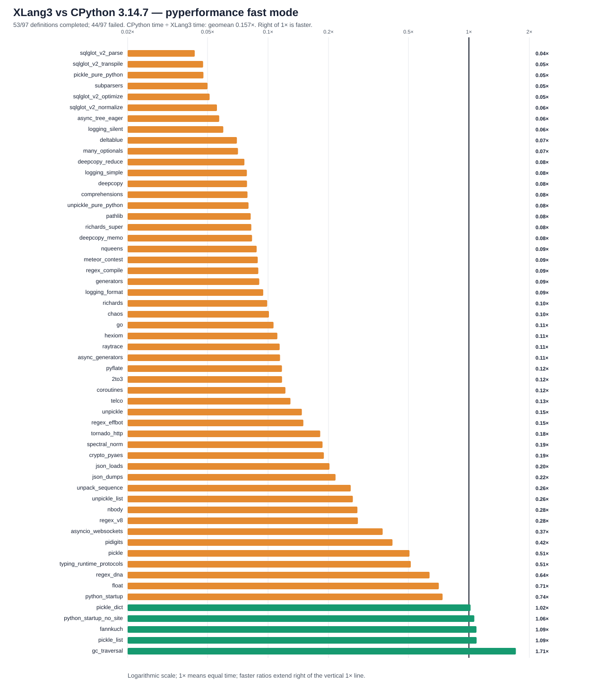

# XLang3 after bytearray in-place add vs CPython 3.14.7: full pyperformance run

This XLang3 Release run attempted all **97** pyperformance 1.14.0 definitions in `--fast` mode. It completed **53** definitions and recorded **44** failures/timeouts. The command returned exit code 1 because pyperformance treats those benchmark failures as an unsuccessful suite; every definition was attempted.

Of **56** matched subtests, XLang3 was faster on **5**. The geometric mean of CPython time divided by XLang3 time was **0.15654×**; values over 1× favor XLang3. Fast-mode samples carry stability warnings and are directional evidence. This is about **6.39× slower than CPython** on this matched set; the overall performance goal remains open.

## Run configuration

- XLang3 Release executable SHA-256: `A36B8CF5087BCC4E5FCF12F2A81BD528B6104A36663DFEB49B80D5B61B33C7E0`.
- XLang3 runtime DLL SHA-256: `828F125B1C6BEE78519F54A3EAA4D5E4F8356C25530ED038FD26A8EC9B06CA4A`.
- CPython reference: pyperformance 1.14.0 on CPython 3.14.7; XLang3 loaded `C:\Python\Python314\Lib (Python 3.14.7)`.
- The XLang3 `PYTHONPATH` contains the Windows pyperf compatibility shim and the shared benchmark dependency site-packages. No Python 3.13 standard-library overlay was used.
- Each XLang3 benchmark definition had a 120-second cap covering pyperf worker calibration and measurement. Overrides: none.

## Largest slowdowns and wins

| Subtest | CPython 3.14.7 | XLang3 | CPython / XLang3 |
|---|---:|---:|---:|
| `sqlglot_v2_parse` | 1.01 ms | 23.41 ms | 0.043× |
| `sqlglot_v2_transpile` | 1.302 ms | 27.4 ms | 0.048× |
| `pickle_pure_python` | 273.5 µs | 5.734 ms | 0.048× |
| `subparsers` | 8.151 ms | 163.1 ms | 0.050× |
| `sqlglot_v2_optimize` | 41.61 ms | 812.8 ms | 0.051× |

Measured wins:

- `gc_traversal`: **1.713×** (1.362 ms vs 2.332 ms).
- `pickle_list`: **1.093×** (4.233 µs vs 4.625 µs).
- `fannkuch`: **1.091×** (297.1 ms vs 324 ms).
- `python_startup_no_site`: **1.064×** (19.44 ms vs 20.68 ms).
- `pickle_dict`: **1.019×** (25.91 µs vs 26.41 µs).

## Failure breakdown

- 22 definitions: Benchmark died.
- 22 definitions: Benchmark timed out.

The [all-97 status CSV](data/pyperformance-xlang3-bytearray-iadd-full-fast-20261006-all-97-status.csv) retains every benchmark definition and failure status. The [matched subtest CSV](data/pyperformance-xlang3-bytearray-iadd-full-fast-20261006-subtests.csv) contains raw per-subtest means and speed ratios.

## Raw evidence

- XLang3 pyperf JSON: [`pyperformance-xlang3-bytearray-iadd-full-fast-20261006.json`](data/pyperformance-xlang3-bytearray-iadd-full-fast-20261006.json).
- Runner status log: [`pyperformance-xlang3-bytearray-iadd-full-fast-20261006.log`](data/pyperformance-xlang3-bytearray-iadd-full-fast-20261006.log).
- CPython 3.14.7 pyperf JSON: [`pyperformance-cpython314-clean-release-full-fast-20261002.json`](data/pyperformance-cpython314-clean-release-full-fast-20261002.json).
- Earlier runs that used a Python 3.13 standard library are retained separately; this run supersedes them as the same-version Python 3.14 comparison.

Benchmark worker failures have several causes, including unavailable optional benchmark dependencies, XLang3 native-module gaps, and interpreter compatibility bugs. The status CSV gives case-level failure details, and the runner log preserves worker tracebacks when available. A worker death is not a performance score; inspect its case-specific cause before treating it as a speed result.

## Effect of the bytearray fix

The focused official Base32 workload was previously measured at 38.5 s before
the fix and 1.90 s afterward, a **20.3× gain against the old XLang3 build**.
The same workload took 435 ms in CPython 3.14.7, so the improved XLang3 result
was still **4.4× slower than CPython**. These focused measurements are
[documented separately](bytearray-inplace-add-base32-trial-20261006.md).

The full `base64` definition still exceeded the 120-second cap in this run.
Its failed definition does not contribute a completed Base32 subtest to the
full-run JSON or geometric mean. The focused improvement therefore does not
prove an overall suite gain. The earlier full run matched 59 subtests and
this one matches 56, so their geometric means also cover different sets.

The pending live keyword-default correction was not built into this executable.
The [provenance file](data/pyperformance-xlang3-bytearray-iadd-full-fast-20261006-provenance.json) records the
fixed binary hashes and the Python 3.14.7 manager. No diagnostic timer flag
was enabled in the timed workers.

## Complete benchmark definition list

Every one of the 97 definitions appears below. Timing fragments include
subtest names; CP/XLang ratios greater than 1× favor XLang3. Missing XLang3
timings indicate a recorded failure or timeout, not a speed score.

| Definition | CPython 3.14.7 subtests | XLang3 status and subtests | Failure detail |
|---|---|---|---|
| `2to3` | 2to3=346.7 ms | completed; 2to3=2953 ms (0.1174× CP/XLang) |  |
| `argparse` | many_optionals=667.9 µs | completed; many_optionals=9.424 ms (0.0709× CP/XLang) |  |
| `argparse_subparsers` | subparsers=8.151 ms | completed; subparsers=163.1 ms (0.0500× CP/XLang) |  |
| `async_generators` | async_generators=287.5 ms | completed; async_generators=2505 ms (0.1148× CP/XLang) |  |
| `async_tree` | async_tree_none=227.4 ms | failed: Benchmark timed out | Benchmark timed out |
| `async_tree_cpu_io_mixed` | async_tree_cpu_io_mixed=428.6 ms | failed: Benchmark timed out | Benchmark timed out |
| `async_tree_cpu_io_mixed_tg` | async_tree_cpu_io_mixed_tg=425.6 ms | failed: Benchmark timed out | Benchmark timed out |
| `async_tree_eager` | async_tree_eager=86.62 ms | completed; async_tree_eager=1516 ms (0.0572× CP/XLang) |  |
| `async_tree_eager_cpu_io_mixed` | async_tree_eager_cpu_io_mixed=336.2 ms | failed: Benchmark timed out | Benchmark timed out |
| `async_tree_eager_cpu_io_mixed_tg` | async_tree_eager_cpu_io_mixed_tg=388.3 ms | failed: Benchmark timed out | Benchmark timed out |
| `async_tree_eager_io` | async_tree_eager_io=559.1 ms | failed: Benchmark timed out | Benchmark timed out |
| `async_tree_eager_io_tg` | async_tree_eager_io_tg=555.3 ms | failed: Benchmark timed out | Benchmark timed out |
| `async_tree_eager_memoization` | async_tree_eager_memoization=189.1 ms | failed: Benchmark timed out | Benchmark timed out |
| `async_tree_eager_memoization_tg` | async_tree_eager_memoization_tg=261.1 ms | failed: Benchmark timed out | Benchmark timed out |
| `async_tree_eager_tg` | async_tree_eager_tg=196.3 ms | failed: Benchmark timed out | Benchmark timed out |
| `async_tree_io` | async_tree_io=552.1 ms | failed: Benchmark timed out | Benchmark timed out |
| `async_tree_io_tg` | async_tree_io_tg=553.9 ms | failed: Benchmark timed out | Benchmark timed out |
| `async_tree_memoization` | async_tree_memoization=280.8 ms | failed: Benchmark timed out | Benchmark timed out |
| `async_tree_memoization_tg` | async_tree_memoization_tg=281.8 ms | failed: Benchmark timed out | Benchmark timed out |
| `async_tree_tg` | async_tree_none_tg=238.3 ms | failed: Benchmark timed out | Benchmark timed out |
| `asyncio_tcp` | asyncio_tcp=741.4 ms | failed: Benchmark timed out | Benchmark timed out |
| `asyncio_tcp_ssl` |  | failed: Benchmark timed out | Benchmark timed out |
| `asyncio_websockets` | asyncio_websockets=188.7 ms | completed; asyncio_websockets=507.3 ms (0.3721× CP/XLang) |  |
| `base64` |  | failed: Benchmark timed out | Benchmark timed out |
| `bpe_tokeniser` |  | failed: Benchmark timed out | Benchmark timed out |
| `chameleon` | chameleon=11.85 ms | failed: Benchmark died | SyntaxError: line 1, column 13: expected '}' after dict literal |
| `chaos` | chaos=47.75 ms | completed; chaos=472.4 ms (0.1011× CP/XLang) |  |
| `comprehensions` | comprehensions=14.22 µs | completed; comprehensions=180 µs (0.0790× CP/XLang) |  |
| `concurrent_imap` | bench_mp_pool=164.1 ms; bench_thread_pool=1.22 ms | failed: Benchmark died | OSError: DuplicateHandle failed with Win32 error 6 |
| `coroutines` | coroutines=17.86 ms | completed; coroutines=146.3 ms (0.1221× CP/XLang) |  |
| `coverage` | coverage=60.36 ms | failed: Benchmark died | TypeError: print_exception(): Exception expected for value, object found |
| `crypto_pyaes` | crypto_pyaes=67.92 ms | completed; crypto_pyaes=358.1 ms (0.1897× CP/XLang) |  |
| `dask` | dask=810.6 ms | failed: Benchmark died | AttributeError: module 'psutil._psutil_windows' has no attribute 'virtual_mem' |
| `deepcopy` | deepcopy=217.8 µs; deepcopy_reduce=2.314 µs; deepcopy_memo=23.65 µs | completed; deepcopy=2.771 ms (0.0786× CP/XLang); deepcopy_reduce=30.33 µs (0.0763× CP/XLang); deepcopy_memo=283.9 µs (0.0833× CP/XLang) |  |
| `deltablue` | deltablue=3.004 ms | completed; deltablue=42.91 ms (0.0700× CP/XLang) |  |
| `django_template` |  | completed; django_template=598.6 ms |  |
| `docutils` | docutils=1872 ms | failed: Benchmark died | KeyError: "format mapping key 'parens' not found" |
| `dulwich_log` | dulwich_log=47.51 ms | failed: Benchmark died | TypeError: object is not subscriptable |
| `fannkuch` | fannkuch=324 ms | completed; fannkuch=297.1 ms (1.0908× CP/XLang) |  |
| `fastapi` | fastapi_http=579.6 ms | failed: Benchmark timed out | Benchmark timed out |
| `float` | float=57.95 ms | completed; float=81.83 ms (0.7083× CP/XLang) |  |
| `gc_collect` | create_gc_cycles=1.623 ms | failed: Benchmark died | Benchmark died |
| `gc_traversal` | gc_traversal=2.332 ms | completed; gc_traversal=1.362 ms (1.7128× CP/XLang) |  |
| `generators` | generators=31.42 ms | completed; generators=347.4 ms (0.0904× CP/XLang) |  |
| `genshi` | genshi_text=24.46 ms; genshi_xml=45.65 ms | failed: Benchmark died | TypeError: iter() expected 1 or 2 arguments |
| `go` | go=103.7 ms | completed; go=973.4 ms (0.1065× CP/XLang) |  |
| `hexiom` | hexiom=5.44 ms | completed; hexiom=48.88 ms (0.1113× CP/XLang) |  |
| `html5lib` | html5lib=49.61 ms | failed: Benchmark died | RuntimeError: list.append expected 1 argument |
| `json_dumps` | json_dumps=8.063 ms | completed; json_dumps=37.19 ms (0.2168× CP/XLang) |  |
| `json_loads` | json_loads=19.33 µs | completed; json_loads=95.53 µs (0.2023× CP/XLang) |  |
| `logging` | logging_format=9.755 µs; logging_silent=70.03 ns; logging_simple=7.514 µs | completed; logging_format=103.1 µs (0.0947× CP/XLang); logging_silent=1.169 µs (0.0599× CP/XLang); logging_simple=95.79 µs (0.0784× CP/XLang) |  |
| `mako` | mako=8.554 ms | failed: Benchmark died | KeyError: '2' |
| `mdp` | mdp=1093 ms | failed: Benchmark died | Benchmark died |
| `meteor_contest` | meteor_contest=120.2 ms | completed; meteor_contest=1352 ms (0.0889× CP/XLang) |  |
| `nbody` | nbody=90.4 ms | completed; nbody=324.4 ms (0.2786× CP/XLang) |  |
| `networkx` | shortest_path=470 ms | failed: Benchmark died | AttributeError: object has no attribute '__argmap__' |
| `networkx_connected_components` | connected_components=423.2 ms | failed: Benchmark died | AttributeError: object has no attribute '__argmap__' |
| `networkx_k_core` |  | failed: Benchmark died | AttributeError: object has no attribute '__argmap__' |
| `nqueens` | nqueens=76.93 ms | completed; nqueens=876.2 ms (0.0878× CP/XLang) |  |
| `pathlib` | pathlib=50.56 ms | completed; pathlib=616.6 ms (0.0820× CP/XLang) |  |
| `pickle` | pickle=9.839 µs | completed; pickle=19.44 µs (0.5061× CP/XLang) |  |
| `pickle_dict` | pickle_dict=26.41 µs | completed; pickle_dict=25.91 µs (1.0195× CP/XLang) |  |
| `pickle_list` | pickle_list=4.625 µs | completed; pickle_list=4.233 µs (1.0925× CP/XLang) |  |
| `pickle_pure_python` | pickle_pure_python=273.5 µs | completed; pickle_pure_python=5.734 ms (0.0477× CP/XLang) |  |
| `pidigits` | pidigits=164.8 ms | completed; pidigits=395.8 ms (0.4164× CP/XLang) |  |
| `pprint` | pprint_safe_repr=657.8 ms; pprint_pformat=1328 ms | failed: Benchmark timed out | Benchmark timed out |
| `pyflate` | pyflate=366.5 ms | completed; pyflate=3125 ms (0.1173× CP/XLang) |  |
| `python_startup` | python_startup=24.94 ms | completed; python_startup=33.71 ms (0.7398× CP/XLang) |  |
| `python_startup_no_site` | python_startup_no_site=20.68 ms | completed; python_startup_no_site=19.44 ms (1.0638× CP/XLang) |  |
| `raytrace` | raytrace=272.2 ms | completed; raytrace=2381 ms (0.1143× CP/XLang) |  |
| `regex_compile` | regex_compile=118.6 ms | completed; regex_compile=1326 ms (0.0894× CP/XLang) |  |
| `regex_dna` | regex_dna=142.7 ms | completed; regex_dna=224.1 ms (0.6369× CP/XLang) |  |
| `regex_effbot` | regex_effbot=1.995 ms | completed; regex_effbot=13.31 ms (0.1499× CP/XLang) |  |
| `regex_v8` | regex_v8=18.81 ms | completed; regex_v8=67.14 ms (0.2802× CP/XLang) |  |
| `richards` | richards=36.6 ms | completed; richards=369.5 ms (0.0991× CP/XLang) |  |
| `richards_super` | richards_super=41.37 ms | completed; richards_super=501 ms (0.0826× CP/XLang) |  |
| `scimark` | scimark_fft=250.6 ms; scimark_lu=76.64 ms; scimark_monte_carlo=60.26 ms; scimark_sor=105.2 ms; scimark_sparse_mat_mult=3.249 ms | failed: Benchmark died | TypeError: object cannot be interpreted as an integer |
| `spectral_norm` | spectral_norm=103.8 ms | completed; spectral_norm=555.6 ms (0.1868× CP/XLang) |  |
| `sphinx` | sphinx=819 ms | failed: Benchmark died | KeyError: "format mapping key 'parens' not found" |
| `sqlalchemy_declarative` | sqlalchemy_declarative=95.53 ms | failed: Benchmark died | ImportError: parse error importing module 'sqlalchemy.sql.selectable': line 2601, column 23: invalid syntax. Did you mean 'if'? |
| `sqlalchemy_imperative` | sqlalchemy_imperative=11.45 ms | failed: Benchmark died | ImportError: parse error importing module 'sqlalchemy.sql.selectable': line 2601, column 23: invalid syntax. Did you mean 'if'? |
| `sqlglot_v2` | sqlglot_v2_normalize=98.39 ms | completed; sqlglot_v2_normalize=1767 ms (0.0557× CP/XLang) |  |
| `sqlglot_v2_optimize` | sqlglot_v2_optimize=41.61 ms | completed; sqlglot_v2_optimize=812.8 ms (0.0512× CP/XLang) |  |
| `sqlglot_v2_parse` | sqlglot_v2_parse=1.01 ms | completed; sqlglot_v2_parse=23.41 ms (0.0432× CP/XLang) |  |
| `sqlglot_v2_transpile` | sqlglot_v2_transpile=1.302 ms | completed; sqlglot_v2_transpile=27.4 ms (0.0475× CP/XLang) |  |
| `sqlite_synth` | sqlite_synth=1.912 µs | failed: Benchmark died | AttributeError: 'Connection' object has no attribute 'create_aggregate' |
| `sympy` |  | failed: Benchmark died | RecursionError: maximum recursion depth exceeded |
| `telco` | telco=5.755 ms | completed; telco=44.52 ms (0.1293× CP/XLang) |  |
| `tomli_loads` | tomli_loads=1845 ms | failed: Benchmark timed out | Benchmark timed out |
| `tornado_http` | tornado_http=274.7 ms | completed; tornado_http=1510 ms (0.1819× CP/XLang) |  |
| `typing_runtime_protocols` | typing_runtime_protocols=132.4 µs | completed; typing_runtime_protocols=257.8 µs (0.5136× CP/XLang) |  |
| `unpack_sequence` | unpack_sequence=44.67 ns | completed; unpack_sequence=173.2 ns (0.2580× CP/XLang) |  |
| `unpickle` | unpickle=10.58 µs | completed; unpickle=71.85 µs (0.1473× CP/XLang) |  |
| `unpickle_list` | unpickle_list=3.365 µs | completed; unpickle_list=12.72 µs (0.2644× CP/XLang) |  |
| `unpickle_pure_python` | unpickle_pure_python=205.3 µs | completed; unpickle_pure_python=2.566 ms (0.0800× CP/XLang) |  |
| `xdsl` | xdsl_constant_fold=35.78 ms | failed: Benchmark died | AttributeError: GenericAlias object has no attribute 'get' |
| `xml_etree` | xml_etree_parse=116 ms; xml_etree_iterparse=72.67 ms; xml_etree_generate=80.22 ms; xml_etree_process=51.04 ms | failed: Benchmark died | AssertionError: missing end tags |
