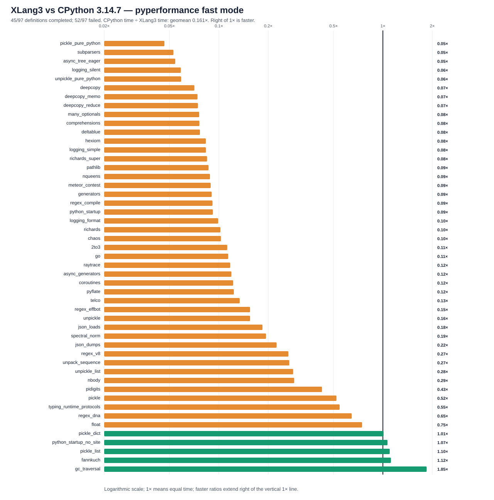

# XLang3 vs CPython 3.14.7: corrected full pyperformance run

The corrected XLang3 run attempted all **97** pyperformance 1.14.0 definitions in `--fast` mode. It completed **45** definitions and recorded **52** failures/timeouts. The command returned exit code 1 because pyperformance treats those benchmark failures as an unsuccessful suite; every definition was attempted.

Of **49** matched subtests, XLang3 was faster on **5**. The geometric mean of CPython time divided by XLang3 time was **0.16130×**; values over 1× favor XLang3. Fast-mode samples carry stability warnings and are directional evidence.

This run has 49 matched subtests, compared with 52 in the preceding full run,
so the two full-suite geometric means are not a like-for-like measure of the
change. The controlled 21-pair eager-tree comparison is the evidence for the
constructor-cache speedup; see the [focused report](call-ex-constructor-cache-async-tree-eager-20261004.md).

## Run configuration

- XLang3 Release executable SHA-256: `533991326CE1CCD5A73A0A1B47F32A14AC2C8574184B37D1D6BFEFE19DBA328E`.
- XLang3 runtime DLL SHA-256: `74C62FEAA72F33CF2F4BA297D14DD1FA024A1A8D2D10558395549079F57CE43F`.
- CPython reference: pyperformance 1.14.0 on CPython 3.14.7; XLang3 loaded `Python 3.14 standard library`.
- The XLang3 `PYTHONPATH` contains the Windows pyperf compatibility shim and the shared benchmark dependency site-packages. No Python 3.13 standard-library overlay was used.
- Each XLang3 benchmark definition had a 120-second cap covering pyperf worker calibration and measurement. Overrides: async_tree*=30s, async_tree_eager=300s.

## Largest slowdowns and wins

| Subtest | CPython 3.14.7 | XLang3 | CPython / XLang3 |
|---|---:|---:|---:|
| `pickle_pure_python` | 273.5 µs | 5.873 ms | 0.047× |
| `subparsers` | 8.151 ms | 154.3 ms | 0.053× |
| `async_tree_eager` | 86.62 ms | 1597 ms | 0.054× |
| `logging_silent` | 70.03 ns | 1.194 µs | 0.059× |
| `unpickle_pure_python` | 205.3 µs | 3.484 ms | 0.059× |

Measured wins:

- `gc_traversal`: **1.849×** (1.262 ms vs 2.332 ms).
- `fannkuch`: **1.120×** (289.4 ms vs 324 ms).
- `pickle_list`: **1.101×** (4.201 µs vs 4.625 µs).
- `python_startup_no_site`: **1.068×** (19.38 ms vs 20.68 ms).
- `pickle_dict`: **1.010×** (26.15 µs vs 26.41 µs).

## Failure breakdown

- 32 definitions: Benchmark died.
- 20 definitions: Benchmark timed out.

The [all-97 status CSV](data/pyperformance-xlang3-call-ex-constructor-cache-vs-cpython314-full-fast-20261004-all-97-status.csv) retains every benchmark definition and failure status. The [matched subtest CSV](data/pyperformance-xlang3-call-ex-constructor-cache-vs-cpython314-full-fast-20261004-subtests.csv) contains raw per-subtest means and speed ratios.

## Raw evidence

- XLang3 pyperf JSON: [`pyperformance-xlang3-call-ex-constructor-cache-full-fast-20261004.json`](data/pyperformance-xlang3-call-ex-constructor-cache-full-fast-20261004.json).
- Normalized per-definition status log: [`pyperformance-xlang3-call-ex-constructor-cache-full-fast-20261004-status.log`](data/pyperformance-xlang3-call-ex-constructor-cache-full-fast-20261004-status.log).
- CPython 3.14.7 pyperf JSON: [`pyperformance-cpython314-clean-release-full-fast-20261002.json`](data/pyperformance-cpython314-clean-release-full-fast-20261002.json).
- Earlier runs that used a Python 3.13 standard library are retained separately; this run supersedes them as the same-version Python 3.14 comparison.

Benchmark worker failures have several causes, including unavailable optional dependencies and XLang3 compatibility errors. The status CSV records each definition's completion, timeout, or worker-death status. The normalized status log was reconstructed from the completed run summary and the pyperf JSON; it does not contain worker tracebacks. A worker death is not a performance score.
