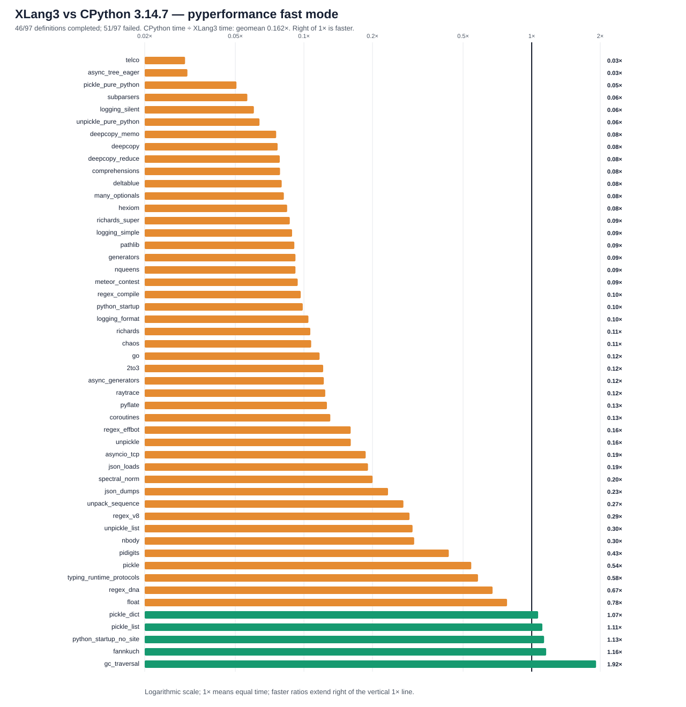

# XLang3 vs CPython 3.14.7: corrected full pyperformance run

The corrected XLang3 run attempted all **97** pyperformance 1.14.0 definitions in `--fast` mode. It completed **46** definitions and recorded **51** failures/timeouts. The command returned exit code 1 because pyperformance treats those benchmark failures as an unsuccessful suite; every definition was attempted.

Of **50** matched subtests, XLang3 was faster on **5**. The geometric mean of CPython time divided by XLang3 time was **0.16205×**; values over 1× favor XLang3. Fast-mode samples carry stability warnings and are directional evidence.

## Run configuration

- XLang3 Release executable SHA-256: `78759AC13404C2A05ED26F2ADA691E094BF7944C5C58952FC4635DD4116171AC`.
- XLang3 runtime DLL SHA-256: `AA32D00FEBF2AC72666026D58DF544F6D649F9C2C14009227A90098D51B5EE61`.
- CPython reference: pyperformance 1.14.0 on CPython 3.14.7; XLang3 loaded `CPython 3.14.7 standard library with the repository Windows pyperf shim`.
- The XLang3 `PYTHONPATH` contains the Windows pyperf compatibility shim and the shared benchmark dependency site-packages. No Python 3.13 standard-library overlay was used.
- Each XLang3 benchmark definition had a 300-second cap covering pyperf worker calibration and measurement. Overrides: async_tree*=300s.

## Largest slowdowns and wins

| Subtest | CPython 3.14.7 | XLang3 | CPython / XLang3 |
|---|---:|---:|---:|
| `telco` | 5.755 ms | 191.4 ms | 0.030× |
| `async_tree_eager` | 86.62 ms | 2812 ms | 0.031× |
| `pickle_pure_python` | 273.5 µs | 5.411 ms | 0.051× |
| `subparsers` | 8.151 ms | 144.4 ms | 0.056× |
| `logging_silent` | 70.03 ns | 1.161 µs | 0.060× |

Measured wins:

- `gc_traversal`: **1.917×** (1.217 ms vs 2.332 ms).
- `fannkuch`: **1.158×** (279.9 ms vs 324 ms).
- `python_startup_no_site`: **1.134×** (18.25 ms vs 20.68 ms).
- `pickle_list`: **1.114×** (4.151 µs vs 4.625 µs).
- `pickle_dict`: **1.067×** (24.75 µs vs 26.41 µs).

## Failure breakdown

- 32 definitions: Benchmark died.
- 19 definitions: Benchmark timed out.

The [all-97 status CSV](data/pyperformance-xlang3-call-ex-varargs-keyword-defaults-vs-cpython314-20261004-all-97-status.csv) retains every benchmark definition and failure status. The [matched subtest CSV](data/pyperformance-xlang3-call-ex-varargs-keyword-defaults-vs-cpython314-20261004-subtests.csv) contains raw per-subtest means and speed ratios.

## Raw evidence

- XLang3 pyperf JSON: [`pyperformance-xlang3-call-ex-varargs-keyword-defaults-all-97-fast-20261004.json`](data/pyperformance-xlang3-call-ex-varargs-keyword-defaults-all-97-fast-20261004.json).
- Runner status log: [`pyperformance-xlang3-call-ex-varargs-keyword-defaults-all-97-fast-20261004.log`](data/pyperformance-xlang3-call-ex-varargs-keyword-defaults-all-97-fast-20261004.log).
- CPython 3.14.7 pyperf JSON: [`pyperformance-cpython314-clean-release-full-fast-20261002.json`](data/pyperformance-cpython314-clean-release-full-fast-20261002.json).
- Earlier runs that used a Python 3.13 standard library are retained separately; this run supersedes them as the same-version Python 3.14 comparison.

Benchmark worker failures have several causes, including unavailable optional benchmark dependencies, XLang3 native-module gaps, and interpreter compatibility bugs. The status CSV gives case-level failure details, and the runner log preserves worker tracebacks when available. A worker death is not a performance score; inspect its case-specific cause before treating it as a speed result.
