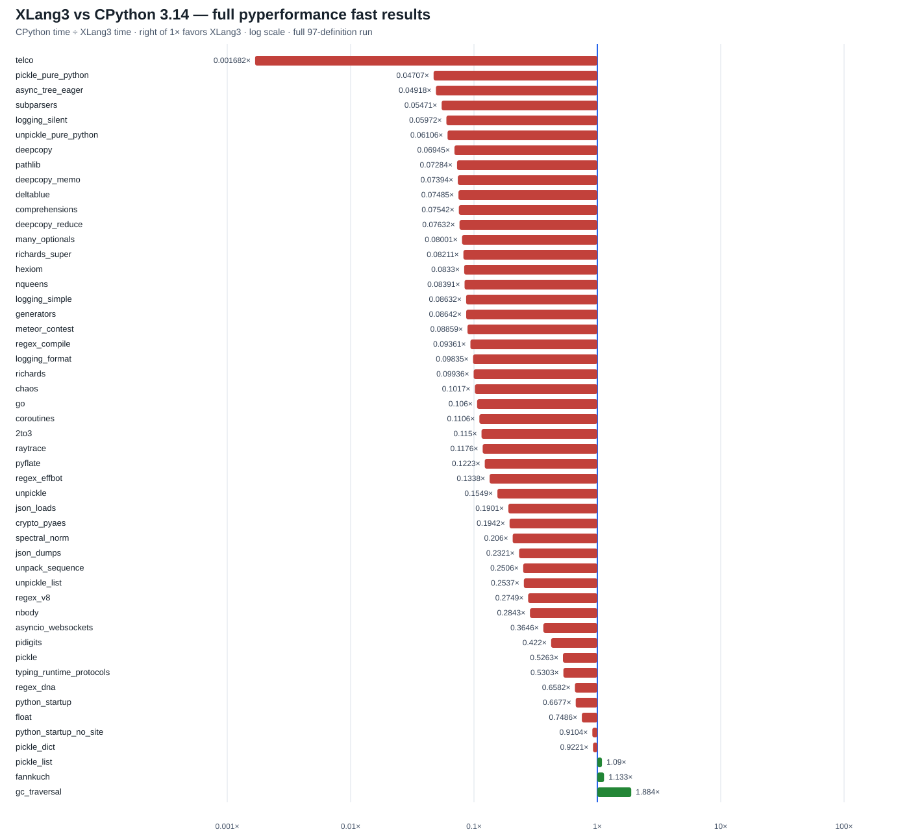

# XLang3 class-hash candidate vs CPython 3.14: full pyperformance run

This run tested the early `ObjectKind::Class` hash path described in
[`deepcopy-class-hash-trial-20261002.md`](deepcopy-class-hash-trial-20261002.md).
It attempted all 97 pyperformance 1.14 definitions in fast mode with a
120-second top-level cap, using the shared CPython 3.14.7 dependency site and
Windows-safe pyperf hooks. The CPython reference is the matching clean Release
run from the same host and setup.

XLang3 measured **50 subtests across 46 definitions**; **51 definitions
failed or timed out** (23 timeouts and 28 worker/runtime failures). CPython's
matched raw data and failure details remain in the previous clean-run report.
Of the 50 matched XLang3/CPython subtests, XLang3 was faster on 3 and slower
on 47. Their geometric speed ratio, CPython time divided by XLang3 time, is
**0.15514×**, or about **6.45× slower** across that sample. This is not a full
suite win, and the fast samples are noisy; the matched set differs from the
clean XLang3 control run.

The target improved materially: `deepcopy_memo` measured **320 µs** here,
versus **585 µs** in the clean XLang3 full run and **23.6 µs** for CPython. It
is now about **13.5× slower** than CPython, down from about **24.8× slower**.
The focused rigorous A/B measured 574 µs ± 59 µs on the clean control and
319 µs ± 29 µs on the candidate. The fixed 11-case Release gate also passed;
see the trial report for the raw gate artifact.

| Slow subtest | CPython 3.14 | XLang3 candidate | CPython/XLang3 |
| --- | ---: | ---: | ---: |
| `telco` | 5.75 ms | 3.42 s | 0.00168× |
| `pickle_pure_python` | 274 µs | 5.81 ms | 0.0471× |
| `async_tree_eager` | 86.6 ms | 1.76 s | 0.0492× |
| `subparsers` | 8.15 ms | 149 ms | 0.0547× |
| `logging_silent` | 70.0 ns | 1.17 µs | 0.0597× |
| `deepcopy_memo` | 23.6 µs | 320 µs | 0.0739× |

The `async_tree_eager` case completed at 1.76 s in this run, while 15 other
async-tree definitions timed out at 120 seconds. The preceding clean full run
timed out all 16, so the eager case's behavior remains intermittent. Other
failures include third-party compatibility exceptions such as Chameleon's
`str.split` call, missing `distutils`, package parser errors, and worker
failures; the status CSV preserves all 97 outcomes.

The largest measured remaining gap is `telco`, at **3.42 s vs 5.75 ms**.
CPython runs the same Python benchmark with its native `_decimal` accelerator;
XLang3 currently falls back to the pure-Python `_pydecimal` implementation.
This is the next high-value runtime target and is permitted by the project
rule because CPython provides `_decimal` as a native module. The source
comparison and compatibility boundary are recorded in
[`telco-decimal-native-gap-20261002.md`](telco-decimal-native-gap-20261002.md).

## Artifacts

- [All 97 definition statuses](data/pyperformance-xlang3-class-hash-full-fast-20261002-all-97-status.csv)
- [All subtests and speed ratios](data/pyperformance-xlang3-class-hash-full-fast-20261002-subtests.csv)
- [Horizontal comparison chart](pyperformance-xlang3-class-hash-full-fast-20261002.svg)
- [Raw XLang3 pyperf JSON](data/pyperformance-xlang3-class-hash-full-fast-20261002.json)
- [Reconstructed case-status log](data/pyperformance-xlang3-class-hash-full-fast-20261002-status.log)
- [Matching CPython 3.14.7 raw JSON](data/pyperformance-cpython314-clean-release-full-fast-20261002.json)

The stock `pyperformance run` launcher failed on this Windows host with
pyperf's `select` error 10038. The repository's
`run_pyperformance_xlang3_shimmed.py` completed the all-97 attempt. The
`*-status.log` is a reconstructed case-status file, not verbatim stdout: its
97-case order and failure types were taken from the completed runner output
and final summary; timings come directly from the raw pyperf JSON.
