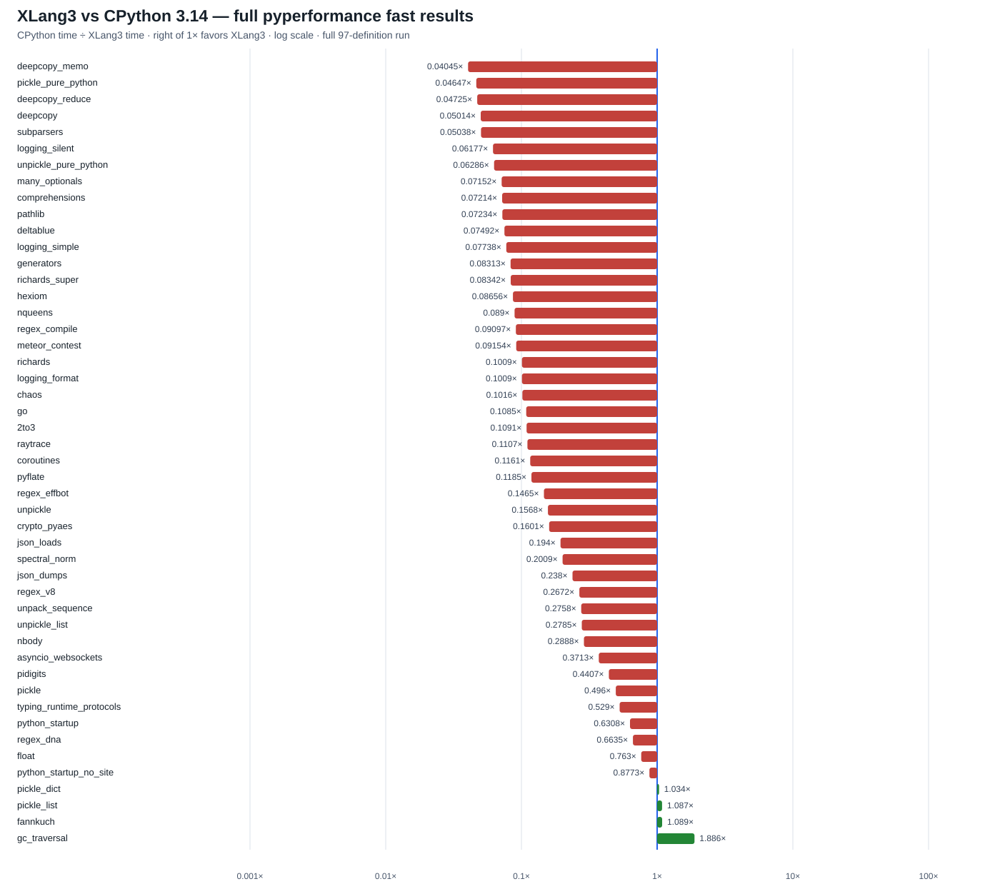

# XLang3 clean Release vs CPython 3.14: full pyperformance run

This comparison uses a newly built, isolated XLang3 Release executable and a
fresh CPython 3.14.7 reference run. The same pyperformance 1.14.0 definitions,
dependency site, fast-mode settings, Windows command-safe compatibility hook,
and 120-second top-level case cap were used for both runtimes.

All **97 definitions** were attempted. XLang3 measured 48 subtests across 44
completed definitions; 53 definitions failed or timed out. CPython measured 91
definitions, with 5 failures and one partial definition. Of the 48 matched
subtests, XLang3 was faster on 4 and slower on 44. The geometric mean of
CPython time divided by XLang3 time is **0.16904×**: XLang3 took about **5.92×
as long** across this matched set. This aggregates distinct workloads and is
directional evidence only; most fast-mode samples report instability.

The chart places the 1× parity line at the center. The full 97-row status file
preserves each measured, failed, timed-out, or partial definition. The
subtest file preserves every available mean and matched speed ratio.

## Results

- [All 97 definition statuses and failure details](data/pyperformance-xlang3-clean-release-full-fast-20261002-all-97-status.csv)
- [All subtest timings and matched ratios](data/pyperformance-xlang3-clean-release-full-fast-20261002-subtests.csv)
- [XLang3 raw pyperf JSON](data/pyperformance-xlang3-clean-release-full-fast-20261002.json) and [full log](data/pyperformance-xlang3-clean-release-full-fast-20261002.log)
- [CPython 3.14 raw pyperf JSON](data/pyperformance-cpython314-clean-release-full-fast-20261002.json) and [full log](data/pyperformance-cpython314-clean-release-full-fast-20261002.log)

The largest matched slowdowns were:

| Subtest | CPython 3.14 | XLang3 | CPython/XLang3 |
|---|---:|---:|---:|
| `deepcopy_memo` | 23.6 µs | 583.3 µs | 0.0405× (24.7× slower) |
| `pickle_pure_python` | 274 µs | 5.90 ms | 0.0465× (21.5× slower) |
| `deepcopy_reduce` | 2.31 µs | 48.9 µs | 0.0473× (21.2× slower) |
| `deepcopy` | 218 µs | 4.35 ms | 0.0501× (20.0× slower) |
| `subparsers` | 8.15 ms | 162 ms | 0.0504× (19.8× slower) |
| `logging_silent` | 70.0 ns | 1.13 µs | 0.0618× (16.2× slower) |
| `unpickle_pure_python` | 205 µs | 3.26 ms | 0.0629× (15.9× slower) |
| `many_optionals` | 668 µs | 9.34 ms | 0.0715× (14.0× slower) |
| `pathlib` | 50.6 ms | 699 ms | 0.0723× (13.8× slower) |
| `comprehensions` | 14.2 µs | 197 µs | 0.0721× (13.9× slower) |
| `meteor_contest` | 120 ms | 1.31 s | 0.0917× (10.9× slower) |
| `regex_compile` | 119 ms | 1.30 s | 0.0918× (10.9× slower) |

The four measured wins were `gc_traversal` at **1.89×**, `fannkuch` at
**1.09×**, `pickle_list` at **1.09×**, and `pickle_dict` at **1.03×**. The
matched ratios are in the subtest CSV; they include all 48 rows, not only the
largest gaps shown above.

## Failures and compatibility

XLang3's 53 failed definitions comprise **25 timeouts** and **28 worker or
runtime failures**. All 16 `async_tree` definitions timed out, including
`async_tree_eager`, and `async_generators` also timed out. The other timed-out
definitions were `asyncio_tcp`, `asyncio_tcp_ssl`, `base64`, `bpe_tokeniser`,
`fastapi`, `pprint`, `telco`, and `tomli_loads`. The remaining failures are
listed with their exact details in the 97-row CSV and full log. Several are
third-party compatibility failures, including Chameleon string handling,
Tornado parsing, NetworkX decorator metadata, and missing `distutils` in
packages that still import it.

CPython also hit the 120-second cap on `asyncio_tcp_ssl`, `base64`,
`bpe_tokeniser`, and `networkx_k_core`; it failed to import `django_template`
and `sympy` because the shared dependency site lacks `distutils`. `base64`
retained partial CPython timings before its timeout. These reference failures
remain explicit in the status CSV; no missing result was assigned a synthetic
time.

## Async fast-mode discrepancy

The full `--fast` run timed out all 16 `async_tree` definitions at 120 seconds.
A focused `--debug-single-value` run of the exact official `async_tree_eager`
case completed in 1.88 seconds on the clean executable and 2.42 seconds on the
saved October 1 fast-call executable. Under the same `--fast` runner and 120-
second cap, the saved executable completed with a mean of 1.93 seconds per
iteration (11 worker runs, about 67 seconds total), while the clean executable
timed out at 120 seconds without producing a result. Thus a single workload
execution is fast on both builds, but repeated `--fast` execution exposes a
severe clean-build-only slowdown or hang. The native `_asyncio` contract test
passes, which rules out the accelerator simply being absent. Next, inspect
worker-by-worker progress, process memory, and Task/Future/callback growth to
find the repeated-execution trigger before changing asyncio semantics again.

Focused run identities: clean executable
`EF20D5E34C5F36F7C7D40FB152311C3449CA505980DAD963CEEBC859578A94A2` with
runtime `BD61627CA60E44E870781C9129F9FFFB5EFECA96A14354568024E90ECB99E153`;
saved October 1 executable
`3AFB3E841A8BA45AE5CB0DF05A21FA6390C786709A5DAB6B1A11CFAA0906483B` with
runtime `EBC04BEF7E3364B7BFCCADBE88F1E5D19690393F41103078E50B713C366088C6`.
The [saved-build debug result](data/async-tree-eager-saved-fastcall-debug-20261002.json),
[clean-build debug result](data/async-tree-eager-clean-release-debug-20261002.json),
[saved-build fast result](data/async-tree-eager-saved-fastcall-fast-20261002.json),
and [clean-build fast timeout log](data/async-tree-eager-clean-release-fast-timeout-20261002.txt)
preserve these focused checks.

The repeat probe reproduces pyperf's event-loop lifecycle
(`new_event_loop`, `set_event_loop`, `run_until_complete`, clear the current
loop, then `close`) with the same eager tree object. CPython completed 11
consecutive full trees at 93–95 ms each. XLang3's repeated-run result is
intermittent: one clean-build sequence stalled on run 3, while a later
stage-marked sequence completed six runs at about 1.8–2.6 seconds each and
stalled during run 7. A saved control likewise stalled during run 7. Forced
collection allowed one clean sequence to complete five runs, but a longer run
still stalled. In a diagnostic build, registry-lock tracing reported no
contention before a stall; Task-step and unregister counters stopped advancing
while the process was idle. This narrows the issue to repeated full-size
Task/event-loop execution, but does not identify a deterministic threshold or
root cause. The probe and outcomes are preserved in [its results log](data/async-tree-loop-reuse-probe-20261002.txt).

The pure-Python `copy`, `pickle`, and benchmark libraries remain Python code.
Their slowdowns must be addressed through XLang3's compiler, IR, VM, and shared
runtime paths. Native modules remain appropriate only where CPython itself
provides a native module, with the same Python-visible import name and
compatible API/ABI.

## Run identity and validation

- XLang3 executable SHA-256: `EF20D5E34C5F36F7C7D40FB152311C3449CA505980DAD963CEEBC859578A94A2`.
- XLang3 runtime DLL SHA-256: `BD61627CA60E44E870781C9129F9FFFB5EFECA96A14354568024E90ECB99E153`.
- CPython: 3.14.7; executable SHA-256: `4942B86A6597E5AEE0128DAA00050ED79BC21F6E709A78EB19CBFEB0C2F39AC9`.
- Both used pyperformance 1.14.0, pyperf 2.10.0, `--fast`, all 97 definitions,
  the same shared dependency site, and the same 120-second case cap. The XLang3
  run returned 1 because 53 definitions failed; the CPython run returned 1
  because 6 definitions failed or were partial.
- The clean XLang3 binary passed the fixed 11-case Release regression gate
  against the preserved baseline (see
  [`fresh-release-build-fixed-baseline-20261002.json`](data/fresh-release-build-fixed-baseline-20261002.json)).
  The focused net test and 53 of the 55 non-fixture CTest cases passed; the
  fixture runner and build-path-specific Visual Studio launch test remain
  unverified on this isolated build.
