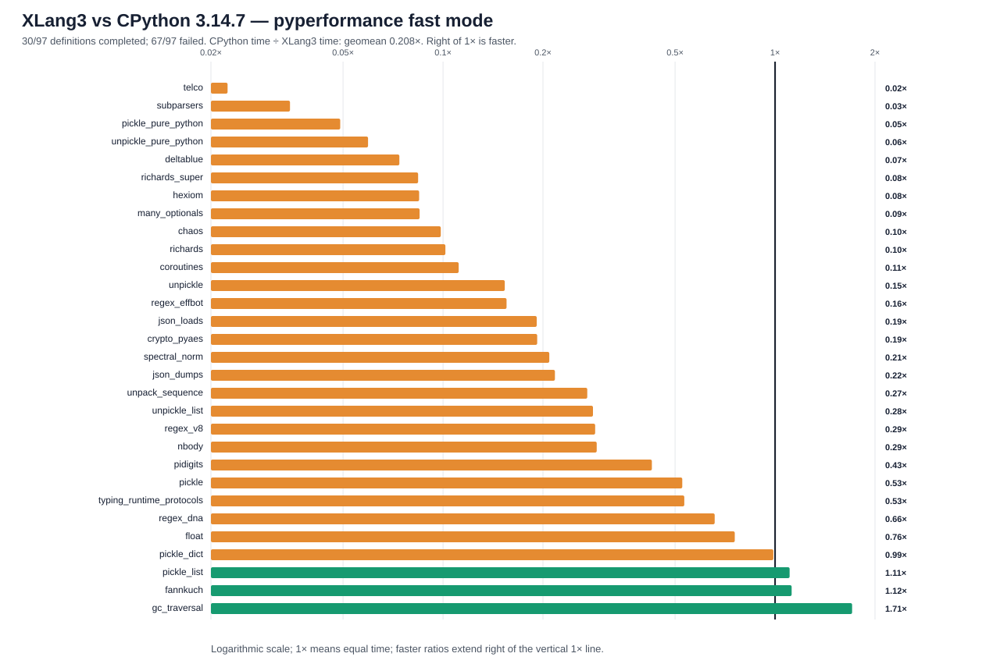

# XLang3 vs CPython 3.14.7: corrected full pyperformance run

The corrected XLang3 run attempted all **97** pyperformance 1.14.0 definitions in `--fast` mode. It completed **30** definitions and recorded **67** failures/timeouts. The command returned exit code 1 because pyperformance treats those benchmark failures as an unsuccessful suite; every definition was attempted.

Of **30** matched subtests, XLang3 was faster on **3**. The geometric mean of CPython time divided by XLang3 time was **0.20821×**; values over 1× favor XLang3. Fast-mode samples carry stability warnings and are directional evidence.

## Run configuration

- XLang3 Release executable SHA-256: `00681D8E09C5FE51996988D7164B19905A2CC664EFCBAD232F6A72CB05618721`.
- XLang3 runtime DLL SHA-256: `8F574CA53483DB9858D6CE27B47F1B214A7F39674C5A9DEAC4DA651670B9528F`.
- CPython reference: pyperformance 1.14.0 on CPython 3.14.7; XLang3 used the accessible Python 3.13 standard library because the configured Python 3.14 standard-library directory is inaccessible to this process.
- The XLang3 `PYTHONPATH` includes `scratch/performance-trials/python313-copy-compat`, which restores the `bytearray.copy` behavior expected by the Python 3.14 compatibility layer.
- Each XLang3 benchmark definition had a 30-second cap covering pyperf worker calibration and measurement. Overrides: async_tree*=20s.

## Largest slowdowns and wins

| Subtest | CPython 3.14.7 | XLang3 | CPython / XLang3 |
|---|---:|---:|---:|
| `telco` | 5.755 ms | 256.3 ms | 0.022× |
| `subparsers` | 8.151 ms | 235.5 ms | 0.035× |
| `pickle_pure_python` | 273.5 µs | 5.579 ms | 0.049× |
| `unpickle_pure_python` | 205.3 µs | 3.453 ms | 0.059× |
| `deltablue` | 3.004 ms | 40.66 ms | 0.074× |

Measured wins:

- `gc_traversal`: **1.706×** (1.367 ms vs 2.332 ms).
- `fannkuch`: **1.122×** (288.8 ms vs 324 ms).
- `pickle_list`: **1.106×** (4.181 µs vs 4.625 µs).

## Failure breakdown

- 35 definitions: Benchmark died.
- 32 definitions: Benchmark timed out.

The [all-97 status CSV](data/pyperformance-xlang3-current-quantize-control-full-fast-bounded-20261002-all-97-status.csv) retains every benchmark definition and failure status. The [matched subtest CSV](data/pyperformance-xlang3-current-quantize-control-full-fast-bounded-20261002-subtests.csv) contains raw per-subtest means and speed ratios.

## Raw evidence

- XLang3 pyperf JSON: [`pyperformance-xlang3-current-quantize-control-full-fast-bounded-20261002.json`](data/pyperformance-xlang3-current-quantize-control-full-fast-bounded-20261002.json).
- Runner status log: [`pyperformance-xlang3-current-quantize-control-full-fast-bounded-20261002-status.log`](data/pyperformance-xlang3-current-quantize-control-full-fast-bounded-20261002-status.log).
- CPython 3.14.7 pyperf JSON: [`pyperformance-cpython314-clean-release-full-fast-20261002.json`](data/pyperformance-cpython314-clean-release-full-fast-20261002.json).
- Previous run without the `bytearray.copy` overlay is retained separately; this report supersedes it for corrected compatibility status.

Benchmark worker failures have several causes: Python 3.13/3.14 standard-library and dependency mismatches, XLang3 native-module gaps, and interpreter compatibility bugs. This bounded-run status log summarizes timeout/death classifications; it does not preserve full tracebacks. Do not attribute a failure to performance without inspecting its case-specific cause.
