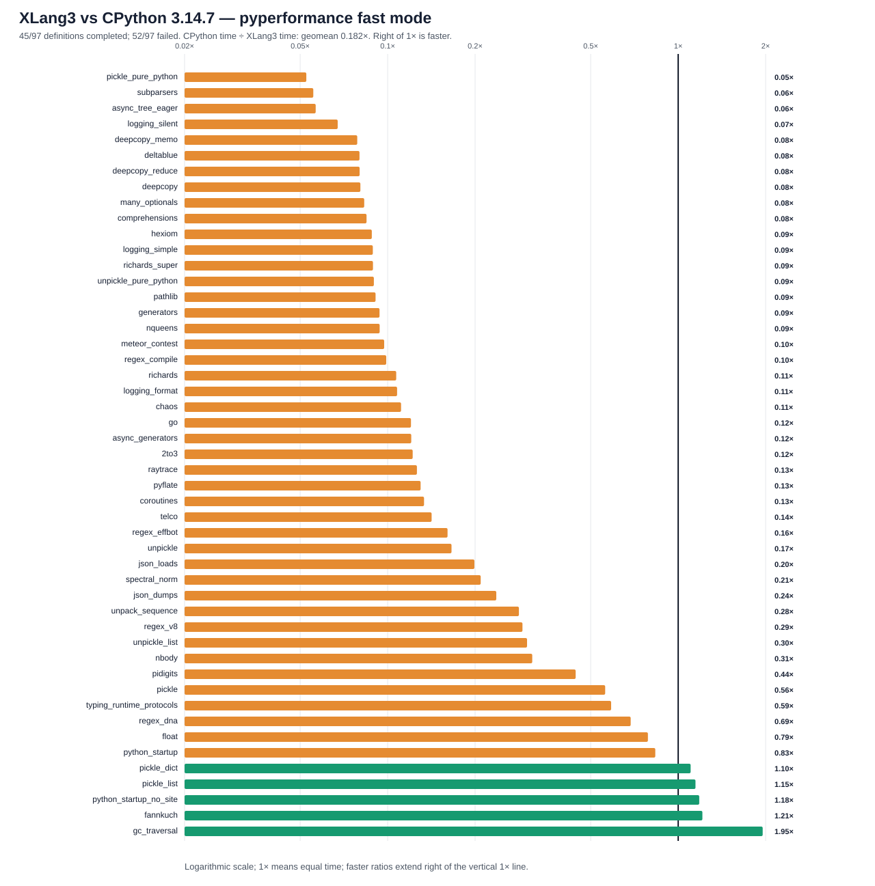

# XLang3 vs CPython 3.14.7: current Release full pyperformance run

The current XLang3 Release run attempted all **97** pyperformance 1.14.0 definitions in `--fast` mode. It completed **45** definitions and recorded **52** failures/timeouts. The command returned exit code 1 because pyperformance treats those benchmark failures as an unsuccessful suite; every definition was attempted.

Of **49** matched subtests, XLang3 was faster on **5**. The geometric mean of CPython time divided by XLang3 time was **0.18172×**; values over 1× favor XLang3. Fast-mode samples carry stability warnings and are directional evidence.

## Run configuration

- XLang3 Release executable SHA-256: `94F65647D7E3116A81CC7D1E7783D5E951E7A260101667177257F9266502E033`.
- XLang3 runtime DLL SHA-256: `C60087265E4A97FEF73EC4F9CDA28BCDE02A4291FA2E4ED760E4390DB9E9BDE5`.
- CPython reference: pyperformance 1.14.0 on CPython 3.14.7; XLang3 loaded `Python 3.14 standard library`.
- The XLang3 `PYTHONPATH` contains the Windows pyperf compatibility shim and the shared benchmark dependency site-packages. No Python 3.13 standard-library overlay was used.
- Each XLang3 benchmark definition had a 120-second cap covering pyperf worker calibration and measurement. Overrides: none.

## Largest slowdowns and wins

| Subtest | CPython 3.14.7 | XLang3 | CPython / XLang3 |
|---|---:|---:|---:|
| `pickle_pure_python` | 273.5 µs | 5.212 ms | 0.052× |
| `subparsers` | 8.151 ms | 146.9 ms | 0.055× |
| `async_tree_eager` | 86.62 ms | 1532 ms | 0.057× |
| `logging_silent` | 70.03 ns | 1.04 µs | 0.067× |
| `deepcopy_memo` | 23.65 µs | 300.9 µs | 0.079× |

Measured wins:

- `gc_traversal`: **1.954×** (1.194 ms vs 2.332 ms).
- `fannkuch`: **1.211×** (267.5 ms vs 324 ms).
- `python_startup_no_site`: **1.182×** (17.5 ms vs 20.68 ms).
- `pickle_list`: **1.147×** (4.03 µs vs 4.625 µs).
- `pickle_dict`: **1.104×** (23.92 µs vs 26.41 µs).

## Change since the prior full comparison

The matched-case geometric mean moved from **0.16948×** to **0.18172×** CPython/XLang3, a directional 7.2% ratio improvement. Excluding `python_startup`, the other 48 ratios improved 5.2% geometrically; the startup fix reduced that case from the prior corrected 80.8 ms to 29.9 ms. The run still has five wins among 49 subtests, so this is not a broad reversal. Fast-mode samples are noisy and should be treated as directional.

## Failure breakdown

- 32 definitions: Benchmark died; details captured for dependency gaps, multiprocessing handle duplication, and runtime semantic failures are in the status CSV.
- 20 definitions: Benchmark timed out at 120 seconds.

The failure-summary file is a reconstruction of the runner's final failure list, not a verbatim stdout/stderr log. The current run's aggregated pyperf JSON is preserved; the status CSV includes the failure causes observed in the console and existing recorded cause where it was unchanged.

The [all-97 status CSV](data/pyperformance-xlang3-current-release-all-97-vs-cpython314-fast-20261005-all-97-status.csv) retains every benchmark definition and failure status. The [matched subtest CSV](data/pyperformance-xlang3-current-release-all-97-vs-cpython314-fast-20261005-subtests.csv) contains raw per-subtest means and speed ratios.

## Raw evidence

- XLang3 pyperf JSON: [`pyperformance-xlang3-current-release-all-97-vs-cpython314-fast-20261005.json`](data/pyperformance-xlang3-current-release-all-97-vs-cpython314-fast-20261005.json).
- Runner status log: [`pyperformance-xlang3-current-release-all-97-vs-cpython314-fast-20261005-failure-summary.log`](data/pyperformance-xlang3-current-release-all-97-vs-cpython314-fast-20261005-failure-summary.log).
- CPython 3.14.7 pyperf JSON: [`pyperformance-cpython314-clean-release-full-fast-20261002.json`](data/pyperformance-cpython314-clean-release-full-fast-20261002.json).
- Earlier runs that used a Python 3.13 standard library are retained separately; this run supersedes them as the same-version Python 3.14 comparison.

Benchmark worker failures include absent optional dependencies and runtime compatibility defects. A worker death is not a performance score. This run left the comparison goal open: pure-Python Pickler, subparsers, and asyncio remain far slower than CPython, and numerous benchmark definitions still fail or time out.
