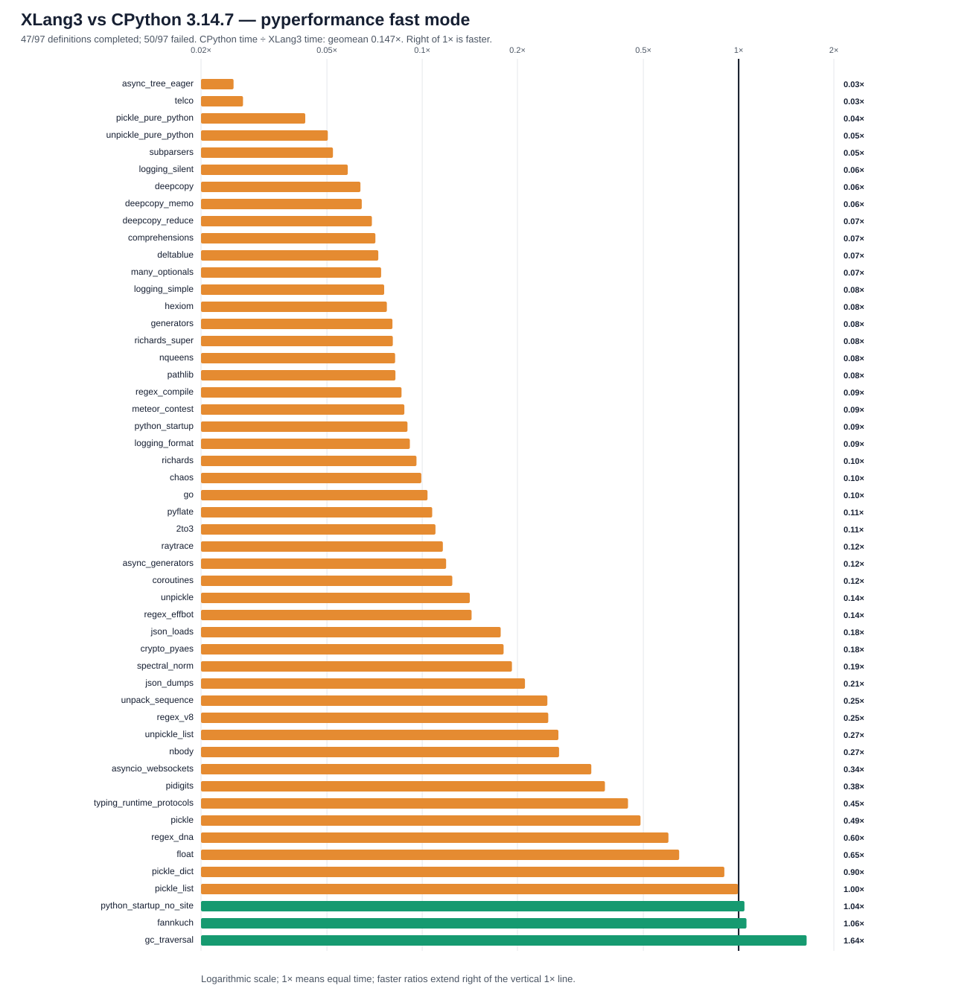

# XLang3 vs CPython 3.14.7: corrected full pyperformance run

The corrected XLang3 run attempted all **97** pyperformance 1.14.0 definitions in `--fast` mode. It completed **47** definitions and recorded **50** failures/timeouts. The command returned exit code 1 because pyperformance treats those benchmark failures as an unsuccessful suite; every definition was attempted.

Of **51** matched subtests, XLang3 was faster on **3**. The geometric mean of CPython time divided by XLang3 time was **0.14699×**; values over 1× favor XLang3. Fast-mode samples carry stability warnings and are directional evidence.

## Run configuration

- XLang3 Release executable SHA-256: `69C551F01CA5BA4C0F75E16A52D8D900543E11D155698AA69E8BF84F9A7A9312`.
- XLang3 runtime DLL SHA-256: `4616AB3825EC913CEA045CBD392FBE682FB006631786A026D6B127383FD115F6`.
- CPython reference: pyperformance 1.14.0 on CPython 3.14.7; XLang3 loaded `Python 3.14 standard library`.
- The XLang3 `PYTHONPATH` contains the Windows pyperf compatibility shim and the shared benchmark dependency site-packages. No Python 3.13 standard-library overlay was used.
- Each XLang3 benchmark definition had a 120-second cap covering pyperf worker calibration and measurement. Overrides: async_tree*=30s, async_tree_eager=300s.

## Largest slowdowns and wins

| Subtest | CPython 3.14.7 | XLang3 | CPython / XLang3 |
|---|---:|---:|---:|
| `async_tree_eager` | 86.62 ms | 3418 ms | 0.025× |
| `telco` | 5.755 ms | 212 ms | 0.027× |
| `pickle_pure_python` | 273.5 µs | 6.406 ms | 0.043× |
| `unpickle_pure_python` | 205.3 µs | 4.078 ms | 0.050× |
| `subparsers` | 8.151 ms | 156 ms | 0.052× |

Measured wins:

- `gc_traversal`: **1.640×** (1.422 ms vs 2.332 ms).
- `fannkuch`: **1.059×** (306 ms vs 324 ms).
- `python_startup_no_site`: **1.043×** (19.83 ms vs 20.68 ms).

## Failure breakdown

- 29 definitions: Benchmark died.
- 21 definitions: Benchmark timed out.

The [all-97 status CSV](data/pyperformance-xlang3-decimal-string-full-fast-20261003-all-97-status.csv) retains every benchmark definition and failure status. The [matched subtest CSV](data/pyperformance-xlang3-decimal-string-full-fast-20261003-subtests.csv) contains raw per-subtest means and speed ratios.

## Raw evidence

- XLang3 pyperf JSON: [`pyperformance-xlang3-decimal-string-full-fast-20261003.json`](data/pyperformance-xlang3-decimal-string-full-fast-20261003.json).
- Runner status log: [`pyperformance-xlang3-decimal-string-full-fast-20261003.log`](data/pyperformance-xlang3-decimal-string-full-fast-20261003.log).
- CPython 3.14.7 pyperf JSON: [`pyperformance-cpython314-clean-release-full-fast-20261002.json`](data/pyperformance-cpython314-clean-release-full-fast-20261002.json).
- Earlier runs that used a Python 3.13 standard library are retained separately; this run supersedes them as the same-version Python 3.14 comparison.

Benchmark worker failures have several causes, including unavailable optional benchmark dependencies, XLang3 native-module gaps, and interpreter compatibility bugs. The status CSV gives case-level failure details, and the runner log preserves worker tracebacks when available. A worker death is not a performance score; inspect its case-specific cause before treating it as a speed result.
