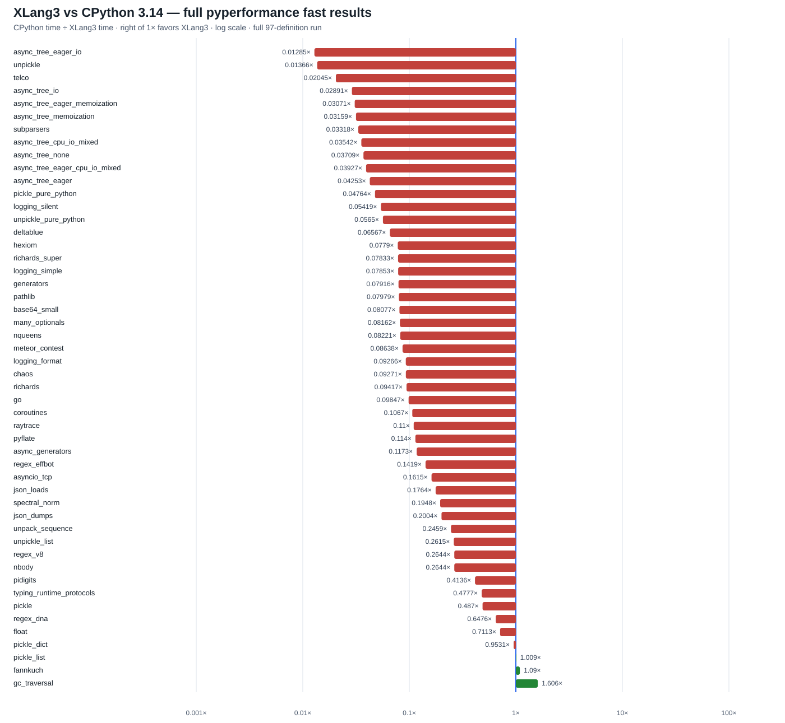

# XLang3 Decimal-zero candidate: full pyperformance comparison

This run attempted all **97** pyperformance 1.14.0 definitions in `--fast`
mode with a 120-second cap per definition. It used the Release executable
whose SHA-256 is
`FF789588391A20E980C5F5E31AF776A946B213E1DBEBD2E4524CB449582B80E8` and the
runtime DLL whose SHA-256 is
`594BA4883C7A3EEF455F1DBBC5DB9E440F85948B6413B91FA931B90CA28D5CC3`.

XLang3 produced **51** subtest measurements, of which **50** matched the saved
CPython 3.14.7 full-suite reference: it was faster on **3** and slower on
**47**. The geometric mean of CPython time divided by XLang3 time was
**0.11386×**, or about **8.78× slower overall** across those matched cases.
This is not evidence that the overall speed goal has been met. Fast-mode
samples are directional; the raw JSON retains their runs and uncertainties.

The three matched wins were `gc_traversal` (**1.61×**), `fannkuch`
(**1.09×**), and `pickle_list` (**1.01×**). The largest measured gaps were
`async_tree_eager_io` (**77.8× slower**), `unpickle` (**73.2×**), `telco`
(**48.9×**), `async_tree_io` (**34.6×**), and `async_tree_eager_memoization`
(**32.6×**). Full timings and all statuses are in the CSV files below.

## Complete run evidence

- [All 97 definition statuses](data/pyperformance-xlang3-decimal-zero-full-fast-20261002-all-97-status.csv)
- [All subtest timings and matched speed ratios](data/pyperformance-xlang3-decimal-zero-full-fast-20261002-subtests.csv)
- [Raw XLang3 pyperf JSON](data/pyperformance-xlang3-decimal-zero-full-fast-20261002.json)
- [Full log, including failures and timeouts](data/pyperformance-xlang3-decimal-zero-full-fast-20261002.log)
- [CPython 3.14.7 reference JSON](data/pyperformance-cpython314-clean-release-full-fast-20261002.json)
- [CPython reference full log](data/pyperformance-cpython314-clean-release-full-fast-20261002.log)

The XLang3 run exited with status 1 because some definitions failed or timed
out. Every definition was nevertheless attempted. Failures caused by the
available Python 3.13 standard library, including `bytearray.copy` and the
missing `_py_warnings` module, remain failures in the status table and are not
treated as timings.

There is a standard-library mismatch: the XLang3 process loads the accessible
Python 3.13 standard library because the configured Python 3.14 library path
returns Access Denied. The saved reference was produced by CPython 3.14.7.
Benchmark definitions, pyperformance version, and shared dependencies match,
but this does not isolate interpreter speed from standard-library version
differences. Re-run after an accessible matching 3.14 standard library is
available before making a final 3.14 claim.

The Decimal-zero fast path reduced the saved `telco` result from **3.42 s** to
**281 ms**, but it still trails the 3.14 reference (5.75 ms) by **48.9×**.
`decimal.py` and `_pydecimal.py` remain Python; optimization work belongs at
XLang3's native `_decimal` boundary, which mirrors CPython's native-module
boundary, or in shared runtime/compiler paths. The pure-Python `pickle.py`,
`copy.py`, and other standard-library modules remain Python.

The objective remains open: materially reduce the broad runtime gaps, fix
benchmark compatibility failures where possible, and validate changes against
the fixed Release baseline.
