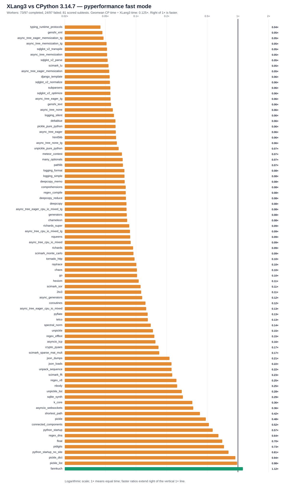

# Fresh XLang3 all-97 attempt versus saved CPython 3.14.7

The CPython reference was measured on October 7, 2026; XLang3 is freshly measured. This is an **unpaired saved-reference comparison**. CPython EXE/DLL, benchmark Python sources, hook and dependency metadata are pinned, but historical metadata alone does not prove every historical package/data byte.

The XLang3 run attempted all **97** pyperformance 1.14.0 definitions in `--fast` mode. Its workers completed **73** definitions and recorded **24** failures/timeouts. Benchmark failures make the suite unsuccessful; every definition was attempted.

Of **81** matched subtests, XLang3 was faster on **1**. The geometric mean of CPython time divided by XLang3 time was **0.12455×**; values over 1× favor XLang3. Fast-mode samples carry stability warnings and are directional evidence. The aggregate covers scored successful subtests only; it is not a whole-suite speed score.

## Run configuration

- XLang3 Release executable SHA-256: `0447d8a9ead0abc63b8d7061842960198b335240620a9c79b47d09de93c1a249`.
- XLang3 runtime DLL SHA-256: `19218af32ff4fdfb802144a713591c2126fcc0f1233ae04a08cfecc975922523`.
- CPython reference: pyperformance 1.14.0 on CPython 3.14.7; XLang3 loaded `C:/Python/Python314/Lib`.
- The XLang3 `PYTHONPATH` contains the Windows pyperf compatibility shim and the shared benchmark dependency site-packages. No Python 3.13 standard-library overlay was used.
- Each XLang3 benchmark definition had a 300-second cap covering pyperf worker calibration and measurement. Overrides: networkx*=600s.

## Largest slowdowns and wins

| Subtest | CPython 3.14.7 | XLang3 | CPython / XLang3 |
|---|---:|---:|---:|
| `typing_runtime_protocols` | 128.1 µs | 2.86 ms | 0.045× |
| `genshi_xml` | 42.5 ms | 908 ms | 0.047× |
| `async_tree_eager_memoization_tg` | 266 ms | 5537 ms | 0.048× |
| `async_tree_memoization_tg` | 275.8 ms | 5362 ms | 0.051× |
| `sqlglot_v2_transpile` | 1.226 ms | 23.57 ms | 0.052× |

Nominal timing wins (not proof of statistical significance or correctness):

- `fannkuch`: **1.119×** (283.5 ms vs 317.2 ms).

## Failure breakdown

- 13 definitions: Benchmark died.
- 11 definitions: Benchmark timed out.

The [all-97 status CSV](data/pyperformance-xlang3-dict-scalar-append-vs-cpython3147-full-fast-20261008-all-97-status.csv) retains every benchmark definition and failure status. The [matched subtest CSV](data/pyperformance-xlang3-dict-scalar-append-vs-cpython3147-full-fast-20261008-subtests.csv) contains raw per-subtest means and speed ratios.
Partial values from failed definitions remain in raw evidence and are excluded from timing tables, speed ratios and aggregate statistics.

## Raw evidence

- XLang3 pyperf JSON: [`pyperformance-xlang3-dict-scalar-append-vs-cpython3147-full-fast-20261008-input-xlang.json`](data/pyperformance-xlang3-dict-scalar-append-vs-cpython3147-full-fast-20261008-input-xlang.json).
- Runner status log: [`pyperformance-xlang3-dict-scalar-append-vs-cpython3147-full-fast-20261008-input-xlang.log`](data/pyperformance-xlang3-dict-scalar-append-vs-cpython3147-full-fast-20261008-input-xlang.log).
- CPython 3.14.7 pyperf JSON: [`pyperformance-xlang3-dict-scalar-append-vs-cpython3147-full-fast-20261008-input-cpython3147.json`](data/pyperformance-xlang3-dict-scalar-append-vs-cpython3147-full-fast-20261008-input-cpython3147.json).
- Earlier runs that used a Python 3.13 standard library are retained separately; this run supersedes them as the same-version Python 3.14 comparison.

Benchmark worker failures have several causes, including unavailable optional benchmark dependencies, XLang3 native-module gaps, and interpreter compatibility bugs. The status CSV gives case-level failure details, and the runner log preserves worker tracebacks when available. A worker death is not a performance score; inspect its case-specific cause before treating it as a speed result.

- Saved CPython status log: [`pyperformance-xlang3-dict-scalar-append-vs-cpython3147-full-fast-20261008-input-cpython3147.log`](data/pyperformance-xlang3-dict-scalar-append-vs-cpython3147-full-fast-20261008-input-cpython3147.log).

## Workload correctness exclusions

Worker completion does not prove equal work. The following raw timings remain in the CSV, but have no speed ratio and are excluded from the chart, win count and geometric mean:

- `gc_traversal`: Traversal work remains uncertified; retain raw status/timing and withhold speed score pending independent current workload coverage..

Evidence: [pyperformance-xlang3-dict-scalar-append-vs-cpython3147-full-fast-20261008-correctness-exclusions.json](data/pyperformance-xlang3-dict-scalar-append-vs-cpython3147-full-fast-20261008-correctness-exclusions.json).

## Saved reference dates and input identity

CPython completed all 97 definitions / 124 subtests on 2026-10-08T01:02:03.676413+00:00 through 2026-10-08T01:32:59.043022+00:00. The fresh XLang3 run began 2026-10-09T02:04:52.108179+00:00 and ended 2026-10-09T04:21:06.868023+00:00. These are **unpaired saved-reference comparisons**, not paired optimization gains. CPython throughput is 1x; the chart uses CP time / XLang3 time, with values over 1x favoring XLang3. Fast-mode variation/warnings remain.

Exact CPython EXE/DLL, manager versions, compatibility hook, all 224 recorded benchmark Python sources and 82 dependency METADATA identities match the saved October 7 reference. Current benchmark/dependency source, data and native bytes were additionally pinned before/after the fresh run. **Historical package METADATA does not prove every dependency source/data byte was unchanged since October 7.** The existing 43-source SQL audit covers that SQL scope only; no broader retrospective package-source equivalence is asserted.

[All raw values](data/pyperformance-xlang3-dict-scalar-append-vs-cpython3147-full-fast-20261008-all-raw-values.csv) and [sample variation](data/pyperformance-xlang3-dict-scalar-append-vs-cpython3147-full-fast-20261008-sample-variation.csv) retain every full-JSON timing, including clearly marked unscored failed definitions/workloads. [Failed partial snapshots](data/pyperformance-xlang3-dict-scalar-append-vs-cpython3147-full-fast-20261008-failed-partial-subtests.csv) remain separate and unscored; invalid/truncated files retain index rows and exact raw bytes. No values/outliers are trimmed or pooled.

Worker completion and nominal wins do not certify equal work in every benchmark. GC traversal remains conservatively unscored pending current independent workload coverage. ElementTree variants retain their original recorded names and backend metadata in raw JSON; accelerator/pure-Python variants are not renamed.

## Candidate provenance and separate targeted reference

This full run measured the exact source115 worktree and complete Release178 inventory recorded at 9c6160b416d40f2408b02971587df333bfd67b30. The checkout retained unrelated dirty source paths; the inventories and prior compiled-source archives identify their bytes. The owned committed changes alone, or a clean checkout, are not claimed to reproduce every reported score. The prior source56 all-97 matrix remains an older result and is not substituted into this table.

The separate fresh October 8 targeted `pickle_pure_python` reference retained all 20 values per runtime: CPython 0.000270742062498 s and XLang3 0.0041378881249 s per normalized unit. It is about 15.284x slower than CPython in that targeted run. Those values remain separate; the all-97 table uses only the historical October 7 CPython full-run JSON.

The full-run compiler/CTest watcher recorded no overlap or scanner errors at one-second intervals; processes entirely between observations may be missed. Raw watcher observations and every failed partial are preserved.
