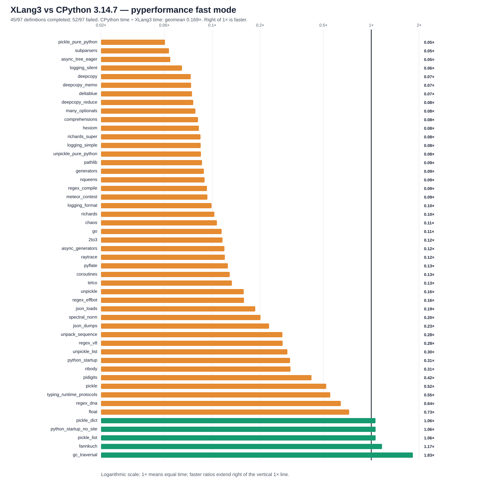

# XLang3 vs CPython 3.14.7: full pyperformance results with corrected startup case

The full XLang3 run attempted all **97** pyperformance 1.14.0 definitions in `--fast` mode. It completed **45** definitions and recorded **52** failures/timeouts. The suite returned exit code 1 because pyperformance treats those benchmark failures as unsuccessful; every definition was attempted.

The original `python_startup` score was contaminated by the compatibility `sitecustomize.py`: it imported `pyperf._runner` and `_worker` in the timed `xlang3 -c pass` process. After excluding that worker-only shim from startup children, the official startup benchmark was rerun with the same XLang3 executable and runtime DLL. The corrected **80.8 ms** value replaces only that case; the other 96 case results and all failure statuses come from the full run. The raw single-case run and the original full run are both retained below.

Of **49** matched subtests, XLang3 was faster on **5**. The geometric mean of CPython time divided by XLang3 time was **0.16948×**; values over 1× favor XLang3. Fast-mode samples carry stability warnings and are directional evidence.

## Run configuration

- XLang3 Release executable SHA-256: `4E014A32CDB168B1B10965B0BB242824F777DF0E4C9B635FE2435A39B88E6414`.
- XLang3 runtime DLL SHA-256: `539C434DF8EC85F35CBACEFF4402359C8432FB0B5E7E81B3F4B35A80AD6688BF`.
- CPython reference: pyperformance 1.14.0 on CPython 3.14.7; XLang3 loaded `Python 3.14 standard library`.
- The XLang3 `PYTHONPATH` contains the Windows pyperf compatibility shim and the shared benchmark dependency site-packages. No Python 3.13 standard-library overlay was used.
- Each XLang3 benchmark definition had a 120-second cap covering pyperf worker calibration and measurement. Overrides: none.
- For `python_startup`, the timed `-c` child used the same dependency site-packages as CPython and omitted the shim that patches pyperf workers; this prevents the harness hook from becoming part of the startup score.

## Largest slowdowns and wins

| Subtest | CPython 3.14.7 | XLang3 | CPython / XLang3 |
|---|---:|---:|---:|
| `pickle_pure_python` | 273.5 µs | 5.418 ms | 0.050× |
| `subparsers` | 8.151 ms | 152.3 ms | 0.054× |
| `async_tree_eager` | 86.62 ms | 1590 ms | 0.054× |
| `logging_silent` | 70.03 ns | 1.085 µs | 0.065× |
| `deepcopy` | 217.8 µs | 2.972 ms | 0.073× |

Measured wins:

- `gc_traversal`: **1.827×** (1.277 ms vs 2.332 ms).
- `fannkuch`: **1.168×** (277.4 ms vs 324 ms).
- `pickle_list`: **1.065×** (4.342 µs vs 4.625 µs).
- `python_startup_no_site`: **1.065×** (19.42 ms vs 20.68 ms).
- `pickle_dict`: **1.064×** (24.83 µs vs 26.41 µs).

## Failure breakdown

- 32 definitions: Benchmark died.
- 20 definitions: Benchmark timed out.

The [all-97 status CSV](data/pyperformance-xlang3-fixed-release-all-97-vs-cpython314-fast-shim-corrected-20261005-all-97-status.csv) retains every benchmark definition and failure status. The [matched subtest CSV](data/pyperformance-xlang3-fixed-release-all-97-vs-cpython314-fast-shim-corrected-20261005-subtests.csv) contains raw per-subtest means and speed ratios.

## Raw evidence

- Comparison JSON combines the full-run results with the corrected startup measurement: [`pyperformance-xlang3-fixed-release-all-97-vs-cpython314-fast-shim-corrected-20261005.json`](data/pyperformance-xlang3-fixed-release-all-97-vs-cpython314-fast-shim-corrected-20261005.json).
- Original full-run JSON and log: [`JSON`](data/pyperformance-xlang3-fixed-release-all-97-vs-cpython314-fast-20261005.json), [`log`](data/pyperformance-xlang3-fixed-release-all-97-vs-cpython314-fast-20261005.log).
- Corrected single-case `python_startup` JSON and log: [`JSON`](data/pyperformance-xlang3-python-startup-shim-corrected-fixed-release-20261005.json), [`log`](data/pyperformance-xlang3-python-startup-shim-corrected-fixed-release-20261005.log).
- Combined failure-status log: [`pyperformance-xlang3-fixed-release-all-97-vs-cpython314-fast-shim-corrected-20261005.log`](data/pyperformance-xlang3-fixed-release-all-97-vs-cpython314-fast-shim-corrected-20261005.log).
- CPython 3.14.7 pyperf JSON: [`pyperformance-cpython314-clean-release-full-fast-20261002.json`](data/pyperformance-cpython314-clean-release-full-fast-20261002.json).
- Earlier runs that used a Python 3.13 standard library are retained separately; this run supersedes them as the same-version Python 3.14 comparison.

Benchmark worker failures have several causes, including unavailable optional benchmark dependencies, XLang3 native-module gaps, and interpreter compatibility bugs. The status CSV gives case-level failure details, and the runner log preserves worker tracebacks when available. A worker death is not a performance score; inspect its case-specific cause before treating it as a speed result.
