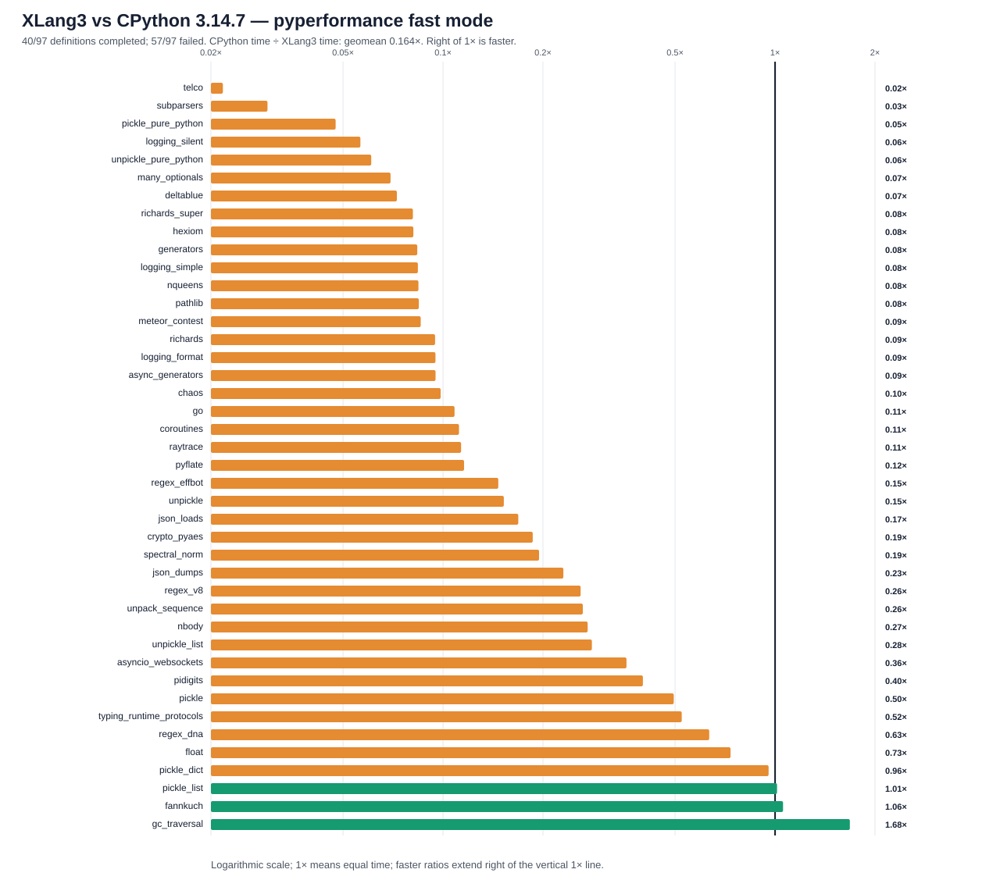

# XLang3 vs CPython 3.14.7: corrected full pyperformance run

The corrected XLang3 run attempted all **97** pyperformance 1.14.0 definitions in `--fast` mode. It completed **40** definitions and recorded **57** failures/timeouts. The command returned exit code 1 because pyperformance treats those benchmark failures as an unsuccessful suite; every definition was attempted.

Of **42** matched subtests, XLang3 was faster on **3**. The geometric mean of CPython time divided by XLang3 time was **0.16369×**; values over 1× favor XLang3. Fast-mode samples carry stability warnings and are directional evidence.

## Run configuration

- XLang3 Release executable SHA-256: `5F3E4D0F5ED27BFA0DC4F6D19863638CFCDA0B5275BC06F1A825DE7D521FD79C`.
- XLang3 runtime DLL SHA-256: `0CFFCB9EF450A15D4A3E744DCE44104810504992AA4AE287B0F1B0C3938B3B68`.
- CPython reference: pyperformance 1.14.0 on CPython 3.14.7; XLang3 used the accessible Python 3.13 standard library because the configured Python 3.14 standard-library directory is inaccessible to this process.
- The XLang3 `PYTHONPATH` includes `scratch/performance-trials/python313-copy-compat`, which restores the `bytearray.copy` behavior expected by the Python 3.14 compatibility layer.
- Each XLang3 benchmark definition had a 120-second cap. The cap covers pyperf worker calibration and measurement together.

## Largest slowdowns and wins

| Subtest | CPython 3.14.7 | XLang3 | CPython / XLang3 |
|---|---:|---:|---:|
| `telco` | 5.755 ms | 264.8 ms | 0.022× |
| `subparsers` | 8.151 ms | 275.4 ms | 0.030× |
| `pickle_pure_python` | 273.5 µs | 5.762 ms | 0.047× |
| `logging_silent` | 70.03 ns | 1.242 µs | 0.056× |
| `unpickle_pure_python` | 205.3 µs | 3.377 ms | 0.061× |

Measured wins:

- `gc_traversal`: **1.680×** (1.388 ms vs 2.332 ms).
- `fannkuch`: **1.057×** (306.6 ms vs 324 ms).
- `pickle_list`: **1.014×** (4.562 µs vs 4.625 µs).

## Failure breakdown

- 35 definitions: Benchmark died.
- 22 definitions: Benchmark timed out.

The [all-97 status CSV](data/pyperformance-xlang3-gc-early-reject-vs-cpython314-full-fast-20261002-all-97-status.csv) retains every benchmark definition and concise failure detail. The [matched subtest CSV](data/pyperformance-xlang3-gc-early-reject-vs-cpython314-full-fast-20261002-subtests.csv) contains raw per-subtest means and speed ratios.

## Raw evidence

- XLang3 pyperf JSON: [`pyperformance-xlang3-gc-early-reject-full-fast-20261002.json`](data/pyperformance-xlang3-gc-early-reject-full-fast-20261002.json).
- Full run log and tracebacks: [`pyperformance-xlang3-gc-early-reject-full-fast-20261002.log`](data/pyperformance-xlang3-gc-early-reject-full-fast-20261002.log).
- CPython 3.14.7 pyperf JSON: [`pyperformance-cpython314-clean-release-full-fast-20261002.json`](data/pyperformance-cpython314-clean-release-full-fast-20261002.json).
- Previous run without the `bytearray.copy` overlay is retained separately; this report supersedes it for corrected compatibility status.

Benchmark worker failures have several causes: Python 3.13/3.14 standard-library and dependency mismatches (for example missing `distutils` and `annotationlib`), XLang3 native-module gaps, and interpreter compatibility bugs. See the failure-detail column and full log before attributing a failure to performance.
