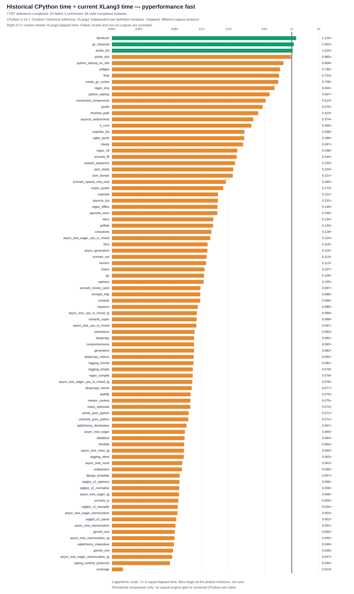

# Generic-GC R7b origin-aware per-definition capture

77/97 definitions completed; 20 genuine final failures; 0 unfinished. Capture complete: `True`; suite passed: `False`. 86 authenticated completed subtests are scored against October7 historical CPython3.14.7 fast results; this is unpaired evidence. Completed-subset geometric mean CP/X: `0.12663556685065108`. CP/X above1 means XLang3 faster; reciprocal X/CP above1 means XLang3 took longer. Invalid/failed/unrun outputs are unscored.

[97 statuses](data/pyperformance-xlang3-gc-r7b-per-definition-ownership-supplement-20261009-all-97-status.csv), [124 expected subtests](data/pyperformance-xlang3-gc-r7b-per-definition-ownership-supplement-20261009-all-124-subtests.csv), [all attempts](data/pyperformance-xlang3-gc-r7b-per-definition-ownership-supplement-20261009-all-attempts.csv) and [authentication](data/pyperformance-xlang3-gc-r7b-per-definition-ownership-supplement-20261009-report-provenance.json). Original ledger SHA `4662c4d85745f6823cdca3757d734b1f3e883b065f6fe0991009f5422b4a0a38`; composite SHA `1b4722611ba85bcd570ac6223c5106c1551eda67accafb3cf0309211f1196128`.

## Distinct origins and limits

Original-v1 uses frozen48faf, its original parser and full pin-map proof. Supplement-v2 uses its separately frozen R3 producer/binding, prospective older-row ownership correction and strict single-definition timeout/death recognition. The primary pyperformance1.14.0 run.py/commands.py hashes and parser policy are pinned in the binding. Every retained receipt is checked against its own origin digest/parser, never relabelled as the other origin. All 30 invalid attempts remain excluded, even where a later valid outcome exists. Valid original completions and genuine failures were never repeated. The cumulative child-launch cap is3 per definition across both origins. The fixed exclusive reservation prevents a fresh-prefix budget reset; crash recovery is independent root work.

Engine143/Release178/baseline177 and original dependency/workload pins are identical across origins; added pins enumerate immutable origin evidence and sibling/bundle/reservation artifacts. The original runner, fast mode,300-second complete-case cap/networkx600, bodies/datasets/calibration/values and shared watcher are unchanged. Per-definition windows, explicit resumptions and two observation-policy versions differ from the historical single-manager CP protocol. Host/order/cache differences remain possible. Historical dependency METADATA does not prove every old transitive/data/native byte. Source143 includes six unowned dirty inputs, not a clean-checkout claim.

Foreign runtimes/tools and malformed creation still invalidate. Dormant-worker parent guard is unchanged. The prospective parser requires one exact canonical[1/1]header; malformed/multiple/mismatched headers or duplicate/contradictory known markers raise an invalid-log error. A same-name legacy footer may have a matching official timeout/death marker without a no-suite line; named-only failure requires exactly one No-benchmark-was-run line. Final failure requires nonzero exit and unchanged phase guards. Exit0/claimed-completed with a failure marker is invalid. Partial means in failed logs are retained but never scored. One-second polling plus scan time can miss short foreign processes; unseen orphan descendants fail closed. Raw invalid observations are not retrospectively recertified. Terminal composite identity passed: `True`. This artifact audit does not load binaries, rerun benchmarks, revalidate the engine currently on disk or prove each benchmark's semantics exhaustively. No causal engine-gain/universal CPython-win claim is made.

## Every original definition

| Definition | XLang3 status | Retained origin | Global child launches | Failure detail |
| --- | --- | --- | ---: | --- |
| 2to3 | completed | original-v1 | 1 |  |
| argparse | completed | original-v1 | 1 |  |
| argparse_subparsers | completed | original-v1 | 1 |  |
| async_generators | completed | original-v1 | 1 |  |
| async_tree | completed | supplement-v2 | 2 |  |
| async_tree_cpu_io_mixed | completed | original-v1 | 1 |  |
| async_tree_cpu_io_mixed_tg | completed | supplement-v2 | 2 |  |
| async_tree_eager | completed | supplement-v2 | 2 |  |
| async_tree_eager_cpu_io_mixed | completed | original-v1 | 1 |  |
| async_tree_eager_cpu_io_mixed_tg | completed | original-v1 | 1 |  |
| async_tree_eager_io | failed | supplement-v2 | 2 | ERROR: Benchmark async_tree_eager_io timed out |
| async_tree_eager_io_tg | failed | supplement-v2 | 2 | ERROR: Benchmark async_tree_eager_io_tg timed out |
| async_tree_eager_memoization | completed | original-v1 | 1 |  |
| async_tree_eager_memoization_tg | completed | original-v1 | 1 |  |
| async_tree_eager_tg | completed | supplement-v2 | 2 |  |
| async_tree_io | failed | supplement-v2 | 2 | ERROR: Benchmark async_tree_io timed out |
| async_tree_io_tg | failed | supplement-v2 | 2 | ERROR: Benchmark async_tree_io_tg timed out |
| async_tree_memoization | completed | original-v1 | 1 |  |
| async_tree_memoization_tg | completed | original-v1 | 1 |  |
| async_tree_tg | completed | original-v1 | 1 |  |
| asyncio_tcp | completed | original-v1 | 1 |  |
| asyncio_tcp_ssl | failed | supplement-v2 | 2 | ERROR: Benchmark asyncio_tcp_ssl timed out |
| asyncio_websockets | completed | original-v1 | 1 |  |
| base64 | failed | supplement-v2 | 2 | ERROR: Benchmark base64 timed out |
| bpe_tokeniser | failed | supplement-v2 | 2 | ERROR: Benchmark bpe_tokeniser timed out |
| chameleon | completed | original-v1 | 1 |  |
| chaos | completed | original-v1 | 1 |  |
| comprehensions | completed | supplement-v2 | 2 |  |
| concurrent_imap | failed | supplement-v2 | 2 | ERROR: Benchmark concurrent_imap failed: Benchmark died |
| coroutines | completed | original-v1 | 1 |  |
| coverage | completed | original-v1 | 1 |  |
| crypto_pyaes | completed | original-v1 | 1 |  |
| dask | failed | supplement-v2 | 2 | ERROR: Benchmark dask failed: Benchmark died |
| deepcopy | completed | original-v1 | 1 |  |
| deltablue | completed | original-v1 | 1 |  |
| django_template | completed | original-v1 | 1 |  |
| docutils | failed | supplement-v2 | 2 | ERROR: Benchmark docutils failed: Benchmark died |
| dulwich_log | failed | supplement-v2 | 2 | ERROR: Benchmark dulwich_log failed: Benchmark died |
| fannkuch | completed | original-v1 | 1 |  |
| fastapi | failed | supplement-v2 | 2 | ERROR: Benchmark fastapi timed out |
| float | completed | original-v1 | 1 |  |
| gc_collect | completed | original-v1 | 1 |  |
| gc_traversal | completed | original-v1 | 1 |  |
| generators | completed | original-v1 | 1 |  |
| genshi | completed | original-v1 | 1 |  |
| go | completed | original-v1 | 1 |  |
| hexiom | completed | original-v1 | 1 |  |
| html5lib | completed | original-v1 | 1 |  |
| json_dumps | completed | original-v1 | 1 |  |
| json_loads | completed | original-v1 | 1 |  |
| logging | completed | original-v1 | 1 |  |
| mako | failed | supplement-v2 | 2 | ERROR: Benchmark mako failed: Benchmark died |
| mdp | failed | supplement-v2 | 2 | ERROR: Benchmark mdp failed: Benchmark died |
| meteor_contest | completed | original-v1 | 1 |  |
| nbody | completed | original-v1 | 1 |  |
| networkx | completed | original-v1 | 1 |  |
| networkx_connected_components | completed | original-v1 | 1 |  |
| networkx_k_core | completed | supplement-v2 | 2 |  |
| nqueens | completed | original-v1 | 1 |  |
| pathlib | completed | original-v1 | 1 |  |
| pickle | completed | supplement-v2 | 2 |  |
| pickle_dict | completed | original-v1 | 1 |  |
| pickle_list | completed | original-v1 | 1 |  |
| pickle_pure_python | completed | original-v1 | 1 |  |
| pidigits | completed | original-v1 | 1 |  |
| pprint | failed | supplement-v2 | 2 | ERROR: Benchmark pprint timed out |
| pyflate | completed | original-v1 | 1 |  |
| python_startup | completed | supplement-v2 | 2 |  |
| python_startup_no_site | completed | original-v1 | 1 |  |
| raytrace | completed | original-v1 | 1 |  |
| regex_compile | completed | original-v1 | 1 |  |
| regex_dna | completed | original-v1 | 1 |  |
| regex_effbot | completed | supplement-v2 | 2 |  |
| regex_v8 | completed | supplement-v2 | 2 |  |
| richards | completed | original-v1 | 1 |  |
| richards_super | completed | original-v1 | 1 |  |
| scimark | completed | original-v1 | 1 |  |
| spectral_norm | completed | original-v1 | 1 |  |
| sphinx | failed | supplement-v2 | 2 | ERROR: Benchmark sphinx failed: Benchmark died |
| sqlalchemy_declarative | completed | original-v1 | 1 |  |
| sqlalchemy_imperative | completed | original-v1 | 1 |  |
| sqlglot_v2 | completed | original-v1 | 1 |  |
| sqlglot_v2_optimize | completed | original-v1 | 1 |  |
| sqlglot_v2_parse | completed | original-v1 | 1 |  |
| sqlglot_v2_transpile | completed | original-v1 | 1 |  |
| sqlite_synth | completed | original-v1 | 1 |  |
| sympy | failed | supplement-v2 | 2 | ERROR: Benchmark sympy failed: Benchmark died |
| telco | completed | original-v1 | 1 |  |
| tomli_loads | failed | supplement-v2 | 2 | ERROR: Benchmark tomli_loads timed out |
| tornado_http | completed | original-v1 | 1 |  |
| typing_runtime_protocols | completed | original-v1 | 1 |  |
| unpack_sequence | completed | original-v1 | 1 |  |
| unpickle | completed | original-v1 | 1 |  |
| unpickle_list | completed | original-v1 | 1 |  |
| unpickle_pure_python | completed | original-v1 | 1 |  |
| xdsl | failed | supplement-v2 | 2 | ERROR: Benchmark xdsl failed: Benchmark died |
| xml_etree | failed | supplement-v2 | 2 | ERROR: Benchmark xml_etree timed out |

## Complete124 expected-subtest comparison matrix

Times are arithmetic scored means. CP/X speed above1 means X faster; X/CP elapsed factor above1 means X slower. Unsuccessful X time/ratios are blank.

| Definition | Subtest | Historical CP3.14.7 time | XLang3 time | CP/X speed (>1 X faster) | X/CP elapsed (>1 X slower) | Status | Origin | Score |
| --- | --- | ---: | ---: | ---: | ---: | --- | --- | --- |
| 2to3 | 2to3 | 315 ms | 2721 ms | 0.115754× | 8.639002× | completed | original-v1 | scored historical unpaired |
| argparse | many_optionals | 638.1 µs | 8.577 ms | 0.074391× | 13.442475× | completed | original-v1 | scored historical unpaired |
| argparse_subparsers | subparsers | 7.881 ms | 131.2 ms | 0.060078× | 16.645051× | completed | original-v1 | scored historical unpaired |
| async_generators | async_generators | 286.2 ms | 2484 ms | 0.115238× | 8.677684× | completed | original-v1 | scored historical unpaired |
| async_tree | async_tree_none | 229.3 ms | 3782 ms | 0.060644× | 16.489589× | completed | supplement-v2 | scored historical unpaired |
| async_tree_cpu_io_mixed | async_tree_cpu_io_mixed | 428 ms | 4921 ms | 0.086963× | 11.499110× | completed | original-v1 | scored historical unpaired |
| async_tree_cpu_io_mixed_tg | async_tree_cpu_io_mixed_tg | 425 ms | 4823 ms | 0.088133× | 11.346505× | completed | supplement-v2 | scored historical unpaired |
| async_tree_eager | async_tree_eager | 85.71 ms | 1322 ms | 0.064819× | 15.427663× | completed | supplement-v2 | scored historical unpaired |
| async_tree_eager_cpu_io_mixed | async_tree_eager_cpu_io_mixed | 338.2 ms | 2727 ms | 0.124010× | 8.063853× | completed | original-v1 | scored historical unpaired |
| async_tree_eager_cpu_io_mixed_tg | async_tree_eager_cpu_io_mixed_tg | 385.4 ms | 4922 ms | 0.078289× | 12.773231× | completed | original-v1 | scored historical unpaired |
| async_tree_eager_io | async_tree_eager_io | 562.2 ms |  |  |  | failed | supplement-v2 | unscored |
| async_tree_eager_io_tg | async_tree_eager_io_tg | 554.8 ms |  |  |  | failed | supplement-v2 | unscored |
| async_tree_eager_memoization | async_tree_eager_memoization | 187.5 ms | 3505 ms | 0.053500× | 18.691707× | completed | original-v1 | scored historical unpaired |
| async_tree_eager_memoization_tg | async_tree_eager_memoization_tg | 266 ms | 5689 ms | 0.046759× | 21.386115× | completed | original-v1 | scored historical unpaired |
| async_tree_eager_tg | async_tree_eager_tg | 193.1 ms | 3464 ms | 0.055740× | 17.940474× | completed | supplement-v2 | scored historical unpaired |
| async_tree_io | async_tree_io | 562.2 ms |  |  |  | failed | supplement-v2 | unscored |
| async_tree_io_tg | async_tree_io_tg | 546.7 ms |  |  |  | failed | supplement-v2 | unscored |
| async_tree_memoization | async_tree_memoization | 278.5 ms | 5475 ms | 0.050872× | 19.657158× | completed | original-v1 | scored historical unpaired |
| async_tree_memoization_tg | async_tree_memoization_tg | 275.8 ms | 5561 ms | 0.049589× | 20.165815× | completed | original-v1 | scored historical unpaired |
| async_tree_tg | async_tree_none_tg | 239.4 ms | 3775 ms | 0.063410× | 15.770403× | completed | original-v1 | scored historical unpaired |
| asyncio_tcp | asyncio_tcp | 585.3 ms | 3884 ms | 0.150695× | 6.635926× | completed | original-v1 | scored historical unpaired |
| asyncio_tcp_ssl | asyncio_tcp_ssl | 1613 ms |  |  |  | failed | supplement-v2 | unscored |
| asyncio_websockets | asyncio_websockets | 176.4 ms | 471.2 ms | 0.374255× | 2.671975× | completed | original-v1 | scored historical unpaired |
| base64 | base64_small | 271.6 µs |  |  |  | failed | supplement-v2 | unscored |
| base64 | base64_large | 7.899 ms |  |  |  | failed | supplement-v2 | unscored |
| base64 | urlsafe_base64_small | 413.2 µs |  |  |  | failed | supplement-v2 | unscored |
| base64 | base32_small | 7.576 ms |  |  |  | failed | supplement-v2 | unscored |
| base64 | base32_large | 382.9 ms |  |  |  | failed | supplement-v2 | unscored |
| base64 | base16_small | 292.4 µs |  |  |  | failed | supplement-v2 | unscored |
| base64 | base16_large | 6.198 ms |  |  |  | failed | supplement-v2 | unscored |
| base64 | ascii85_small | 16.04 ms |  |  |  | failed | supplement-v2 | unscored |
| base64 | ascii85_large | 851.8 ms |  |  |  | failed | supplement-v2 | unscored |
| base64 | base85_small | 5.484 ms |  |  |  | failed | supplement-v2 | unscored |
| base64 | base85_large | 299.6 ms |  |  |  | failed | supplement-v2 | unscored |
| bpe_tokeniser | bpe_tokeniser | 3586 ms |  |  |  | failed | supplement-v2 | unscored |
| chameleon | chameleon | 11.6 ms | 139.6 ms | 0.083079× | 12.036725× | completed | original-v1 | scored historical unpaired |
| chaos | chaos | 48.17 ms | 450.3 ms | 0.106983× | 9.347262× | completed | original-v1 | scored historical unpaired |
| comprehensions | comprehensions | 13.96 µs | 170.4 µs | 0.081924× | 12.206455× | completed | supplement-v2 | scored historical unpaired |
| concurrent_imap | bench_mp_pool | 153.9 ms |  |  |  | failed | supplement-v2 | unscored |
| concurrent_imap | bench_thread_pool | 1.007 ms |  |  |  | failed | supplement-v2 | unscored |
| coroutines | coroutines | 17.41 ms | 136.4 ms | 0.127672× | 7.832558× | completed | original-v1 | scored historical unpaired |
| coverage | coverage | 65.51 ms | 4933 ms | 0.013280× | 75.299385× | completed | original-v1 | scored historical unpaired |
| crypto_pyaes | crypto_pyaes | 57.55 ms | 333.5 ms | 0.172591× | 5.794036× | completed | original-v1 | scored historical unpaired |
| dask | dask | 925.8 ms |  |  |  | failed | supplement-v2 | unscored |
| deepcopy | deepcopy | 210.8 µs | 2.568 ms | 0.082099× | 12.180489× | completed | original-v1 | scored historical unpaired |
| deepcopy | deepcopy_reduce | 2.213 µs | 27.3 µs | 0.081058× | 12.336875× | completed | original-v1 | scored historical unpaired |
| deepcopy | deepcopy_memo | 21.83 µs | 282.4 µs | 0.077290× | 12.938210× | completed | original-v1 | scored historical unpaired |
| deltablue | deltablue | 2.516 ms | 39.16 ms | 0.064235× | 15.567890× | completed | original-v1 | scored historical unpaired |
| django_template | django_template | 28.87 ms | 508.4 ms | 0.056784× | 17.610550× | completed | original-v1 | scored historical unpaired |
| docutils | docutils | 1816 ms |  |  |  | failed | supplement-v2 | unscored |
| dulwich_log | dulwich_log | 51.01 ms |  |  |  | failed | supplement-v2 | unscored |
| fannkuch | fannkuch | 317.2 ms | 283.3 ms | 1.119714× | 0.893085× | completed | original-v1 | scored historical unpaired |
| fastapi | fastapi_http | 365.7 ms |  |  |  | failed | supplement-v2 | unscored |
| float | float | 55.2 ms | 76.34 ms | 0.723145× | 1.382849× | completed | original-v1 | scored historical unpaired |
| gc_collect | create_gc_cycles | 1.469 ms | 2.075 ms | 0.707658× | 1.413112× | completed | original-v1 | scored historical unpaired |
| gc_traversal | gc_traversal | 2.14 ms | 2.034 ms | 1.052024× | 0.950549× | completed | original-v1 | scored historical unpaired |
| generators | generators | 26.63 ms | 325.1 ms | 0.081911× | 12.208362× | completed | original-v1 | scored historical unpaired |
| genshi | genshi_text | 19.37 ms | 387.6 ms | 0.049961× | 20.015431× | completed | original-v1 | scored historical unpaired |
| genshi | genshi_xml | 42.5 ms | 888.2 ms | 0.047854× | 20.896968× | completed | original-v1 | scored historical unpaired |
| go | go | 95.73 ms | 904 ms | 0.105898× | 9.443084× | completed | original-v1 | scored historical unpaired |
| hexiom | hexiom | 5.091 ms | 45.61 ms | 0.111625× | 8.958581× | completed | original-v1 | scored historical unpaired |
| html5lib | html5lib | 42.62 ms | 670.1 ms | 0.063599× | 15.723519× | completed | original-v1 | scored historical unpaired |
| json_dumps | json_dumps | 7.636 ms | 34.56 ms | 0.220932× | 4.526274× | completed | original-v1 | scored historical unpaired |
| json_loads | json_loads | 18.1 µs | 80.9 µs | 0.223780× | 4.468678× | completed | original-v1 | scored historical unpaired |
| logging | logging_format | 7.551 µs | 93.54 µs | 0.080727× | 12.387455× | completed | original-v1 | scored historical unpaired |
| logging | logging_silent | 69.12 ns | 1.098 µs | 0.062933× | 15.890036× | completed | original-v1 | scored historical unpaired |
| logging | logging_simple | 6.937 µs | 87.33 µs | 0.079437× | 12.588521× | completed | original-v1 | scored historical unpaired |
| mako | mako | 7.847 ms |  |  |  | failed | supplement-v2 | unscored |
| mdp | mdp | 980.4 ms |  |  |  | failed | supplement-v2 | unscored |
| meteor_contest | meteor_contest | 89.46 ms | 1198 ms | 0.074703× | 13.386295× | completed | original-v1 | scored historical unpaired |
| nbody | nbody | 82.85 ms | 288.4 ms | 0.287302× | 3.480662× | completed | original-v1 | scored historical unpaired |
| networkx | shortest_path | 425.8 ms | 1006 ms | 0.423202× | 2.362935× | completed | original-v1 | scored historical unpaired |
| networkx_connected_components | connected_components | 380.9 ms | 742.4 ms | 0.513115× | 1.948879× | completed | original-v1 | scored historical unpaired |
| networkx_k_core | k_core | 2085 ms | 5866 ms | 0.355343× | 2.814180× | completed | supplement-v2 | scored historical unpaired |
| nqueens | nqueens | 76.88 ms | 851.5 ms | 0.090296× | 11.074639× | completed | original-v1 | scored historical unpaired |
| pathlib | pathlib | 42.31 ms | 564.9 ms | 0.074898× | 13.351487× | completed | original-v1 | scored historical unpaired |
| pickle | pickle | 9.425 µs | 19.86 µs | 0.474632× | 2.106893× | completed | supplement-v2 | scored historical unpaired |
| pickle_dict | pickle_dict | 23.59 µs | 23.96 µs | 0.984560× | 1.015682× | completed | original-v1 | scored historical unpaired |
| pickle_list | pickle_list | 4.024 µs | 3.933 µs | 1.023179× | 0.977346× | completed | original-v1 | scored historical unpaired |
| pickle_pure_python | pickle_pure_python | 257.5 µs | 3.603 ms | 0.071474× | 13.991017× | completed | original-v1 | scored historical unpaired |
| pidigits | pidigits | 163 ms | 220.3 ms | 0.739833× | 1.351657× | completed | original-v1 | scored historical unpaired |
| pprint | pprint_safe_repr | 598.7 ms |  |  |  | failed | supplement-v2 | unscored |
| pprint | pprint_pformat | 1233 ms |  |  |  | failed | supplement-v2 | unscored |
| pyflate | pyflate | 344.9 ms | 2589 ms | 0.133231× | 7.505757× | completed | original-v1 | scored historical unpaired |
| python_startup | python_startup | 18.6 ms | 32.8 ms | 0.567001× | 1.763664× | completed | supplement-v2 | scored historical unpaired |
| python_startup_no_site | python_startup_no_site | 15.75 ms | 19.49 ms | 0.808414× | 1.236989× | completed | original-v1 | scored historical unpaired |
| raytrace | raytrace | 227.3 ms | 2166 ms | 0.104925× | 9.530642× | completed | original-v1 | scored historical unpaired |
| regex_compile | regex_compile | 98.07 ms | 1238 ms | 0.079190× | 12.627909× | completed | original-v1 | scored historical unpaired |
| regex_dna | regex_dna | 137.4 ms | 213.3 ms | 0.644166× | 1.552395× | completed | original-v1 | scored historical unpaired |
| regex_effbot | regex_effbot | 1.86 ms | 12.48 ms | 0.149105× | 6.706699× | completed | supplement-v2 | scored historical unpaired |
| regex_v8 | regex_v8 | 15.72 ms | 63.27 ms | 0.248411× | 4.025582× | completed | supplement-v2 | scored historical unpaired |
| richards | richards | 34.14 ms | 356.1 ms | 0.095865× | 10.431310× | completed | original-v1 | scored historical unpaired |
| richards_super | richards_super | 38.41 ms | 439 ms | 0.087500× | 11.428548× | completed | original-v1 | scored historical unpaired |
| scimark | scimark_fft | 227.4 ms | 931.3 ms | 0.244139× | 4.096033× | completed | original-v1 | scored historical unpaired |
| scimark | scimark_lu | 75.29 ms | 1373 ms | 0.054856× | 18.229472× | completed | original-v1 | scored historical unpaired |
| scimark | scimark_monte_carlo | 52.83 ms | 546.7 ms | 0.096645× | 10.347165× | completed | original-v1 | scored historical unpaired |
| scimark | scimark_sor | 97.53 ms | 862.7 ms | 0.113047× | 8.845891× | completed | original-v1 | scored historical unpaired |
| scimark | scimark_sparse_mat_mult | 3.144 ms | 16.98 ms | 0.185101× | 5.402458× | completed | original-v1 | scored historical unpaired |
| spectral_norm | spectral_norm | 75.79 ms | 509.9 ms | 0.148632× | 6.728011× | completed | original-v1 | scored historical unpaired |
| sphinx | sphinx | 742.4 ms |  |  |  | failed | supplement-v2 | unscored |
| sqlalchemy_declarative | sqlalchemy_declarative | 89.23 ms | 1324 ms | 0.067396× | 14.837752× | completed | original-v1 | scored historical unpaired |
| sqlalchemy_imperative | sqlalchemy_imperative | 11.24 ms | 229.7 ms | 0.048929× | 20.437903× | completed | original-v1 | scored historical unpaired |
| sqlglot_v2 | sqlglot_v2_normalize | 90.41 ms | 1613 ms | 0.056058× | 17.838641× | completed | original-v1 | scored historical unpaired |
| sqlglot_v2_optimize | sqlglot_v2_optimize | 42.47 ms | 753.5 ms | 0.056365× | 17.741475× | completed | original-v1 | scored historical unpaired |
| sqlglot_v2_parse | sqlglot_v2_parse | 988.3 µs | 19 ms | 0.052004× | 19.229237× | completed | original-v1 | scored historical unpaired |
| sqlglot_v2_transpile | sqlglot_v2_transpile | 1.226 ms | 22.69 ms | 0.054009× | 18.515557× | completed | original-v1 | scored historical unpaired |
| sqlite_synth | sqlite_synth | 1.833 µs | 6.192 µs | 0.296012× | 3.378246× | completed | original-v1 | scored historical unpaired |
| sympy | sympy_expand | 349.2 ms |  |  |  | failed | supplement-v2 | unscored |
| sympy | sympy_integrate | 14.65 ms |  |  |  | failed | supplement-v2 | unscored |
| sympy | sympy_sum | 104.2 ms |  |  |  | failed | supplement-v2 | unscored |
| sympy | sympy_str | 202.8 ms |  |  |  | failed | supplement-v2 | unscored |
| telco | telco | 5.71 ms | 42.52 ms | 0.134300× | 7.446008× | completed | original-v1 | scored historical unpaired |
| tomli_loads | tomli_loads | 1755 ms |  |  |  | failed | supplement-v2 | unscored |
| tornado_http | tornado_http | 140.1 ms | 1458 ms | 0.096136× | 10.401958× | completed | original-v1 | scored historical unpaired |
| typing_runtime_protocols | typing_runtime_protocols | 128.1 µs | 2.896 ms | 0.044235× | 22.606503× | completed | original-v1 | scored historical unpaired |
| unpack_sequence | unpack_sequence | 36.58 ns | 156.8 ns | 0.233312× | 4.286098× | completed | original-v1 | scored historical unpaired |
| unpickle | unpickle | 9.832 µs | 65.08 µs | 0.151060× | 6.619888× | completed | original-v1 | scored historical unpaired |
| unpickle_list | unpickle_list | 3.215 µs | 10.79 µs | 0.298085× | 3.354745× | completed | original-v1 | scored historical unpaired |
| unpickle_pure_python | unpickle_pure_python | 168.3 µs | 2.381 ms | 0.070675× | 14.149260× | completed | original-v1 | scored historical unpaired |
| xdsl | xdsl_constant_fold | 33.65 ms |  |  |  | failed | supplement-v2 | unscored |
| xml_etree | xml_etree_parse | 126.7 ms |  |  |  | failed | supplement-v2 | unscored |
| xml_etree | xml_etree_iterparse | 75.17 ms |  |  |  | failed | supplement-v2 | unscored |
| xml_etree | xml_etree_generate | 69.44 ms |  |  |  | failed | supplement-v2 | unscored |
| xml_etree | xml_etree_process | 48.57 ms |  |  |  | failed | supplement-v2 | unscored |
