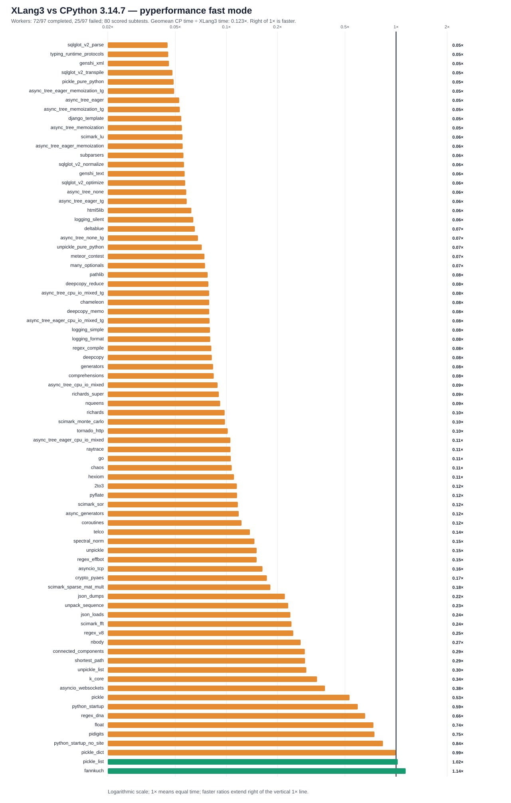

# XLang3 vs CPython 3.14.7: corrected full pyperformance run

The XLang3 run attempted all **97** pyperformance 1.14.0 definitions in `--fast` mode. Its workers completed **72** definitions and recorded **25** failures/timeouts. Benchmark failures make the suite unsuccessful; every definition was attempted.

CPython 3.14.7 completed all **97** definitions with **0** failures, recording **124** subtests.

Of **80** matched subtests, XLang3 was faster on **2**. The geometric mean of CPython time divided by XLang3 time was **0.12330×**; values over 1× favor XLang3. Across this scored subset, XLang3 takes **8.11× CPython's time** by geometric mean. This excludes failed definitions and the withheld GC traversal score; it is not a successful whole-suite result. Fast-mode samples carry stability warnings and are directional evidence.

## Run configuration

- XLang3 Release executable SHA-256: `72dd41692c627ccc5242eda336578cfccc4d404ba63b395cae441698b6ba16a6`.
- XLang3 runtime DLL SHA-256: `b0310f599fc7576463dd27c5be00dd96fb7ab9dfe6b11665adb706d8c6114e7d`.
- CPython reference: pyperformance 1.14.0 on CPython 3.14.7; XLang3 loaded `C:\Python\Python314\Lib`.
- The XLang3 `PYTHONPATH` contains the Windows pyperf compatibility shim and the shared benchmark dependency site-packages. No Python 3.13 standard-library overlay was used.
- Each XLang3 benchmark definition had a 300-second cap covering pyperf worker calibration and measurement. Overrides: networkx*=600s.

## Largest slowdowns and wins

| Subtest | CPython 3.14.7 | XLang3 | CPython / XLang3 |
|---|---:|---:|---:|
| `sqlglot_v2_parse` | 988.3 µs | 21.95 ms | 0.045× |
| `typing_runtime_protocols` | 128.1 µs | 2.82 ms | 0.045× |
| `genshi_xml` | 42.5 ms | 926.9 ms | 0.046× |
| `sqlglot_v2_transpile` | 1.226 ms | 25.47 ms | 0.048× |
| `pickle_pure_python` | 257.5 µs | 5.269 ms | 0.049× |

Nominal timing wins (not proof of statistical significance or correctness):

- `fannkuch`: **1.140×** (278.3 ms vs 317.2 ms).
- `pickle_list`: **1.023×** (3.934 µs vs 4.024 µs).

## Failure breakdown

- 14 definitions: Benchmark died.
- 11 definitions: Benchmark timed out.

The [all-97 status CSV](data/pyperformance-xlang3-live-eval-vs-cpython3147-full-fast-20261007-all-97-status.csv) retains every benchmark definition and failure status. The [matched subtest CSV](data/pyperformance-xlang3-live-eval-vs-cpython3147-full-fast-20261007-subtests.csv) contains raw per-subtest means and speed ratios.
Partial values from failed definitions remain in raw evidence and are excluded from timing tables, speed ratios and aggregate statistics.

## Raw evidence

- XLang3 pyperf JSON: [`pyperformance-xlang3-live-eval-full-fast-20261007.json`](data/pyperformance-xlang3-live-eval-full-fast-20261007.json).
- Runner status log: [`pyperformance-xlang3-live-eval-full-fast-20261007.log`](data/pyperformance-xlang3-live-eval-full-fast-20261007.log).
- CPython 3.14.7 pyperf JSON: [`pyperformance-cpython3147-live-eval-full-fast-20261007.json`](data/pyperformance-cpython3147-live-eval-full-fast-20261007.json).
- Earlier runs that used a Python 3.13 standard library are retained separately; this run supersedes them as the same-version Python 3.14 comparison.

Benchmark worker failures have several causes, including unavailable optional benchmark dependencies, XLang3 native-module gaps, and interpreter compatibility bugs. The status CSV gives case-level failure details, and the runner log preserves worker tracebacks when available. A worker death is not a performance score; inspect its case-specific cause before treating it as a speed result.

- Fresh CPython status log: [`pyperformance-cpython3147-live-eval-full-fast-20261007.log`](data/pyperformance-cpython3147-live-eval-full-fast-20261007.log).

## Workload correctness exclusions

Worker completion does not prove equal work. The following raw timings remain in the CSV, but have no speed ratio and are excluded from the chart, win count and geometric mean:

- `gc_traversal`: Collector omits generic tracked list/instance graph discovery; cycle-collection case also fails. Completed status and raw timing retained, speed score withheld.

Evidence: [gc-traversal-coverage-exclusion-20261007.json](data/gc-traversal-coverage-exclusion-20261007.json).

## Sample variation

The [sample-variation CSV](data/pyperformance-xlang3-live-eval-vs-cpython3147-full-fast-20261007-sample-variation.csv) records sample counts, means, sample standard deviations, relative deviations and ranges for the scored subtests of both runtimes. Pyperf instability warnings occurred in 60 XLang3 definitions and 62 CPython definitions among this scored set. Warnings are recorded at definition level; a definition may emit multiple subtests. The CSV excludes failed definitions and their partial values. These are descriptive statistics, not independent samples proving significance or a confidence interval for speed ratios.

## Unscored partial evidence

The [failed-definition partial table](data/pyperformance-xlang3-live-eval-vs-cpython3147-full-fast-20261007-failed-partial-subtests.csv) preserves available subtest sample counts and descriptive timings from failed definitions, with original file paths and SHA-256 hashes. It includes no CPython speed ratios and does not contribute to charts, win counts, or either geometric mean. Different saved files are separate snapshots; their samples are not pooled. Invalid or untimed partial files retain an index row without an invented timing.

## Current workload evidence

Genshi XML now contains the actual 1,000 rows and 10,000 cells, with exact output hashes matching CPython; its current timing is included. The earlier unexpanded XML result stays excluded in its historical report. This is not a claim that every completed benchmark has independent workload-equivalence validation. Nominal wins remain subject to semantic validation and noisy fast-mode timing.

[Validated runtime checkpoint and exact Genshi outputs](eval-live-namespace-checkpoint-20261007.md).

The native cycle-collection case `gc_collect` failed its assertion that at least 2,100 unreachable cycle nodes are collected. `gc_traversal` retains its nested containers and checks that collection returns zero. Its nominal traversal timing does not establish cycle reclamation or complete GC compatibility. Source inspection confirms `gc.collect()` delegates to a collector seeded by local class, weakref-target and native-payload candidates, without enumerating the generic tracked list/instance heap. The benchmark list graph has no such candidate seed. Its completed status and raw timing remain recorded, but its speed ratio, chart bar, win count and aggregate contribution are withheld.

Source inspection also identified that the current class-body lowerer omits `for` statements, matching the dictionary-population failures in Docutils and Pygments imported by Mako. Those failed definitions are excluded from scores. Other completed definitions have not all been independently checked for equivalent class-body execution; completion and nominal timings are not blanket semantic certification. The validated Genshi output counts/hashes are separate stronger evidence for that workload.

## ElementTree backend metadata

The official benchmark distinguishes accelerator and pure-Python subtest names. The recorded backends below remain attached to their original names; different variants are not silently renamed or scored as exact-name matches. Failed partial records remain unscored.

| Runtime | Subtest | Recorded backend | Evidence |
|---|---|---|---|
| xlang3 | xml_etree_pure_python_parse | xml.etree.ElementTree (pure Python) | failed partial; unscored |
| cpython3147 | xml_etree_parse | xml.etree.ElementTree (with C accelerator) | full record |
| cpython3147 | xml_etree_iterparse | xml.etree.ElementTree (with C accelerator) | full record |
| cpython3147 | xml_etree_generate | xml.etree.ElementTree (with C accelerator) | full record |
| cpython3147 | xml_etree_process | xml.etree.ElementTree (with C accelerator) | full record |

## Changes from the previous full run

Previously failed definitions now completed: `async_tree_cpu_io_mixed`, `async_tree_cpu_io_mixed_tg`, `async_tree_eager_cpu_io_mixed_tg`, `networkx_k_core`. Previously completed definitions now failed: none. 25 definitions failed in both runs. These are worker outcomes; completion alone does not certify workload equivalence.

On the **75** valid scored subtests common to both XLang3 runs, the geometric mean of old XLang3 time divided by current XLang3 time is **1.1003×**. Above 1× means less time in the current build. These independent fast-mode samples span multiple engine changes; they are descriptive and do not prove statistical significance. The old invalid XML output is excluded from this before/after calculation. An earlier checkpoint found and terminated a leftover task-local Python process consuming a CPU core after the historical full runs. Its original script is unrecoverable; the saved before/after aggregate cannot isolate engine gains from possible load differences. [Recorded process observation](data/bigint-division-leftover-process-20261007.json). The fresh current XLang3-versus-CPython comparison uses the new sequential runs.

Largest nominal improvements and slowdowns in that common set:

| Subtest | Older XLang3 | Current XLang3 | Old / current |
|---|---:|---:|---:|
| `async_tree_eager_cpu_io_mixed` | 7040 ms | 3203 ms | 2.1981× |
| `pidigits` | 405.7 ms | 218.4 ms | 1.8575× |
| `html5lib` | 816.9 ms | 685.6 ms | 1.1915× |
| `asyncio_tcp` | 4250 ms | 3585 ms | 1.1856× |
| `genshi_text` | 399.9 ms | 341 ms | 1.1729× |
| `async_tree_eager` | 1460 ms | 1625 ms | 0.8982× |
| `spectral_norm` | 519.5 ms | 517.7 ms | 1.0033× |
| `coroutines` | 142.5 ms | 141.7 ms | 1.0052× |
| `scimark_sparse_mat_mult` | 17.5 ms | 17.3 ms | 1.0119× |
| `generators` | 327.2 ms | 318.9 ms | 1.0260× |

Newly scored subtests relative to that earlier valid set: `async_tree_cpu_io_mixed`, `async_tree_cpu_io_mixed_tg`, `async_tree_eager_cpu_io_mixed_tg`, `genshi_xml`, `k_core`. They are included in the current CPython comparison, but not this common-set aggregate.

[Exact common-subtest means and input hashes](data/live-eval-full-common-subtests-20261007.json). The old XLang3 provenance did not hash benchmark Python source files at its start; the old CPython provenance recorded them.

## Controller sources

[Full-run controller](data/pyperformance-live-eval-full-suite-20261007-controller.py) and [report controller](data/pyperformance-live-eval-full-report-20261007-controller.py) preserve the exact experiment-specific orchestration and reporting code. They contain fixed checkpoint/output guards; they are historical sources, not commands to overwrite these saved results.
