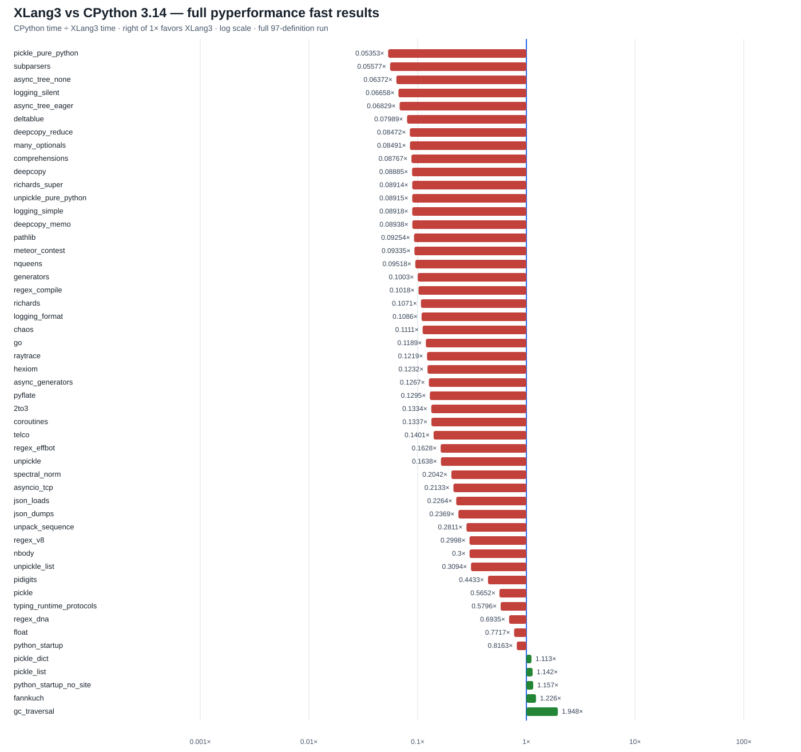

# XLang3 `main` vs CPython 3.14.7: full pyperformance rerun

**Superseded:** this run used only `C:\Python\Python314\Lib\site-packages` and omitted packages in the project's CPython 3.14.7 compatibility site. Its dependency-related failure inventory and aggregate do not represent the corrected full comparison. See the [corrected full run](pyperformance-xlang3-main-dependency-site-full-fast-20261006.md), which attempts all 97 definitions with that dependency site.

This run validates the current pushed `main` checkpoint, including the nested
Python-call exception-guard cleanup. It attempted all **97** pyperformance
1.14.0 definitions in fast mode. **47** completed and **50** failed or timed
out; the nonzero suite exit code records those failures, not a missing run.

Across **51** matching subtests, XLang3 is faster on **5**. The geometric
mean of CPython elapsed time divided by XLang3 elapsed time is **0.18251×**,
so XLang3 is about **5.48× slower** on this matched set. The previous full
checkpoint was 0.17933×; this run is 1.8% higher, but fast-mode variation
does not support attributing that small difference to one code change.

The largest remaining slowdowns are `pickle_pure_python` at **0.0535×**
(about 18.7× slower), `subparsers` at **0.0558×**, `async_tree_none` at
**0.0637×**, `logging_silent` at **0.0666×**, and `async_tree_eager` at
**0.0683×**. XLang3's measured wins are `gc_traversal` (**1.948×**),
`fannkuch` (**1.226×**), `python_startup_no_site` (**1.157×**),
`pickle_list` (**1.142×**), and `pickle_dict` (**1.113×**).

The failure table records every definition. Failures break down into **32
worker deaths** and **18 timeouts**. Some worker deaths name missing optional
packages (for example `websockets`, `chameleon`, `dask`, and `networkx`);
others come from compatibility or runtime errors. Timed-out work includes
mixed async-tree variants, `asyncio_tcp_ssl`, `base64`, `bpe_tokeniser`, and
`pprint`.

## Build and verification

- CPython reference: **3.14.7**, pyperformance 1.14.0, same Windows host and
  saved full-fast reference used by the previous checkpoint.
- The executable was built from current `main` in the scratch directory
  `build-repro/main-verify-20261006`; the fixed Release executable was left
  untouched.
- Scratch executable SHA-256:
  `4A068BBEDFDE8BEA5F24DD35DA80D1FFCB3F95578B91CE8CBE699B969D456C7C`.
- Scratch runtime DLL SHA-256:
  `BD0F2F28FC14E1B14CEAB7C1C1AF0C121507F7A43DA537B5E0882A2B4EBB5895`.
- The full fixture runner and `xlang3_interpreter_tests.exe` passed before
  benchmarking.
- The fixed `build-repro/Release` hashes remained
  `A5F5028C15E145EDCE645A5AFC25C11FBCE77F51E882312B1FBE06E63C72A4AF`
  (executable) and
  `BC1B9C0A8086F7E6FB0C037516DC9C1EEA20427FA887E3AA623714BC5EF5DA8D`
  (runtime DLL).

The runner used a 120-second per-definition cap, with `async_tree*=30`,
`async_tree=300`, and `async_tree_eager=300` overrides. Fast-mode stability
warnings remain; these are directional comparisons, not rigorous final
estimates.

## Evidence

- [All-97 status CSV](data/pyperformance-xlang3-main-after-exception-guard-full-fast-20261006-all-97-status.csv)
- [Matched subtests and ratios CSV](data/pyperformance-xlang3-main-after-exception-guard-full-fast-20261006-subtests.csv)
- [Raw XLang3 pyperf JSON](data/pyperformance-xlang3-main-after-exception-guard-full-fast-20261006.json)
- [Runner log with worker errors](data/pyperformance-xlang3-main-after-exception-guard-full-fast-20261006.log)
- [CPython 3.14.7 reference JSON](data/pyperformance-cpython314-clean-release-full-fast-20261002.json)
- [Previous full XLang3 checkpoint](pyperformance-xlang3-main-post-asyncio-thread-state-full-fast-20261006.md)

The overall goal remains open. The latest full run confirms that small call-
boundary cleanups do not address the largest VM/runtime gaps; continued work
should target a profiled shared cost in the pickle, argparse, and asyncio
paths, then require repeated matched benchmarks before claiming a gain.
