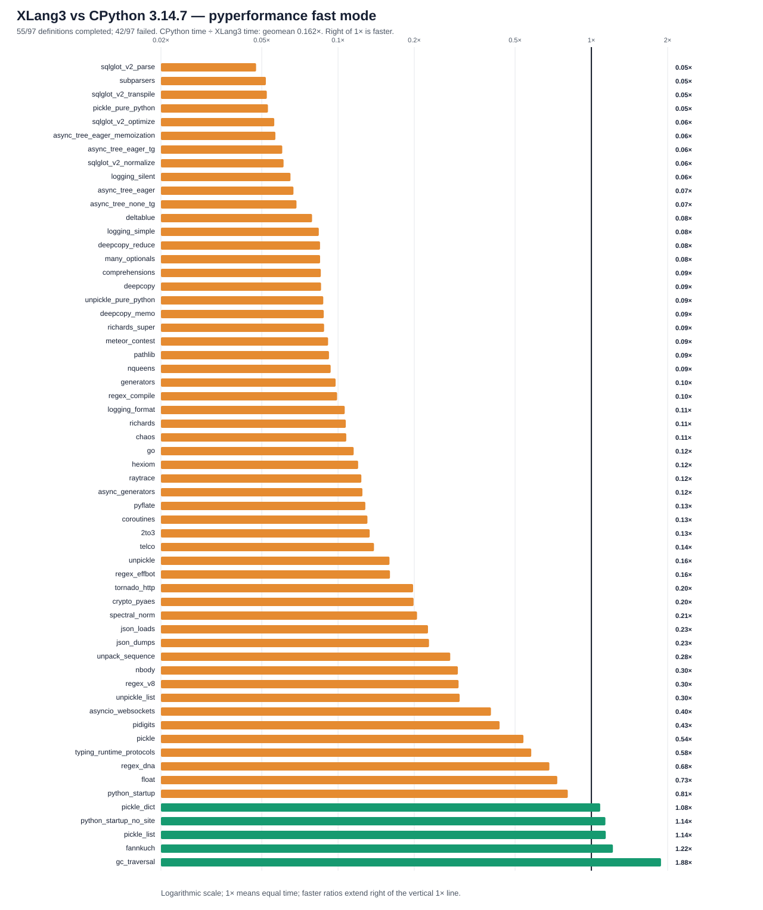

# XLang3 vs CPython 3.14.7: corrected full pyperformance run

The corrected XLang3 run attempted all **97** pyperformance 1.14.0 definitions in `--fast` mode. It completed **55** definitions and recorded **42** failures/timeouts. The command returned exit code 1 because pyperformance treats those benchmark failures as an unsuccessful suite; every definition was attempted.

This replaces the earlier October 6 full-run status and ratios: that run omitted the project's compatibility site-packages, so 8 more definitions now produce benchmark results and the matched-set aggregate changes. The package path used here is `venv/cpython3.14-a6792301b742-compat-31b33d68c68a/Lib/site-packages`.

Of **59** matched subtests, XLang3 was faster on **5**. The geometric mean of CPython time divided by XLang3 time was **0.16155×**; values over 1× favor XLang3. Fast-mode samples carry stability warnings and are directional evidence.

## Run configuration

- XLang3 Release executable SHA-256: `10B09AC8F1EF459339A271DF77C858EA6C71021905C426E1001F0DE7377A8513`.
- XLang3 runtime DLL SHA-256: `2E27F1C65D250BE9D3B8331185F7092E26EE9074A9D74AB3CEC20682E24C3E79`.
- CPython reference: pyperformance 1.14.0 on CPython 3.14.7; XLang3 loaded `Python 3.14 standard library`.
- The XLang3 `PYTHONPATH` contains the Windows pyperf compatibility shim and the project's CPython 3.14.7 benchmark dependency site (`venv/cpython3.14-a6792301b742-compat-31b33d68c68a/Lib/site-packages`). No Python 3.13 standard-library overlay was used.
- Each XLang3 benchmark definition had a 120-second cap covering pyperf worker calibration and measurement. Overrides: none.

## Largest slowdowns and wins

| Subtest | CPython 3.14.7 | XLang3 | CPython / XLang3 |
|---|---:|---:|---:|
| `sqlglot_v2_parse` | 1.01 ms | 21.28 ms | 0.047× |
| `subparsers` | 8.151 ms | 157.1 ms | 0.052× |
| `sqlglot_v2_transpile` | 1.302 ms | 24.86 ms | 0.052× |
| `pickle_pure_python` | 273.5 µs | 5.173 ms | 0.053× |
| `sqlglot_v2_optimize` | 41.61 ms | 742.7 ms | 0.056× |

Measured wins:

- `gc_traversal`: **1.883×** (1.239 ms vs 2.332 ms).
- `fannkuch`: **1.216×** (266.4 ms vs 324 ms).
- `pickle_list`: **1.140×** (4.057 µs vs 4.625 µs).
- `python_startup_no_site`: **1.136×** (18.21 ms vs 20.68 ms).
- `pickle_dict`: **1.084×** (24.37 µs vs 26.41 µs).

## Failure breakdown

- 24 definitions: Benchmark died.
- 18 definitions: Benchmark timed out.

The [all-97 status CSV](data/pyperformance-xlang3-main-dependency-site-full-fast-20261006-all-97-status.csv) retains every benchmark definition and failure status. The [matched subtest CSV](data/pyperformance-xlang3-main-dependency-site-full-fast-20261006-subtests.csv) contains raw per-subtest means and speed ratios.

## Raw evidence

- XLang3 pyperf JSON: [`pyperformance-xlang3-main-dependency-site-full-fast-20261006.json`](data/pyperformance-xlang3-main-dependency-site-full-fast-20261006.json).
- Runner status log: [`pyperformance-xlang3-main-dependency-site-full-fast-20261006.log`](data/pyperformance-xlang3-main-dependency-site-full-fast-20261006.log).
- CPython 3.14.7 pyperf JSON: [`pyperformance-cpython314-clean-release-full-fast-20261002.json`](data/pyperformance-cpython314-clean-release-full-fast-20261002.json).
- Earlier runs that used a Python 3.13 standard library are retained separately; this run supersedes them as the same-version Python 3.14 comparison.
- The previous October 6 full-run report using an incomplete dependency site is marked as superseded: [`pyperformance-xlang3-main-after-exception-guard-full-fast-20261006.md`](pyperformance-xlang3-main-after-exception-guard-full-fast-20261006.md).

Benchmark worker failures have several causes, including unavailable optional benchmark dependencies, XLang3 native-module gaps, and interpreter compatibility bugs. The status CSV gives case-level failure details, and the runner log preserves worker tracebacks when available. A worker death is not a performance score; inspect its case-specific cause before treating it as a speed result.
