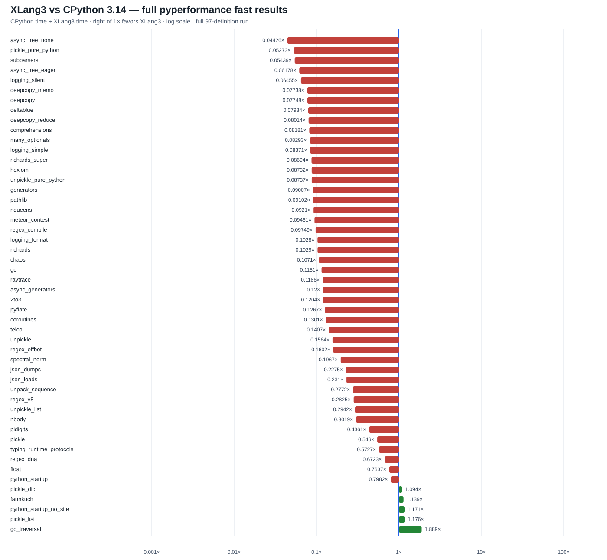

# XLang3 `main` vs CPython 3.14.7: full pyperformance run

This run measures the current `main` Release executable against the saved CPython 3.14.7 Release reference. It attempts all 97 pyperformance definitions. The run completed 46 definitions and recorded 51 failures or timeouts. Among 50 matched subtests, XLang3 was faster in 5 and slower in 45; the geometric mean of CPython time divided by XLang3 time is **0.17324×**. Ratios above 1× favor XLang3.

## Run configuration

- Benchmark suite: pyperformance 1.14.0, `--fast` mode, all 97 definitions.
- Reference runtime: CPython 3.14.7 at `C:\Python\Python314`, from the clean Release reference run dated 2026-10-02.
- XLang3 revision: `ff7d9bfcf5051544172a1045d3897a8e99426085` (`main`).
- XLang3 Release executable SHA-256: `0D86A3A269776639F4CFA7CE9F6D34BF02239CC43A6E0E877C128A07B3882A55`.
- XLang3 runtime DLL SHA-256: `2ADC956634C5F3793A6B1C162368315F47B7E63AB8D58082A94A58AFF39BDAEC`.
- Standard library: Python 3.14 standard library. The Windows pyperf compatibility shim and shared dependency site-packages were used; no Python 3.13 overlay was used.
- Per-definition timeout: 120 seconds; `async_tree*` definitions were capped at 30 seconds except `async_tree` and `async_tree_eager`, each capped at 300 seconds.
- The exact run log includes command output and every attempted definition. Fast-mode results are directional: pyperf warns that many measurements do not have enough samples for stable estimates.

## Largest measured slowdowns

| Subtest | CPython 3.14.7 | XLang3 | CPython / XLang3 |
|---|---:|---:|---:|
| `async_tree_none` | 227.4 ms | 5.137 s | 0.0443× |
| `pickle_pure_python` | 273.5 µs | 5.188 ms | 0.0527× |
| `subparsers` | 8.151 ms | 149.9 ms | 0.0544× |
| `async_tree_eager` | 86.62 ms | 1.402 s | 0.0618× |
| `logging_silent` | 70.03 ns | 1.085 µs | 0.0646× |
| `deepcopy` | 217.8 µs | 2.811 ms | 0.0775× |
| `deltablue` | 3.004 ms | 37.86 ms | 0.0793× |
| `comprehensions` | 14.22 µs | 173.8 µs | 0.0818× |
| `richards_super` | 41.37 ms | 475.8 ms | 0.0869× |
| `telco` | 5.755 ms | 40.90 ms | 0.1407× |
| `json_dumps` | 8.063 ms | 35.45 ms | 0.2275× |
| `json_loads` | 19.33 µs | 83.69 µs | 0.2310× |

## Measured wins

| Subtest | CPython 3.14.7 | XLang3 | CPython / XLang3 |
|---|---:|---:|---:|
| `gc_traversal` | 2.332 ms | 1.235 ms | 1.889× |
| `pickle_list` | 4.625 µs | 3.932 µs | 1.176× |
| `python_startup_no_site` | 20.68 ms | 17.66 ms | 1.171× |
| `fannkuch` | 324.0 ms | 284.5 ms | 1.139× |
| `pickle_dict` | 26.41 µs | 24.14 µs | 1.094× |

The `gc_traversal` result measures the benchmark's traversal workload and does not imply that XLang3 implements cyclic garbage collection. `gc_collect` fails because the benchmark expects collection of reference cycles, which XLang3 does not provide.

## Full-suite outcomes

The full-definition status CSV records CPython and XLang3 status, all available subtest timings, failure details, and cases without a matched score. The 51 XLang3 failures divide into 19 timeouts and 32 worker failures. Important distinctions include:

- Timeouts: all 14 secondary `async_tree*` variants, `asyncio_tcp`, `asyncio_tcp_ssl`, `base64`, `bpe_tokeniser`, and `pprint`.
- Missing optional packages: examples include `websockets`, `chameleon`, `coverage`, `pyaes`, `dask`, `django`, `docutils`, `dulwich`, `httpx`, `genshi`, `html5lib`, `mako`, `networkx`, `sympy`, `tomli`, `tornado`, and `xdsl`.
- Runtime or compatibility failures: `gc_collect` asserts because cycles are not collected; `mdp` asserts in its workload; SciMark fails in its FFT array slice path; `sqlite_synth` expects `Connection.create_aggregate`; `concurrent_imap` fails during Windows multiprocessing worker startup; `xml_etree` also fails in its worker.

Worker failures are not performance scores. Optional-package failures are environment limitations, while runtime assertion and missing API failures indicate compatibility work. The raw log should be consulted for complete tracebacks and exact failure messages.

## Next profiling targets

1. **Async task stepping** is the largest measured gap and the secondary variants frequently exceed even the 30-second cap. The two completed workloads remain 16–23× slower. A small `async_tree_call_profile.py` probe (levels=3, branches=3, 5 fresh event loops) counted 5,742 Python asyncio call events in CPython and 5,792 in XLang3. That near-equal count does not explain the timing gap and points toward per-operation VM cost or native task/coroutine stepping. Source inspection shows `asyncio_task.cpp:step_impl` calls `generator_send`, and `generator_send` constructs an `Interpreter` before `resume_generator`; CPython's Task path advances its native coroutine with `PyIter_Send`. This is a concrete profiling target, not yet a proven single cause. Earlier call-dispatch and event-polling trials were rejected as neutral or regressive.
2. **Pure-Python execution overhead** is visible in pickle, subparsers, deepcopy, logging, and comprehensions. Respect the project rule: do not replace CPython pure-Python standard-library implementations with C++; optimize XLang3's interpreter and call/runtime machinery instead.
3. **JSON wrapper execution** remains 4.4× slower on `json_dumps` and 4.3× slower on `json_loads`. XLang3's `_json` is registered and used. A profile of the exact 4,001-call pyperformance workload counted 4,001 `dumps`, 4,001 `encode`, and 4,001 `iterencode` Python frames in both XLang3 and CPython (12,003 frames total each). The wrapper makes the same number of calls, but XLang3 spends much longer executing them. The direct-native call-path split below confirms that the encoder itself is not the primary slowdown for small values.
4. **Telco** improved from 185.9ms in the prior full run to 40.9ms after the Decimal signal-identity change, but remains 7.1× slower. Re-profile current `telco` before considering a separate Decimal optimization.

### JSON encoder path split

The native `_json` module is registered and serves the default encoder; the gap is not a missing registration. A seven-pass median diagnostic using pyperformance 1.14's four payload shapes shows that public `json.dumps` spends much more time in XLang3's Python wrapper path for small values, while direct calls to XLang3's native encoder are close to or faster than CPython for nested and large payloads. The diagnostic is not an official score.

| Payload | Path | CPython 3.14.7 | XLang3 | CPython / XLang3 |
|---|---|---:|---:|---:|
| Empty | `json.dumps` | 0.898 µs/call | 8.571 µs/call | 0.105× |
| Empty | direct `_json` + join | 0.161 µs/call | 0.877 µs/call | 0.184× |
| Simple | `json.dumps` | 1.513 µs/call | 8.920 µs/call | 0.170× |
| Simple | direct `_json` + join | 0.655 µs/call | 1.207 µs/call | 0.543× |
| Nested | `json.dumps` | 2.789 µs/call | 9.391 µs/call | 0.297× |
| Nested | direct `_json` + join | 1.901 µs/call | 1.904 µs/call | 0.998× |
| Huge (1000 shared nested objects) | `json.dumps` | 1.460 ms/call | 0.692 ms/call | 2.109× |
| Huge (1000 shared nested objects) | direct `_json` + join | 1.424 ms/call | 0.663 ms/call | 2.147× |

This points the next JSON-related work toward general XLang3 execution of the pure-Python `json.dumps`/`JSONEncoder` wrapper and call path. Keep `json`'s pure-Python implementation in Python; optimize shared VM operations, and keep `_json` as XLang3's native counterpart to CPython's native accelerator.

## August baseline check

The preserved August 20 build is not a full-pyperformance baseline: it lacks imports needed by pyperformance 1.14, including `time` and `datetime`, and could not run the complete Python 3.14 suite. The same-source repeated core microbenchmarks instead show the current XLang3 Release build faster than the August artifact in all six cases (1.04–6.33×, depending on workload). The August artifact itself was built later than the August source revision and has a recorded local VM edit, so this result should be treated as a comparison to that preserved binary, not as a clean August source build. See [August core-throughput comparison](august-20-vs-current-core-throughput-20261002.md) and [repeated August microbenchmarks](august-vs-current-python314-microbench-20261004.md). Those selected core wins do not predict the broad stdlib-heavy CPython comparison above.

## Evidence files

- [Horizontal speed-ratio chart](pyperformance-xlang3-main-full-fast-20261005.svg)
- [All 97 definitions: CPython and XLang3 status](data/pyperformance-xlang3-main-full-fast-20261005-all-97-status.csv)
- [Every matched and unmatched subtest](data/pyperformance-xlang3-main-full-fast-20261005-subtests.csv)
- [Raw XLang3 pyperf JSON](data/pyperformance-xlang3-main-full-fast-20261005.json)
- [Full XLang3 runner log](data/pyperformance-xlang3-main-full-fast-20261005.log)
- [CPython 3.14.7 pyperf JSON](data/pyperformance-cpython314-clean-release-full-fast-20261002.json)
- [CPython 3.14.7 runner log](data/pyperformance-cpython314-clean-release-full-fast-20261002.log)
- [CPython 3.14.7 JSON call-path probe](data/json-dumps-callpath-cpython314-fastprobe-20261005.csv)
- [XLang3 JSON call-path probe](data/json-dumps-callpath-xlang3-main-fastprobe-20261005.csv)
- JSON Python-frame count probe: `benchmarks/diagnostics/profile_json_dumps_calls.py` (both runtimes report 4,001 calls to each of `dumps`, `encode`, and `iterencode`, 12,003 total frames).
