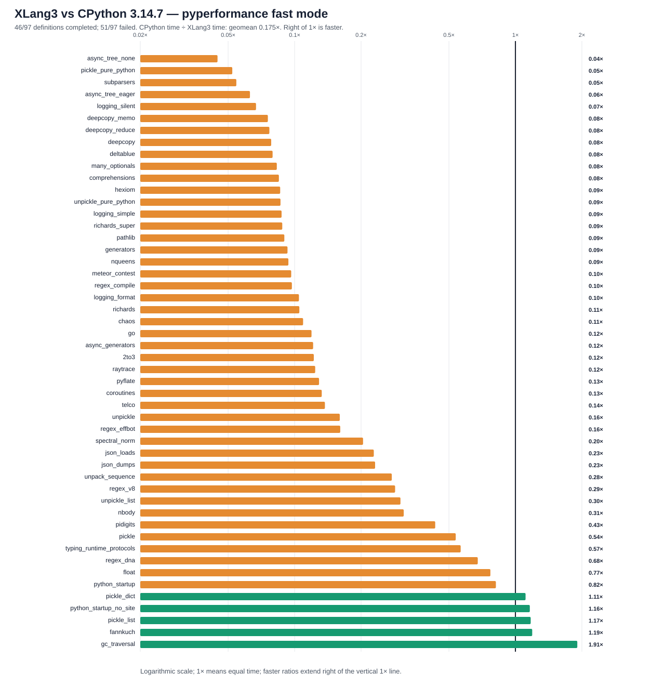

# XLang3 vs CPython 3.14.7: corrected full pyperformance run

The corrected XLang3 run attempted all **97** pyperformance 1.14.0 definitions in `--fast` mode. It completed **46** definitions and recorded **51** failures/timeouts. The command returned exit code 1 because pyperformance treats those benchmark failures as an unsuccessful suite; every definition was attempted.

Of **50** matched subtests, XLang3 was faster on **5**. The geometric mean of CPython time divided by XLang3 time was **0.17493×**; values over 1× favor XLang3. Fast-mode samples carry stability warnings and are directional evidence.

## Run configuration

- XLang3 Release executable SHA-256: `65D72538732BC3554C388584F51B4A0F6A9289EF55D8A378495C92BADAD89D8D`.
- XLang3 runtime DLL SHA-256: `DD840516DC088AD7D6C012AE8CE717673E2B6222531A660F39BFC38BFFC1D42B`.
- CPython reference: pyperformance 1.14.0 on CPython 3.14.7; XLang3 loaded `Python 3.14 standard library`.
- The XLang3 `PYTHONPATH` contains the Windows pyperf compatibility shim and the shared benchmark dependency site-packages. No Python 3.13 standard-library overlay was used.
- Each XLang3 benchmark definition had a 120-second cap covering pyperf worker calibration and measurement. Overrides: async_tree*=30s, async_tree=300s, async_tree_eager=300s.

## Largest slowdowns and wins

| Subtest | CPython 3.14.7 | XLang3 | CPython / XLang3 |
|---|---:|---:|---:|
| `async_tree_none` | 227.4 ms | 5080 ms | 0.045× |
| `pickle_pure_python` | 273.5 µs | 5.241 ms | 0.052× |
| `subparsers` | 8.151 ms | 149.6 ms | 0.054× |
| `async_tree_eager` | 86.62 ms | 1380 ms | 0.063× |
| `logging_silent` | 70.03 ns | 1.047 µs | 0.067× |

Measured wins:

- `gc_traversal`: **1.907×** (1.223 ms vs 2.332 ms).
- `fannkuch`: **1.191×** (272 ms vs 324 ms).
- `pickle_list`: **1.173×** (3.943 µs vs 4.625 µs).
- `python_startup_no_site`: **1.162×** (17.8 ms vs 20.68 ms).
- `pickle_dict`: **1.112×** (23.76 µs vs 26.41 µs).

## Failure breakdown

- 32 definitions: Benchmark died.
- 19 definitions: Benchmark timed out.

The [all-97 status CSV](data/pyperformance-xlang3-main-post-future-full-fast-20261005-all-97-status.csv) retains every benchmark definition and failure status. The [matched subtest CSV](data/pyperformance-xlang3-main-post-future-full-fast-20261005-subtests.csv) contains raw per-subtest means and speed ratios.

## Raw evidence

- XLang3 pyperf JSON: [`pyperformance-xlang3-main-post-future-full-fast-20261005.json`](data/pyperformance-xlang3-main-post-future-full-fast-20261005.json).
- Runner status log: [`pyperformance-xlang3-main-post-future-full-fast-20261005.log`](data/pyperformance-xlang3-main-post-future-full-fast-20261005.log).
- CPython 3.14.7 pyperf JSON: [`pyperformance-cpython314-clean-release-full-fast-20261002.json`](data/pyperformance-cpython314-clean-release-full-fast-20261002.json).
- Earlier runs that used a Python 3.13 standard library are retained separately; this run supersedes them as the same-version Python 3.14 comparison.

Benchmark worker failures have several causes, including unavailable optional benchmark dependencies, XLang3 native-module gaps, and interpreter compatibility bugs. The status CSV gives case-level failure details, and the runner log preserves worker tracebacks when available. A worker death is not a performance score; inspect its case-specific cause before treating it as a speed result.
